# Java程序设计自考真题

## 目录

-   [选择题](#选择题)
    -   [2019年4月](#2019年4月)
    -   [2019年10月](#2019年10月)
    -   [2020年4月](#2020年4月)
    -   [2020年10月](#2020年10月)
    -   [2021年4月](#2021年4月)
    -   [2021年10月](#2021年10月)
    -   [2022年4月](#2022年4月)
    -   [2022年10月](#2022年10月)
-   [填空题](#填空题)
    -   [2019年4月](#2019年4月)
    -   [2019年10月](#2019年10月)
    -   [2020年4月](#2020年4月)
    -   [2020年10月](#2020年10月)
    -   [2021年4月](#2021年4月)
    -   [2021年10月](#2021年10月)
    -   [2022年4月](#2022年4月)
    -   [2022年10月](#2022年10月)
-   [简答题](#简答题)
    -   [2019年4月](#2019年4月)
    -   [2019年10月](#2019年10月)
    -   [2020年4月](#2020年4月)
    -   [2020年10月](#2020年10月)
    -   [2021年4月](#2021年4月)
    -   [2021年10月](#2021年10月)
    -   [2022年4月](#2022年4月)
    -   [2022年10月](#2022年10月)
-   [程序填空题](#程序填空题)
    -   [2019年4月](#2019年4月)
    -   [2019年10月](#2019年10月)
    -   [2020年4月](#2020年4月)
    -   [2020年10月](#2020年10月)
    -   [2021年4月](#2021年4月)
    -   [2021年10月](#2021年10月)
    -   [2022年4月](#2022年4月)
    -   [2022年10月](#2022年10月)
-   [程序分析题](#程序分析题)
    -   [2019年4月](#2019年4月)
    -   [2019年10月](#2019年10月)
    -   [2020年4月](#2020年4月)
    -   [2020年10月](#2020年10月)
    -   [2021年4月](#2021年4月)
    -   [2021年10月](#2021年10月)
    -   [2022年4月](#2022年4月)
    -   [2022年10月](#2022年10月)
-   [程序设计题](#程序设计题)
    -   [2019年4月](#2019年4月)
    -   [2019年10月](#2019年10月)
    -   [2020年4月](#2020年4月)
    -   [2020年10月](#2020年10月)
    -   [2021年4月](#2021年4月)
    -   [2021年10月](#2021年10月)
    -   [2022年4月](#2022年4月)
    -   [2022年10月](#2022年10月)

# 选择题

### 2019年4月

1.  下列字符串中，能作为Java程序标识符的是**A**

    A. WHILE

    B. operator

    C. short

    D. interface
2.  表达式85 >>1的值是**B**
    A. 42.5

    B. 42

    C. 43

    D. false
3.  已知boolean a=false;，以下选项中，与for ( ; ;)不等价的是**D**

    A. for ( ; true; )

    B. for ( ; !a;)

    C. for ( ; !false; )

    D. for ( ; a=false; )
4.  定义一个类时，如果没有为类定义构造方法，则**B**

    A. 系统会创建一个带参数的构造方法

    B. 系统会创建一个不带参数的构造方法

    C. 系统什么也不做

    D. 系统会提示一条错误信息
5.  设有String s = "ABCDEFG";，则表达式s.substring(3)+ s.substring(3,5)的值是 **C**

    A. ABCDDEF

    B. DEFGDEF

    C. DEFGDE

    D. ABCDDE
6.  下列有关接口的描述中，正确的是 **D**

    A. 接口与抽象类是相同的概念

    B. 一个类不可实现多个接口

    C. 接口之间不能有继承关系

    D. 实现接口必须实现该接口的所有方法
7.  在下列选项中，对象序列化可以保存的是 **B**
    A. 静态成员变量

    B. 非静态成员变量

    C. 任何成员方法

    D. 变量的修饰符
8.  下列选项中，属于GridLayout布局特点的是 **C**
    A. 组件从上到下排列放置

    B. 组件可重叠放置

    C. 容器被分成网格状

    D.各组件所占区域可以不同
9.  在下列关于创建菜单项的描述中，不正确的是 **D**
    A. 可以创建空菜单项

    B. 可以创建含有图标的菜单项

    C. 可以创建含有快捷键的菜单项

    D. 不能创建只显示图标的菜单项
10. 下列选项中，能让线程从等待状态恢复到就绪状态的方法是 **A**
    A. notify()

    B. start()

    C. init()

    D. run()

### 2019年10月

1.  Java语言的一个重要特点是与平台的无关性，实现这一特点的关键是**A**

    A. JVM

    B. JDK

    C. IDE

    D. OOP
2.  下列选项中，不属于字符常量的是**D**

    A. 'x'

    B. '8'

    C. 'n'

    D. "008
3.  下列异常类中，属于受检异常的是**C**

    A. ArithmeticException

    B. EmptyStackException

    C. FileNotFoundException

    D. NullPointerException
4.  下列关于类的方法定义的描述中，不正确的是**B**

    A. 方法名必须是一个合法的标识符

    B. 方法一定有返回值

    C. 方法的修饰符段可以含有多个修饰符

    D. 方法体中实际执行的代码段可以为空
5.  下列选项中，用于表示Vector类对象中元素数量的变量是**B**

    A. capacityIncrement

    B. elementCount

    C. elementLength

    D. elementData
6.  用户定义了一个不能被继承的类，在这个类的声明中使用的关键字是**C**

    A. static

    B. private

    C. final

    D. abstract
7.  将Java对象进行序列化，需要使用的输出流类是**D**

    A. FileOutputStream

    B. BufferedOutputStream

    C. DataOutputStream

    D.ObjectOutputStream
8.  下列Graphics类定义的方法中，可以绘制折线的是**C**

    A. drawArc()

    B. drawOval()

    C. drawPolygon()

    D. drawLine()
9.  下列关于构造文本域的描述中，不正确的是**B**

    A. 可以构造空文本域

    B. 可以构造指定行数的文本域

    C. 可以构造指定列数的文本域

    D. 可以构造显示初始字符串的文本域
10. 下列方法中，可以启动线程对象的是**A**

    A. start()

    B. run()

    C. int()

    D. join()

### 2020年4月

1.  MyApp程序经编译后得到类文件MyApp.class，则运行该程序的命令是**B**

    A. java MyApp.class

    B. java MyApp

    C. javac MyApp.class

    D. javac MyApp
2.  下列选项中，表示退格键（Backspace）的转义字符是**D**

    A. '\r'

    B. '\n'

    C. '\t'

    D. '\b'
3.  for(int i=0,j=0; (i==0) && (i>8); i++){j++;}中循环体执行的次数是**A**

    A. 0次

    B. 7次

    C. 8次

    D. 无限次
4.  在一个类中允许多个方法使用同一个方法名，这就是方法的**C**

    A. 签名

    B. 继承

    C. 重载

    D. 覆盖
5.  在Vector类中，用于删除向量序列中给定位置元素的方法是**C**

    A. setElementAt()

    B. removeElement()

    C. removeElementAt()

    D. removeAllElements()
6.  下列定义正确的是**D**

    A. class ObjectStorage{ abstract void ObjectStorage();}

    B. abstract ObjectStorage{ abstract void ObjectStorage();}

    C. class abstract ObjectStorage{ abstract void ObjectStorage();}

    D. abstract class ObjectStorage{ abstract void ObjectStorage(); }
7.  方法int read(byte\[] b, int off, int len)的返回值为**A**

    A. 读取的字节数

    B. 数组b的长度

    C. 读取的最后一个字节值

    D. 数组b中最后一个元素的位置
8.  JPanel默认的布局管理器是**B**

    A. BorderLayout

    B. FlowLayout

    C. GridLayout

    D. CardLayout
9.  设有JFrame对象f和String对象s，则构造强制性对话框的方法是**C**

    A. JDialog()

    B. JDialog(f, s)

    C. JDialog(f, s, true)

    D. JDialog(f, s, false)
10. 下列*不属于*线程组成部分的是**A**

    A. 入口与出口

    B. 执行的代码

    C. 处理的数据

    D. 虚拟CPU

### 2020年10月

1.  Java语言中不支持的语法成分或功能是**B**

    A.引用

    B. #define

    C. 继承

    D. new
2.  某函数中定义了4个变量:int iVal、long lVal、float fVal及 doubled Val，且已经赋了初值。则下列选项中，编译出现错误的是**A**

    A. lVal = fVal;

    B. fVal = iVal;

    C. fVal =lVal;

    D. dVal = fVal;
3.  以下程序代码段的输出结果是**B**
    ```java
    int sumn = 0, sumk = 0,n,k;
    for (n=0,k=0;k<8;n++,k++) { sumn += n;sumk+=k;}
    System.out.print(sumn+""+sumk);
    ```
    A. 28 8

    B. 28 28

    C. 8 28

    D. 8 8
4.  下列对类的静态成员变量的描述中，正确的是**D**

    A. 不能通过类的对象访问类的静态成员变量

    B. 类的每个对象都有自己的静态成员变量

    C. 类的不同对象有不同的静态成员变量值

    D. 静态成员变量是类的所有对象共享的数据
5.  调用方法时,使用值传递方式,形参是引用。下列叙述中正确的是**C**

    A. 形参得到实参所指对象的值

    B. 实参得到形参所指对象的值

    C. 形参和实参指向同一地址

    D. 形参和实参无联系
6.  以下程序代码段的输出结果是**B**
    ```java
    int intArray[ ]={2,4,6,8};
    int result=1,i=1;
    while(i<3) result=result*intArray[i++];
    System.out.print(result);
    ```
    A. 8

    B. 24

    C. 48

    D.192
7.  设引用类型的变量p标记为final，则下列叙述中正确的是**A**

    A. p不能再指向其他对象，但它所指对象中的属性值可以改变

    B. p不能再指向其他对象，它所指对象中的属性值也不可以改变

    C. p能指向其他对象，它所指对象中的属性值也可以改变

    D. p能指向其他对象，但它所指对象中的属性值不可以改变
8.  以下程序代码段的输出结果是**D**
    ```java
    File f = new File("/home/mydic/d07.Java");
    System.out.printIn(f.getName());
    ```
    A.  /home/mydic/d07.Java

    B. \homelmydicld07Java

    C. d07

    D. d07.Java
9.  下列关于Swing 组件与AWT组件的叙述中，正确的是**A**

    A. Swing 组件在实现时不包含任何本地代码

    B. AWT组件在实现时不包含任何本地代码

    C. AWT组件比 Swing 组件的功能更强

    D. Swing组件在不同的平台下运行会有差异
10. API中线程操作方法 yield(的作用是**C**

    A. 启动新建线程对象

    B. 定义线程对象要执行的操作

    C. 强制终止线程的执行

    D. 测试当前线程是否在活动

### 2021年4月

1.  下列选项中，不属于Java语言特性或语法成分的是**B**

    A. 面向对象

    B. 全局变量

    C. JVM

    D. 多线程
2.  下列选项中，能作为文档注释的是**C**

    A. `/*`*`我是javadoc注释`*`*/`

    B. `//我是javadoc注释*/`

    C. `/`*`我是javadoc注释`*`/`

    D.` /`*`我是javadoc注释`*`/`
3.  下列选项中，不能作为for语句中条件表达式的是 **A**

    A. k++

    B. k<=10

    C. k==-1

    D. true
4.  关于类的叙述中，正确的是 **B**

    A. 每个类都要有一个main方法

    B. 类中可以不显式定义构造方法

    C. 声明一个类时，必须使用public修饰符

    D. 类具有封装性，故不能访问类的数据成员
5.  下列选项中，能正确加入如下Java代码段的Test类中，并成为cal()的重载方法的是**D**
    ```java
    public class Test{
    public void cal(int x, int y, int z){}
      //在此处添加cal()的重载方法
    }

    ```
    A. public int cal(int x, int z){ }

    B. public int cal(int x, int y, int z){ }

    C. public int cal(int x, int y, int z){return 0;}

    D. public int cal(int x, int y, float z){return 0;}
6.  下列选项中，能够正确初始化数组m的是 **C**

    A. int \[] m;

    B. m= {1,2,3,4,53;

    C. int \[]m = new int\[5];

    D. int\[] m = new int\[5]{1,2,3,4,53;
7.  下列选项中，能作为Java接口成员的是 **A**

    A. void aMethodO;

    B. private void aMethod();

    C. interface void aMethod();

    D. protected void aMethod();
8.  若程序中有语句FileOutputStream out = new FileOutputStream("myFile.dat");，则选项正确的是**C**

    A. 如果文件 myFile.dat存在，则将抛出IOException异常

    B. 如果文件myFile.dat不存在，则将抛出IOException异常

    C. 如果文件myFile.dat存在，则将覆盖掉文件中已有的内容

    D. 如果文件myFile.dat 存在，则将在文件的末尾开始添加新内容
9.  若要自行设置容器中组件的位置和大小，则需要执行的操作是**D**

    A. 调用方法 setSize(

    B. 调用方法 getContentPaneO

    C. 调用方法 getPreferredSize()

    D. 调用方法 setLayout(null)和 setBounds()
10. 子线程自动获得的优先级是 **D**

    A. 最低优先级

    B. 最高优先级

    C. 随机的优先级

    D. 父类的优先级

### 2021年10月

1.  关于Java编译过程的叙述中，正确的是**C**

    A. 编译源文件时使用的命令是java

    B. 编译是指创建一个Java源程序文件

    C. 编译是将.java文件生成.class文件

    D. 编译生成的类文件是文本文件
2.  下列字符串中，不属于Java语言关键字的是**D**

    A. boolean

    B. default

    C. interface

    D. value
3.  若有程序语句for (int k=-5; k==(-1); k++) System.out.println("OK");，则字符串OK输出的次数是**A**
    A. 0

    B. 1

    C. 4

    D. 5
4.  关于调用实例方法和静态方法的叙述中，正确的是**C**

    A. 在当前类的方法中调用本类实例方法时，前缀使用类名

    B. 在当前类的方法中调用本类静态方法时，前缀必须使用对象实例名

    C. 在当前类的方法中调用本类实例方法时，前缀可以不使用对象实例名

    D. 在当前类的方法中调用其他类的静态方法时，前缀必须使用对象实例名
5.  下列不属于方法签名的是 **B**

    A. 方法名

    B. 方法返回值

    C. 方法参数个数

    D. 方法参数的类型
6.  以下代码段的输出结果是 **B**
    ```java
    int[] score = {1, 2, 3, 4, 5};
    int temp = score[0];
    for(int index=1;index<5;index++){
      if(score[index]<temp){
        temp = score[index];
      }
    }
    System.out.println(temp);
    ```
    A. 数组的平均值

    B. 数组中的最小数

    C. 数组中的最大数

    D. 数组中最后一个元素
7.  若程序中定义类S是类P的子类，类P是类G的子类，则叙述正确的是**C**

    A. 类S只能继承类它中的成员，不能继承类P中的成员

    B. 类S只能继承类Р中的成员，不能继承类G中的成员

    C. 类S可以继承类P及类G中的成员

    D. 类S不能继承类G和类P中的成员
8.  Java中的抽象类Reader和Writer所处理的流是 **D**

    A. 字节流

    B. 对象流

    C. 图像流

    D. 字符流
9.  关于JLabel组件的说法，正确的是 **D**

    A. JLabel上只能有文本,不能有图标

    B. JLabel上只能有图标,不能有文本

    C. JLabel 上既不能有文本也不能有图标

    D. JLabel上既可以有文本也可以有图标
10. Thread类中有3个与线程优先级有关的静态量,下列不属于这些静态量的是**A**

    A. STATIC\_PRIORITY

    B. NORM\_PRIORITY

    C. MAX\_PRIORITY

    D. MIN\_PRIORITY

### 2022年4月

1.  Java语言的特性是 **D**

    A. 指针

    B. 预处理器

    C. 结构和类型定义

    D. 无用内存自动回收机制
2.  不能作为Java标识符使用的字符串是**A**

    A. 2auto

    B. a\_123

    C. STD

    D. \$123
3.  以下程序代码段的输出结果是**B**
    ```java
    int sumi=0,sumj=0,i,j;
    for (i=0,j=0; j<10; i++,j++) sumi+=i; sumj+=j;
    System.out.print(sumi+" "+sumj);
    ```
    A.  45 45

    B.  45 10

    C. 10 45

    D. 10 10
4.  关于构造方法的叙述中，正确的是**D**

    A. 构造方法不可以重载

    B. 一个类可以完全没有构造方法

    C. 系统一定会创建一个带参数的构造方法

    D. 有些情况下，系统会创建一个不带参数的构造方法
5.  调用方法时使用值传递方式将基本数据类型的实参传给形参。对此叙述正确的是**A**

    A. 将实参的值复制给形参

    B. 将形参的值复制给实参

    C. 形参和实参是同一对象

    D. 形参和实参无联系
6.  以下程序代码段的输出结果是**B**
    ```java
    int intArray[] = {3,4,5,6};
    int resultValue = 1;
    for(int i=1; i<3; i++) resultValue=resultValue*intArray[i];
    System.out.print(resultValue);
    ```
    A. 12

    B. 20

    C. 60

    D. 120
7.  在面向对象的程序设计方法的范畴内，叙述正确的是**A**

    A. 子类对象可以作为父类对象使用

    B. 完全不使用结构化的程序设计方法

    C. 多态性是指对象的状态随运行时给定的参数不同而不同

    D. 父类的所有成员在子类的对象中不可访问，也不占内存空间
8.  以下程序代码段的输出结果是 **C**
    ```java
    File f= new File("/workdisk/persondicld07.Java");
    System.out.println(f.getPath());

    ```
    A. /workdisk/persondic

    B. \workdisk\persondic

    C. \workdisk\persondic\d07.Java

    D. C:\workdisk\persondic\d07.Java
9.  在使用BorderLayout布局管理器的容器中，如果加入组件时没有指定区域，

    则默认情况下，组件加入的区域是**D**

    A. East

    B. West

    C. North

    D. Center
10. 可以创建线程的方法是**D**

    A. 实现ActionListener接口

    B. 实现ItemListener接口

    C. 实现Thread接口

    D. 实现Runnable接口

### 2022年10月

1.  关于main()方法的描述中，正确的是

    A. main()方法可以有返回值

    B. main()方法必须声明为静态的

    C. main()方法前的public关键字可以省略

    D. Java语言可以不使用main()方法作为程序运行的入口点
2.  优先级最高的运算符是

    A.＋(加)

    B. ++(前缀加1)

    C. <<

    D. <
3.  在switch(表达式)语句中，表达式的计算结果不能是

    A. long 型

    B. byte型

    C. short型

    D. char型
4.  对应于int类型的包装类是

    A. Int

    B. Char

    C. Integer

    D. Character
5.  下列值为false的表达式是

    A."Java" == "Java"

    B. "Java"== new String("Java")

    C. "Java".equals("Java")

    D. "Java".equals(new String("Java"))
6.  在子类中重写父类中相关方法的过程称为

    A. 方法覆盖

    B. 方法继承

    C. 方法重用

    D. 方法重载
7.  当输入流读取结束后，read()方法的返回值

    A. 1

    B. 0

    C. -1

    D. null
8.  如果BorderLayout布局管理器的add()方法中没有指定组件的放置区域，则默认将组件放置在

    A. North 区域

    B. West区域

    C. East区域

    D..Center区域
9.  在组合框对象jcb创建以后，如果要将其设置为可编辑的，则需要执行的语句是

    A. jcb.getItemCount();

    B. jcb.setEditable();

    C. jcb.addltem();

    D. jcb.setEditable(true);
10. &#x20;使线程暂时停止，并能通过调用此对象的notify()或notifyAll()进行唤醒，实现此操作的方法是

    A. wait()

    B. sleep()

    C. join()

    D. yield()

# 填空题

### 2019年4月

1.  在Windows 操作系统下安装JDK并设置系统环境变量后，可以在命令行窗口输入(**javac**)命令进行测试
2.  在Java程序中char型与int型变量进行算术运算后，其结果的类型是(**int**)
3.  当要在程序中使用其他包中提供的类时，需要使用关键字(**import**)引入所需要的类
4.  自动将基本数据类型转换为对应的包装类的过程称为(**自动装箱**)
5.  String 类中将当前字符串中所有字符转换为小写形式的方法的名字是(**toLowerCase**)
6.  类A的某个成员变量的类型是类B,则类A和类B之间是(**has a**)关系
7.  在 BufferedReader类中，能够实现按行输入的方法的名字是(**readLine**)
8.  KeyListener接口的作用是(**处理键盘事件**)
9.  Swing 组件定义在(**javax.swing**)包中
10. 在解决线程同步问题时，wait方法的作用是让当前线程释放其所持有的(**对象互斥锁**)

### 2019年10月

1.  在Windows操作系统下安装JDK后，需要正确设置系统的环境变量(**Path**)和CLASSPATH。
2.  在Java类中定义的double型成员变量的默认初始值是(**0.0**)。
3.  以下语句执行的结果是(**149**)。 for(int i=0,s=0; i<5; i++){ s+=++i; System.out.print(s);}
4.  在Java语言中，调用类的(**构造方法**)是生成实例对象的唯一途径。
5.  System类中提供了一个可以实现数组复制的方法，这个方法的名字是(**arraycopy**)
6.  当父类中原有的方法不能满足子类的要求时，在子类中修改父类已有的方法，这就是(**方法重写**)
7.  在Java语言中，创建(**File**)类的对象后即可使用其中的方法来获取特定文件的路径信息
8.  在Java语言中，为每个事件类型提供了一个(**侦听程序接口**)它规定了接收并处理该类事件的方法的规范
9.  在Java 语言中，用于创建标准对话框的类是(**JOptionPane**)
10. 在Java语言中，能够释放所有等待线程的方法的名字是(**notifyAll**)

### 2020年4月

1.  Java程序的运行入口是(**main()**)方法。
2.  在Java中，char类型的值用(**16**)位无符号整数表示。
3.  在方法头中，用关键字(**throws**)来声明这个方法可能抛出的异常。
4.  每一个类都必须至少有一个(**构造**)方法。
5.  己知定义String s="自学考试";，则s.substring(2)的值是(**考试**)。
6.  在Java的派生机制中，子类和父类之间是一种(**is a**)的关系，而非has a关系。
7.  Reader和 Writer类是用于(**字符**)流处理的类。
8.  在 Graphics2D类中，用于绘制线段的类是(**Line2D**)。
9.  菜单栏构造方法的名字是(**JMenuBar**)。
10. 在Java中可以通过继承(**Thread**)类创建线程。

### 2020年10月

1.  若执行程序 Hello WorldApp.java 时键入的命令是java HelloWorldApp arg1 arg2，则程序中语句System.out.print(args\[1]);的作用是(**在屏幕上显示arg2**)。
2.  导致程序运行时出现ArrayIndexOutOfBounds异常的错误原因是(**数组下标越界**)。
3.  设有表示人名的类Name，其中含有两个String类型的数据成员变量fN和IN，分别表示名字中的名和姓。为类Name添加一个构造方法，形参分别是na和fna，请写出此构造方法:(**Name(String na, String fna){ fN = na; lN = fna;}**)。
4.  同一个类中多个方法有相同的名字及不同的参数列表，这种情况称为(**方法名的重载**)。
5.  已知有字符串 s，将s 中出现的所有"tian"改为"yue"并赋给字符串t的语句是(**t = s.replace("tian" ,"yue");**)。
6.  用户定义了一个不能被继承的类，在这个类的声明中使用的关键字必须含有(**final**)。
7.  在关闭一个缓冲区输出流之前，为了强制输出剩余数据，一般应先使用(**flush()**)方法。
8.  顶层容器获得其默认的内容窗格的方法是(**getContentPane()**)。
9.  创建一个 3行、20列、显示初始字符串"Input Lincs"的文本区 textA 的语句是(**JTextArea textA = new JTextArea("Input Lines ",3,20);**)。
10. Java 中，为阻止多个线程同时访问同一个条件变量，可以为每一个对象实例配有一个(**对象互斥锁(或监视器)**)。

### 2021年4月

1.  Java编译器将 Java程序编译成虚拟机能够识别的二进制代码，这种代码称为(**字节码**)。
2.  语句System.out.printIn((20+2\*9)/4%7);的输出是(**2**)。
3.  if语句中的条件表达式必须得到一个(**boolean**)类型的值。
4.  对应于基本类型char的包装类是(**Character**)。
5.  若有定义: int myArray\[]\[]= {{23},{46,20},{98,81,64},{54,43,55,76}};，则语句System.out.println(myArray\[1]\[1]);将输出(**20**)。
6.  接口中的数据成员变量在声明时一定要(**赋初值**)。
7.  能够输入输出对象的流称为(**对象流**)。
8.  对组件中文本的字体进行设定的方法是(**setFont()**)。
9.  语句JTextField = new JTextFileld(10);中，函数参数10表示的是文本输入框的(**列数**)。
10. 实现线程之间交互的方法是notify()/notifyall()和(**wait()**)。

### 2021年10月

1.  若执行一个Java程序的命令是java HelloWorldApp arg1，则保存arg1 的数组元素的下标是(**0**)。
2.  语句System.out.printIn(45&20);的输出是(**4**)。
3.  switch语句中，switch关键字之后的表达式必须是int类型或(**char**)类型。
4.  若类C中有一个成员变量M，类C的子类可以访问M，但与类C不在同一个包中的其他类不能访问M,则M的修饰符应该是(**protected**)。
5.  语句 System.out.printIn("ThisIsAString".substring(6));的输出是(**AString**)。
6.  类中不能被覆盖的方法称为(**终极方法**)。
7.  把字节序列恢复为对象的过程称为对象的(**反序列化**)。
8.  当要创建自定义图形时，需要由JPanel类派生一个新类，并重写父类的(**paintComponent()**)方法。
9.  菜单项的构造方法JMenultem(String text int mnemonic)中，参数mnemonic表示的是(**快捷键**)。
10. 强制终止线程执行的方法是(**yield()**)。

### 2022年4月

1.  若公有类 Myapp经过编译后生成字节码文件Myapp.class，并且执行时需要传入两个参数arg1 和 arg2，则在命令提示符后要键入的命令是(**java Myapp arg1 arg2**)。
2.  Java类库中的每个异常都有一个存取方法，可返回抛出异常时创建的描述字符串，该方法的名字是(**getMessage()**)。
3.  设有表示平面坐标系中一个点的类Point，其中含有两个float类型的数据成员变量x和y，分别表示一个点的横、纵坐标。为类Point添加一个构造方法，形参分别是x1和y1，此构造方法是:(**Point(float x1, float y1) {x =x1; y=y1;}**)*。*
4.  方法签名包括方法名称加上方法的(**参数列表**)。
5.  已知有字符数组char chars\[]= {'a'}，由chars创建字符串s的语句是(**String s = new String(chars)**)。
6.  类A中包含了方法 method，该方法只有方法声明，但没有方法的实现，则类A是(**抽象类**)。
7.  对于类 FileOutputStream的实例对象，如果所指定的文件不存在，则(**系统创建一个新文件**)。
8.  Swing中，创建一个初始时不可见、具有指定标题title 的新框架窗体的构造方法是(**JFrame(String title)**)。
9.  创建一个初始字符串为"Input Line"、列数为20的文本域textF的语句是(**JTextField textF = new JTextField("Input Line ", 20);**)。
10. 在Java语言中，为了实现不同线程对共享数据操作的同步，可以使用(**对象互斥锁**)。

### 2022年10月

1.  Java编译器javac的作用是将Java程序编译成()。
2.  下列代码段的输出结果是()。

```java
int a = 3;
int b=2;
boolean f=(++a==3 && b++==3);System.out.println(a+","+b);
```

1.  引发ArrayIndexOutOfBoundsException异常的原因是()。
2.  在创建对象实例时，通过new运算符会自动调用()。
3.  如果有声明int\[]\[]arr = new int \[3]\[7];，则arr.length 的值是()。
4.  用于定义抽象方法的关键字是()。
5.  创建如下数据流,如果myFile,dat文件不存在,则系统会()。

```java
FileOutputStream out = new FileOutputStream("myFile.dat");
```

1.  以下语句构造一个以右对齐方式显示文本"OK"的标签:JLabel jl = new JLabel()。
2.  在JOptionPane类中，用于显示标准输入对话框的方法是()。
3.  线程在等待进入用synchronized声明的方法或代码块时,处于()状态。

# 简答题

### 2019年4月

**请写出二元逻辑运算中的“短路”操作功能。**

进行二元逻辑运算时，先计算运算符左侧表达式的值（2分)，如果使用该值能得到整个表达式的值，则跳过运算符右侧表达式的计算(1分)，否则计算运算符右侧表达式，并得到整个表达式的值（1分)。

**请写出用if语句实现计算**$ y=|x- 5|  $**的代码。**

```c
if(x-5<0)(2分)
  y=5-x;(1分)
else y=x-5;(1分)
```

**请写出以下程序中有错误的代码行的行号。**

```java
class Test23 {
  float a; static float b; final float c=0.0f;
  static void setAB(boolean f){
    a = method1(f);
    b = method2(!f);
    c = method1(f);}
  static float method1(boolean f) { return f ? a:b; }
  float method2(boolean f) { return f ? b:a; }
}

```

答: 4(1分)、5 (1分)、6(1分)、7(1分)

**请写出为文本文件abc.txt创建BufferedReader对象in 的代码。**

```java
BufferedReader in = new BufferedReader(new FileReader("abc.txt"));

```

**请写出创建Font类型对象fn的代码，fn的属性值是Courier字体，BOLD样式，20磅字号。**

```java
Font fn = new Font("Courier", Font.BOLD, 20);
```

### 2019年10月

**请分别写出在类和方法中声明的变量的作用域。**

类中声明的变量的作用域是整个类(2分),方法中声明的变量的作用域是从该变量的声明处开始到包含该声明的语句块结束处（2分)。

**请分别写出类定义中使用public、private、protected 和默认修饰符所修饰的成员的访问权限。**

1.  用public修饰的成员可以被其他任何对象访问。(1分)
2.  用private修饰的成员只能在本类内访问。(1分)
3.  用protected 修饰的成员只可以被同一包及其子类的实例对象访问。(1分)
4.  默认修饰符所修饰的成员可以被所在包中的各类访问。(1分)

**请写出对象转型的2条使用规则。请写出 Swing中提供的4种顶层容器。**

1.  沿类层次向“上”转型总是合法的，此种方式下不需要转型运算符。(2分)
2.  对于向“下”转型，只能是租先类转型到后代类，且要使用显式转换，其他类之间是不允许的。(2分)

**请写出Java语言中线程的组成内容及其调度方式。**

JFrame ( 1分)、JApplet分)、JDialog (1分）和JWindow (1分)。

### 2020年4月

**请写出表示条件“a算术右移3位后大于2或者b是奇数”的Java表达式。**

```java
a>>3>2||b%2==1(4分)
```

**请写出重载方法的2条规则。**

1.  调用语句的实参列表必须足够判明要调用的是哪个方法。实参的类型可能要进行正常的扩展提升。(2分)
2.  方法的返回类型可以相同也可以不同。(2分)

**请分别说明以下数组声明是否正确，对于不正确的声明，请写出错误原因。**

```java
(1) int a[2][4];
(2) int[][]b =new int [][4];
```

1.  不正确(1分),不允许声明静杰数组(1公)。
2.  不正确(1分),维数声明顺序应从高维到低维(1分)。

**请分别写出final类和final方法的特点。**

1.  final类不能被继承(2分)。
2.  final方法不能被覆盖（2分)。

**请分别写出线程控制中方法start(和yield)的功能。**

1.  start()用于启动线程对象(2分)。
2.  yield()用于强制终止线程的执行(2分)。

### 2020年10月

**写出基本数据类型byte、boolean、char和short分别占用的字节数。**

byte类型1字节 boolean类型1字节 char类型2字节 short类型2字节

**设有整数x和y，两者关系如下。使用一个if语句，根据x的值计算y的值。**

$$
y=\begin{cases}
 \ x-x 如果x是正奇数\\
 \ x/2 如果x是正偶数\\
 \ x+2 如果x是正偶数\\
\end{cases}
$$

```java
if(x>0)(1分)
  if(x%2 !＝ 0) y=x-x;(1分)
  else y=x/2;(1分)
else y=x+2;(1分)
```

**列举静态方法的特点。**

1.  静态方法以static修饰。(1分)
2.  静态方法属于类，不属于对象。(1分)
3.  调用静态方法时，前缀可以使用类名。(1分)
4.  静态方法中不能访问类对象的非静态成员，只能访问类的静态成员。(1分)
5.  静态方法中没有this指针。(1分)
6.  静态方法不可以被重写。(1分)

**简要叙述接口与多重继承的关系。**

1.  Java不支持多重继承，一个类只能从唯一的一个类继承而来。但是，这并不意味着Java不能实现多重继承的功能(2分)。
2.  具体来说,Java允许一个类实现多个接口，从而具备了多重继承的能力。因为接口中声明的方法的方法体是空的，所以不会出现多重继承中固有的混乱(2分)。

**Java的抢占式线程调度中，当前运行的线程在何种情况下不再占有CPU?**

1.  当前线程运行结束。(2分)
2.  当前线程因为某种原因而阻塞。(1分)
3.  被另一个高优先级线程抢占。(1分)

### 2021年4月

**说明嵌套的if语句中，if与else的个数应满足的条件及else语句的对应规则。**

1.  if的个数等于或多于else的个数。(2分)
2.  else子句属于逻辑上离它最近的if语句，即同一块中还没有匹配else的最近的if。(2分)

**如果方法的形参是引用类型，则在调用方法时，实参传递的内容是什么?当从方法返回时，对实参有何影响?**

1.  在调用方法时，将实参的首地址传递给形参。(2分)
2.  从方法返回时，对形参的修改也即修改了实参。(2分)

**若让数组A含有"Java"、"program"、"My"3个字符串，请写出创建数组并进行静态初始化的两种不同的语句形式。**

1.  String A\[]= {"Java", "program", "My"};(2分)String A-new String\[3];(1分)
2.  A\[0]="Java";A\[1]="program";A\[2]=My";(1分)

**在同一个类中，同名的方法之间是什么关系?在不同的类中，同名的方法之间是什么关系?**

1.  同一个类中，具有不同签名的同名方法是重戟方法(1分)。
2.  具有继承关系的类之间，有相同参数表的同名方法是重写方法，后代类中的方法覆盖了祖先类中的同名方法(1分)。参数表不同的同名方法是重载方法(1分)。其他不同类中，同名方法没有关系(1分)。

**什么是轻量级组件?什么是重量级组件?在程序中同时使用轻量级组件和重量级组件时，会有什么显示效果?**

1.  不包含本地代码的组件称为轻量级组件。(1分)
2.  包含本地代码的组件称为重量级组件。(1分)
3.  当重量级组件与轻量级组什一同使用时，如果组件区域有重叠，则重量级组件总是显示在上面。(2分)

### 2021年10月

**写出while语句和do语句中循环体的执行情况。**

1.  while语句先判断条件表达式的真假，为真时执行循环体，为假时循环执行结束(1分)。如果初始时条件表达式为假，则循环体一次也不执行(1分)。
2.  do 语句在执行一次循环体后，再判断条件表达式的真假，为真时再次执行循环体，为假时循环执行结束(1分)。不论初始时条件表达式为何值，循环体都至少执行一次（1分)。

**重载方法的返回值类型是否一致?返回值类型是否可以作为区分重载方法的依据?请解释原因。**

1.  重载方法的返回值类型可以相同也可以不同。(1分)
2.  返回值类型不可以作为区分重载方法的依据。(1分)
3.  选择调用哪个方法是在执行方法体之前进行的，此时尚不知道返回值是什么，所以不能确定返回值的类型，故不可以依据返回值类型来区分重载方法。(2分)

**分别写出对应于int、char、void和 byte的包装类名。**

Integer(1分): Character(1分): Void(1分);Byte(1分)。

**列出JOptionPane类中的4种标准对话框及对应的静态方法名。**

1.  确认对话框，showConfirmDialog()。(1分)
2.  输入对话框，showInputDialog()。(1分)
3.  信息对话框，showMessageDialog()。(1分)
4.  选项对话框，showOptionDialog()。(1分)

**若有两个父类P1和P2，一个子类S，分别画出表示单重继承与多重继承的示意图。**

(1) 单重继承(2分)

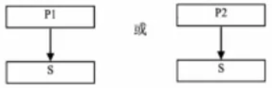

(2) 多重继承(2分)

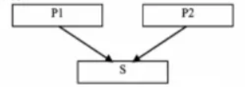

### 2022年4月

**Java中的基本数据类型byte、char、float、long和 short在参与表达式计算时，能够进行自动类型转换的类型顺序依次是什么?**

byte short char long float(4分)

**简要叙述try-catch块的处理过程。**

1.  如果try 块内没有发生异常，则try块内的语句全部执行，然后执行catch 块后的语句。(1分)
2.  如果在try块内发生了某类异常，则执行立即转到对应的catch 块，执行其中的语句去处理异常。(2分)
3.  不论是否捕获到异常，总要执行finally后面的语句。(1分)

**简要叙述包装类的用途,包装类定义存哪个包中?**

1.  当想用处理对象一样的方式来处理基本类型的数据时，必须将基本类型值“包装”为一个对象。(2分)
2.  所有的包装类都定义在 java.lang包中。(2分)

**什么是单重继承与多重继承?**

1.  单重继承是指一个类只能有一个父类。(1分)
2.  多重继承是指从多个类共同派生一个子类，即一个类可以有多个父类。(1分)
3.  Java实现的是单重继承。(2分)

**Java中的继承是哪一种?简要叙述线程死亡的两个原因。**

线程死亡的原因有两个:一是run()方法中最后一个语句执行完毕（2分)，二是当线程遇到异常退出时便进入了死亡状态（2分)。

### 2022年10月

**写出在循环语句中,break语句和continue语句的功能。**

**什么是数组的静态初始化和动态初始化?**

**写出接口定义时对其数据成员变量和方法的要求。**

**写出语句Ellipse2D ellipse = new Ellipse2D.Double(50,80,20,30);的功能。**

**写出Java线程调度所采用的优先级策略。**

# 程序填空题

### 2019年4月

**以下方法getMaxComm()计算正整数m和n的最大公约数并返回。注:方法中使用的是辗转相除法。**

```java
public static int getMaxComm (int m , int n){
  if ( m <= 0 |[n <= 0 ){ System.out.println("输入数据错误! ");}
  if ( m <n ){
    int temp = 0;
    temp = m; m = n;
    /* (1) */
  }
  int r = /* (2) */;
  while ( r != 0 ){
    m = n; n = r; r = m % n;
  }
  return /* (3) */;
}

```

答:

1.  n= temp
2.  m % n
3.  n

**以下MyPanel类在面板上放置一个列表，当单击列表中某个选项时，该选项的值保存在seleltem中。**

```java
class MyPanel extends JPanel implements /*(1)*/ {
  private String seleItem = null;
  JList list;
  MyPanel(String[]listItems){
    list = new JList(listItems); list.setVisibleRowCount(2);
    list.setSelectionMode(ListSelectionModel.SINGLE_SELECTION);
    list.addListSelectionListener(this);
    JScrollPane jsp = new JScrollPane(list);
    add(jsp);
  }
  public String getSeleItem(){ return seleItem;}
  public void valueChanged(/*(2)*/ e) {
    if(e.getSource() == list) {
      seleltem = list./*(3)*/.toString();
    }
  }
}

```

答:

1.  ListSelectionListener
2.  ListSelectionEvent
3.  getSelectedValue()

**以下定义的面板子类TimePanel有一个文本域, 程序每隔1秒在文本域中更新显示当前时间。**

```java
class TimePanel extends JPanel implements Runnable{
  Thread TimeThread = null; JTextField t;
  TimePanel(){
    t=new JTextField(20); add(t);
    TimeThread = new /*(1)*/
    TimeThread.start();
  }
  public void run(){
    Date timeNow;
    while(true){
      timeNow = /*(2)*/;
      t.setText("现在时间:"+timeNow.toString());
      try {
        /*(3)*/
      }catch(InterruptedException e){ }
    }
  }
}

```

答:

1.  Thread(this)
2.  new Date()
3.  sleep(1000)

### 2019年10月

**以下程序分解一个正整数(大于1)的质因数。例如输入12，运行结果是12=2×2×3**。

```java
import java.util.*;
public class Test26{
  public static void main(String []args){
    Scanncr s = new Scanner(System.in);
    System.out.println("Input a number: ");
    int n= /*(1)*/;
    if (n<1) System.exit(O);
    int k=2;
    System.out.print(n+"=");
    while ( k <= n ){
      if ( k == n ){
        System.out.print(n);
        break;
      }
      else if(/*(2)*/)
        System.out.print(k +"×");
        n=n / k;
      }
      else{
        /*(3)*/
      }
    }
  }
}

```

答:

1.  s.nextInt()
2.  n % k == 0
3.  k++

**以下程序在保存随机生成的1000个1～100之间整数的数组中，统计每个整数出现的次数并输出。**

```java
public class Test27{
  public static void main(String[args) {
    int[]arr = new int[1000];
    for (int i=0;i<1000;i++ ){
      arr[i]= (int)(100 * Math.random()+1);//随机生成1至100的整数
    }
    int[]arrCount = new int[100];
    for (int i=0;i<100;i++) /*(1);*/
    for (int i=0;i<1000;i++) /*(2);*/
    System.out.print("整数数组的各值的个数如下: \n");
    for(int i=1;i<=/*(3)*/;i++)
      System.out.print((i)+"的个教为: "+arrCount[i-1]+"\n");
  }
}
```

答:

1.  arrCount\[i]=0
2.  arrCount\[arr\[i]-1]++
3.  arrCount.length

**以下程序将文本域num1和num2内整数的乘积显示在文本域num3内。**

```java
import java.awt.; import java.awt.event. ; import javax.swing.*;
public class Test28{
  public static void main(String[] args){
    new TFrame();
  }
}
class TFrame extends JFrame{
  JTextField num1,num2,num3;
  TFrame(){
    num1=new JTextField(5); num2=new JTextField(5);
    num3=new JTextField(10);
    JLabel lblMul =new JLabel("x");JButton btnEqual = new JButton("=");
    btnEqual.addActionListener(/*(1)*/);
    setLayout(new FlowLayout());
    add(num1); add(lblMul); add(num2);
    add(btnEqual);add(num3);
    pack();setVisible(true);
  }
  class mMonitor implements /*(2)*/{
    public void actionPerformed(ActionEvent e){
      int n1 = Integer.parseInt(num1.getText());
      int n2 = Integer.parseInt(num2.getText());
      num3./*(3)*/(""+(n1*n2));
    }
  }
}
```

答:

1.  new mMonitor()
2.  ActionListener
3.  setText

### 2020年4月

**以下sumOfDivisors()方法的功能是求正整数n的所有约数（因子）之和并返回。**

```java
static int sumOfDivisors (int n){
  int i; int /*(1)*/;
  for(i=1; i<= n; i++){
    if(/*(2)*/)
      sum=/*(3)*/;
  }
  return sum;
}
```

答:

1.  sum=0
2.  n % i==0
3.  sum+i

**以下程序将当前日期及时间作为对象实例写入date.dat文件中。**

```java
import java.io.*; import java.util.Date;
public class Test27{
  public static void main(String[]args){
    Date d = new Date();
    try{
        FileOutputStream f = new FileOutputStream("date.dat");
        ObjectOutputStream s=/*(1)*/;
        s./*(2)*/;
        s.close();
    }catch(FileNotFoundException e){
      e.printStackTrace();
    }catch(/*(3)*/){
      e.printStackTrace();
    }
  }
}

```

答:

1.  new ObjectOutputStream(f)
2.  writeObject(d)
3.  IOException e

**以下程序定义了一个线程类，其功能为显示当前线程的名称。**

```java
class MyThrd implements /*(1)*/ {
  private int i;
  public void /*(2)*/{
  for(i=0; i<5; i++)
    System.out.println(Thread.currentThread()./*(3)*/);
}

```

答:

1.  Runnable
2.  run()

### 2020年10月

**设有二维数组A和B，以下程序将矩阵X保存在数组A中，数组B中保存如矩阵Y所示的内容。**

$$
X={ \left| \begin{matrix} 11 &12 &13 &14 \\ 21 & 22 & 23 &24 \\ 31 &32 &33 &34 \\ 41 &42 &43 & 44 \end{matrix} \right| } \space \space  Y={ \left| \begin{matrix} 54 &44 &34 &24 &14 \\ 53 &43 &33 &23 &13 \\ 52 &42 &32 &22 &12 \\ 51 &41 &31 &21 &11 \end{matrix} \right| } 
$$

```java
public class Test26{
  public static void main(String[] args){
  int A[][]= new int[5][4],B[][]=new int[4][5];int i,j;
  for(i=0; i<5; i++)
    for(j=0;/*(1)*/;j+)A[i]i]=/*(2)*/;
  for(i=0; i<4; i++)
    for(j=0; j<5; j++)/*(3)*/;
  }
}
```

答:

1.  j<4
2.  (i+1)\*10+j+1
3.  B\[i]\[i]=A\[4-j]\[3-i]

**以下程序将输出: Jim 2019100\[Internet project]。**

```java
import java.util.Vector;
class Person {
  private String name="John";
  public String getName() {return name;}
  public void setName(String n){name=n;}
}
class Employee extends Person{
  private int employeeNumber;
  public int getEmployeeNumber(){return employeeNumber;}
  public void setEmployeeNumber(int number){employeeNumber = number;}
}
class Manager extends Employee{
  private String department;
  public Vector<String>responsibilites;
  public Vector<String>getResponsibilites(){return responsibilites;}
}
public class Test27{
  public static void main(String []args){
    Manager jim = new Manager();
    jim.sctName("Jim");jim.setEmployeeNumber(2019100);
    jim.responsibilites=/*(1)*/;
    jim.responsibilites.add("Internet project"");
    System.out.print(jim./*(2)*/+"");
    System.out.print(jim.getEmployeeNumber()+"");
    System.out.print(/*(3)*/);
  }
}
```

答:

1.  new Vector \<String>()
2.  getName()
3.  jim.getResponsibilities()

**以下程序显示两个按钮和一个文本区，并响应按钮事件。当按下按钮Hello时，在文本区显示“Button Hello pressed”"，如题28图所示;当按下按钮Close时，关闭窗口。**

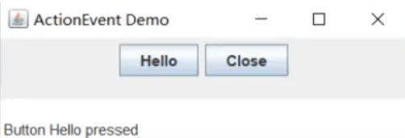

```java
import java.awt.*;import javax.swing.*; import java.awt.event.*;
public class Test28 {
  public static void main(String[] args) {
    ActionEventDemo aed = new ActionEventDemo();
    aed.go();
  }
}
class ActionEventDemo implements /*(1)*/{
  JFrame frame;JButton b1,b2;JTextArea ta; JPanel panel;
  public void go(){
      frame = new JFrame ("ActionEvent Demo");
      bl =new JButton("Hello");b2=new JButton("Close");
      ta =new JTextArea(0,30);
      panel = new JPanel(); panel.add(b1); panel.add(b2);
      b1.addActionListener(this);b2.addActionListener(this);
      frame.getContentPane().add(panel, BorderLayout.CENTER);
      frame.getContentPane().add(ta, BorderLayout.SOUTH);
      frame.pack();frame.setVisible(true);
      frame.setDefaultCloseOperation(JFrame.EXIT_ON_CLOSE);
  }
  public void actionPerformed(ActionEvent e){
    JButton mybut = (JButton)e./*(2)*/;
    if (mybut/*(3)*/){
      ta.append("In Button Hello pressed");
    }
    else System.exit(O);     
  }
}

```

答:

1.  ActionListener
2.  getSource()
3.  \== b1

### 2021年4月

**以下程序从键盘输入1至9之间的一个整数a，计算从一个a到a个a的和s并输出。例如，当a=5时，s =5+55+555+5555+55555。**

```java
import java.util.Scanner;
public class Test26{
  public static void main(String[] args){
    int a, s=0, r=0;
    Scanner sc=new Scanner(System.in);
    System.out.printIn("输入1~9间的一个整数:");  
    a=/*(1)*/;
    for(int i=1;i<=a;i++){
      r=/*(2)*/;
      s=/*(3)*/;
    }
    System.out.println("和为:"+s);
  }
}

```

答:

1.  sc.nextInt()
2.  r\*10+a
3.  s+r

**以下程序定义了父类Person和子类Student。程序将输出:Liubei 25 Shanghai A。**

```java
class Person{
  private String name;
  private int age;
  public String getName({return name;}
  public void setName(String name){this.name=name;}
  public int getAge(){ return age; }
  public void setAge(int age){this.age=age; }
  Person(String name, int age){this.name=name; this.age=age; }
  public String toString(){
    String s=name+"\t"+age;
    return s;
  }
}
class Student extends Person{
  private String hometown;
  private char grade;
  Student(String name, int age, String hometown, char grade){
    /*(1)*/
    this.hometown=hometown;
    this.grade=grade;
  }
  void print(){
    String s=/*(2)*/+"+hometown+"+grade;
    System.out.println(s);
  }
}
public class Test27{
  public static void main(String[ ] args){
    Student st=new Student("Liubei", 25, "Shanghai",'A');
    st./*(3)*/;
  }
}

```

答:

1.  super(name,age)
2.  super.toString()
3.  print()

**以下程序创建一个窗口，窗口内放置一个面板，在面板中绘制直线和矩形。**

```java
import javax.swing.*; import java.awt.*;
public class Test28{
  public static void main(String[] args){
    MyFrame frame = new MyFrame();
  }
}
class MyFrame extends JFrame {
  public MyFrame(){
    setTitle("Test28");
    setSize(300,200);
    getContentPane().add(/*(1)*/);
    setVisible(true);
  }
}
class MyPanel extends JPanel{
  Image myImg;
  public void paintComponent(/*(2)*/){
    g.setColor(Color.green);
    g.drawLine(100,50, 30,50);
    g.setColor(Color.red);
    /*(3)*/(100,50,100,46);
  }
}

```

答:

1.  new MyPanel()
2.  Graphics g
3.  g.drawRect

### 2021年10月

**以下程序从键盘输入一个正整数，然后将该正整数的备位数字反序输出。例如，当输入正整数123时，程序输出321。**

```java
import java.util.Scanner;
public class Test26{
  public static void main(String[]args){
    int i,j;
    Scanner sc= new Scanner(System.in);
    System.out.print("输入一个正整数:");
    i=sc.nextInt();
    while(/*(1)*/){
      j=/*(2)*/;
      System.out.print(j);
      /*(3)*/
    }
  }
}
```

答:

1.  i ≠ 0
2.  i % 10
3.  i ≠ 10

**以下程序定义了父类Person、Person的子类Employee和 Employee的子类Manager。**

```java
import java.util.Vector;
class Person {
  private String name = "John";
  public String getName(){ return name; }
  public void setName(String n){ name= n; }
}
class Employee extends Person {
  private int employeeNumber;
  public int getEmployeeNumber({ return employeeNumber; }
  public void setEmployeeNumber(int number){/*(1)*/=number; }
}
class Manager extends Employee { 
  public Vector<String> esponsibilities;
  public Vector<String> getResponsibilities(){ return responsibilities; }
}
public class Test27{
  public static void main(String [args) {
    Employee jim = new Manager();
    jim.setName("Jim");
    Manager unknown=(/*(2)*/)jim;
    unknown.setEmployeeNumber(1023):
    unknown.responsibilities = new Vector<String>();
    unknown.responsibilities./*(3)*/("Internet project");
    unknown.responsibilities.add("Internet project1");
    System.out.printIn(jim.getName());
    System.out.println(jim.getEmployeeNumber());
    System.out.println(unknown.getName());
    System.out.printIn(unknown.getEmployeeNumber()));
    System.out.println(unknown.getResponsibilities());
  }
}

```

答:

1.  employeeNumber
2.  Manager
3.  add

**以下程序实现了MouseMotionListener接口。**

```java
import java.awt.*;
import java.awt.event.*;
import javax.swing.*;
public class Test28 /*(1)*/ MouseMotionListener {
  private JFrame frame;
  private JTextField tf;
  public static void main(String args[]){
    Test28 one =new Test28();
    one.go();
  }
  public void go(){
    frame =new JFrame("listener example");
    Container contentPane = frame.gotCantentPane();
    contentPane.add(new Label (arag the mouse"), BorderLayout.NORTH);
    tf = new JTextField(30);
    contentPane.add(tr, BorderLayout.SOUTH);
    frame./*(2)*/;
    frame.setSize(300,300);
    frame.setVisible(true);
    frame.setDefaultCloseOperation(JFrame.EXIT_ON_CLOSE);
  }
  public void /*(3)*/(MouseEvent e){
    String s = "Mouse dragging:X = "+ e.getX() +"Y = "+ e.getY();
    tf.setText(s);
  }
  public void mouseMoved (MouseEyent e){}
}
```

答:

1.  implements
2.  addMouseMotionListener(this)
3.  mouseDragged

### 2022年4月

**以下程序的运行结果是将如下的矩阵保存在5行5列的二维数组intArray中,**

$$
\left[ 
\begin{matrix} 1 &2 &3 &4 &5 
\\ 2 &4 &7 &11 &16 
\\ 3 &7 &14 &25 &41 
\\ 4 &11 &25 &50 &91
\\ 5 &16 &41 &91 &182
\end{matrix} 
\right]
$$

除第一行和第一列外，每个位置的元素是其左侧相邻元素及上面相邻元素之和。

```java
public class Test26{
  public static void main(String[] args) {
    int intArray[][]=new int[5][5];
    int i, j;
    for(i=0; i<5; i++) /*(1)*/;
    for(i=1; i<5; i++) /*(2)*/;
    for(i=1; i<5; i++) 
      for(j=1; j<5; j++)
        intArray[i][j]=/*(3)*/;
  }
}
```

答:

1.  intArray\[i]\[0]= i+1
2.  intArray\[0]\[i]= i+1
3.  intArray\[i-1]\[j]+intArray\[i]\[j-1]

**以下程序定义了父类Employee和子类Manager。程序将输出:Jim 2。**

```java
class Employee{
  private String name;
  static int ID=0;
  public Employee(String s){
    name=s;
    ID++;
  }
  String getName(){ return name; }
  int getID(){ return lD; }
}
class Manager extends Employee{
  private String department;
  public Manager(String s, String d){
    /*(1)*/
    department=d;
  }
  String getDepart(){ return department; }
}
public class Test27{
  public static void main(String[ ]args){
    Employee jim = new Employee("Jim");
    Manager adom = new Manager("Adom", "HR");
    System.out.printIn(jim./*(2)*/+""+jim./*(3)*/);
  }
}
```

答:

1.  super(s)
2.  getName()
3.  getlD()

**以下程序当点击组合框中的选项时，在下面的文本区中将显示相关的信息。例如,当依次点击了"One"、"Two"和"Three"后，显示结果如题28图所示。初始时,组合框中显示"Three", 文本区中显示空白。**

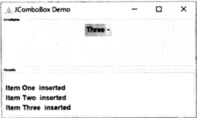

```java
import java.awt.*; import java.awt.event.*; 
import javax.swing.*;import javax.swing.border.*;
public class Test28{
  public static void main(String[] args){
    JComboBoxDemo cbd = new JComboBoxDemo();
    cbd.go();
  }
}

class JComboBoxDemo implements ActionListener {
  JFrame frame = new JFrame("JComboBox Demo");
  JComboBox<String> jcb;
  JTextArea ta = new JTextArea(0,30);
  JPanel p1 = new JPanel(); JPanel p2 = new JPanel();JPanel p3 =new JPanel();
  String[] itemList = { "One", "Two", "Three", "Four", "Five"};
  public void go(){
    jcb = new JComboBox<String>(itemList);p1.add(jcb);
    jcb./*(1)*/;
    Border etched = BorderFactory.createEtchedBorder();
    Border border = BorderFactory.createTitledBorder(etched, "Uneditable");
    p1.setBorder(border);
    JScrollPane jp = new JScrollPane(ta);
    p2.setLayout(new BorderLayout()); p2.add(jp);
    border = BorderFactory.createTitledBorder(etched,"Results");
    p2.setBorder(border);
    jcb./*(2)*/;
    p3.setLayout(new BorderLayout()); p3.add(pl);
    Container cp = frame.getContentPane();
    cp.setLayout(new GridLayout(0,1)); cp.add(p3); cp.add(p2);
    frame.pack(); frame.setVisible( true);
    frame.setDefaultCloseOperation(JFrame.EXIT_ON_CLOSE);
  }
  public void actionPerformed(ActionEvent e){
  JComboBox jcbcurrent = (JComboBox)e.getSource();
    if (jcbcurrent == jcb){
      ta.append("\n Item "+/*(3)*/+"inserted");
    }
  }
}


```

答:

1.  setSelectedIndex(2)
2.  addActionListener(this)
3.  jcb.getSelectedItem()

### 2022年10月

**以下程序从键盘输入一个正整数，并判断该数是否为回文数（如12321是回文数,左右对称）。**

```java
import java.util.Scanner;
public class Test26 {
  public static void main(String[] args) {
    int data;
    Scanner scan = new Scanner(/*(1)*/);
    data = scan.nextInt();
    if(/*(2)*/){
      System.out.println(data + " is a palindrome number.");
    }
  }
  public static boolean isPalindrome(int data) {
    int temp=data, n=0;
    while (temp != 0) {
      n=n*10+temp%10;
      /*(3)*/
    }
    return (data =- n);
  }
}


```

**以下程序在子类中通过调用父类的方法完成构造及显示功能，程序运行结果为:**

(10,20)

Radius: 5

```java
class Point {
  int x,y;
  public Point(int i, int j) {
    x=i; y=j;
  }
  void show() {
    System.out.println("("+x+","+y+")");
  }
}
class Circle extends Point {
  int r;
  public Circle(int i,int j,int k){
    /*(1)*/
    r=k;
  }
  void show(){
    /*(2)*/
    System.out.println("Radius: " + r);
  }
}
public class Test27 {
  public static void main(String[] args){
    Circle c = new Circle(10,20,5);
    /*(3)*/
  }
}

```

**以下程序实现对象的序列化及反序列化。**

```java
import java.io.*;
class Product implements /*(1)*/ {
  int id;
  string type;
  public Product(int id, String type){
    this.id = id;this.type = type;
  }
  public Product() {
    this.id=0; this.type="";
  }
}
public class Test28 {
  public static void main(String[]args){
    Product pdcts = new Product(90001, "Computer");
    try {
      FileOutputStream fo=new FileOutputStream("data.ser");
      ObjectOutputStream so=new ObjectOutputStream(fo);
      so./*(2)*/;
      so.close();
    catch(Exception e) {
      System.out.println(e);
    }
    Product pdctr = new Product();
    try {
      FileInputStream fi = new FileInputStream("data.ser");
      ObjectInputStream si = new ObjectInputStream(fi);
      pdctr = (Product)si./*(3)*/;
      si.close();
    }catch(Exception e){
      System.out.println(e);
    }
  }
}


```

# 程序分析题

### 2019年4月

**阅读以下程序，请写出该程序的输出结果。**

```java
public class Test29{
  static void s(int[] b, int k){
    int i, j, t;
    for(i=1; i<k; i++){
      for(t=b[i], j=i-1; j>=0&&t>b[j]; j--)
        b[j+1]= b[j];
      b[j+1]=t;
    }
  }
  public static void main(String[] args){
    int i; int[] a= {16,12,27,11,13,33};
    s(a, 6);
    for(i = 0; i <a.length; i++) System.out.print(a[i]+" ");
    System.out.println();
  }
}

```

答:

33、33、27、16、13、12、11

**阅读以下程序，请写出该程序的输出结果。**

```java
class Tree{
  String n; boolean isT;
  Tree(String name, boolean t){n=name;isT=t; }
  public void printTree(String str){
    System.out.println();System.out.print(str);
    System.out.print("Name:"+n+",");
    System.out.print(" is Tree:"+isT);
  }
}
class Poplar extends Tree {
  public boolean isP;
  Poplar(String n, boolean f, boolean c){ super(n, f);isP= c; }
  public void printTree(String str){
    super.printTree(str); System.out.println(", Coni:" + isP);
  }
}
public class Test30 {
  public static void main(String[] args){
    Tree tOb1 = new Tree("Cabbage", false);
    Poplar tOb2 = new Poplar("Poplar", true, true);
    tOb1.printTree("cabbage:"); tOb2.printTree("poplar:");
  }
}


```

答:

1.  cabbage:Name:Cabbage, is Tree:false (3分)
2.  poplar:Name:Poplar, is Tree:true,Coni:true(3分)

**阅读以下程序，请回答下列问题:**

(1)程序运行时，在文本域中输入30并回车，程序输出什么样的图形?该图形是什么颜色的?
(2)包围该图形的最小矩形的宽和高分别是多少像素?

```java
import javax.swing.*; import java.awt.*; import java.awt.event.*;
class MyPanel extends JPanel implements ActionListener {
  JTextField text; int width, height; int posX,posY,radius;
  MyPanel() {
    setLayout(new BorderLayout()); text = new JTextField(10);
    add(text, BorderLayout.NORTH); text.addActionListener(this);
  }
  public void paintComponent(Graphics g){
    g.setColor(Color.red);
    g.drawOval(posX, posY, radius * 2, radius * 2);
  }
  
  public void actionPerformed(ActionEvent e){
    if (e.getSource() == text){
      int r = Integer.parseInt(text.getText());
      width = this.getWidth(); height = this.getHeight();
      posX = width/2 -r; posY = height/2 -r;
      radius = r;
      repaint();
    }
  }
}

public class Test31 {
  public static void main(String[] args){
    JFrame myFrame = new JFrame();
    myFrame.getContentPane().add(new MyPanel());
    myFrame.setSize(200,250);myFrame.setLocation(100,100);
    myFrame.setVisible(true);
  }
}

```

答:

(1)输出一个空心圆(2分)，该图形的颜色是红色的（2分)。

(2)包围该图形的最小矩形的宽和高都是60像素。(2分)

### 2019年10月

**阅读以下程序，请写出该程序的输出结果。**

```java
abstract class Person{
  String name;
  int age;
  String occupation;
  public abstract String talk();
}
class Student extends Person{
  public Student(String name, int age, String occupation){
    this.name = name; this.age = age;
    this.occupation = occupation;
  }
  public String talk(){
    return "学生-->姓名:"+this.name+""，年龄:""+-this.age+"! ";
  }
}


```

答:

学生-->姓名:张珊,年龄:20! (3分)

工人-->姓名:李明,年龄:30! (3分)

**阅读以下程序，请写出该程序的输出结果。**

```java
FileInputStream fin = null;
FileOutputStream fout = null;
try{
  fin = new FilelnputStream("d:/text1.txt");
  fout = new FileOutputStream("d:/text2.txt");
  while((fb = fin.read()) !=-1 ){
    fout.write(fb);
  }
  fin.close();
  fout.close();
}catch(FileNotFoundException e2){
  System.out.println("文件不存在!"); System.exit(-1);
}catch(IOException e1){
  System.out.println("操作失败!"); System.exit(-1);
}
System.out.println("操作完成!");
```

答:

打开文件d:text1.txt和 d:text2.txt (1分)，按顺序读取 d:text1.txt文件中的字(2分)，并将其写入 d:\text2.txt文件中(2分)，操作完成后关闭两个文件并显示"操作完成!"(1分）

**阅读以下程序，请写出该程序的输出结果。**

```java
public class Test31 implements Runnable{
  public void run(){
    
  }
}
```

答:

-   在run()方法中-这个线程休眠200秒(2分)
-   在main()方法中-中断其它线程(2分)
-   在run()方法中-中断线程(2分)

### 2020年4月

**阅读以下程序，请写出该方法的功能。**

```java
static int[] fun(int[] a){
  for(int i=0;i<a.length-1;i++){
    for(int j=i+1;j<a.length;j++){
      if(a[i]>a[j]){
        int temp=a[i]; a[i]=a[j]; a[j]=temp;
      }
    }
  }
  return a;
}

```

答: 该方法对输入的一维数组(2分)中各元素按照从小到大顺序进行排列(2分)，并返回排序后的数组(2分)。

**阅读以下程序，请写出该程序的输出结果。**

```java
public class SuperClass {
  public static void main(String[] args){
    new SuperClass (0); new SubClass (); new SubClass (1);
  }
  SuperClass (){ System.out.print("A\n"); }
  SuperClass (int i){ this(); System.out.print("AA\n"); }
}
class SubClass extends SuperClass {
  SubClass ({ super(); System.out.print("B\n"); }
  SubClass (int i){ super(); System.out.print("BB\n");}
}

```

答:

1.  A(1分)
2.  AA(1分)
3.  A(1分)
4.  B(1分)
5.  A(1分)
6.  BB(1分)

**阅读以下程序,请回答下列问题。**

1.  该程序运行界面中除框架外还有什么组件?各有多少个?
2.  这些组件是如何分布的?

```java
import java.awt.*; import javax.swing.*;
class MyWin extends JFrame{
  String[] buttonTxt={"ADD","SUBTRACT"","MULTIPLY","DIVIDE"};
  JButton[] bList = new JButton[buttonTxt.length];
  JRadioButton rb1, rb2;
  ButtonGroup bg;
  MyWin(){
    setTitle("test31");
    Container con = getContentPane();
    con.setPreferredSize(new Dimension(600,200));
    con.setLayout(new GridLayout(0,4));
    for(int i = 0; i<bList.length; i++){
      bList[i] = new JButton(buttonTxt[i]);
      con.add(bList[i]);
    }
    rb1 = new JRadioButton("DEC"); rb2=new JRadioButton("HEX");
    bg = new ButtonGroup(); bg.add(rb1); bg.add(rb2);
    con.add(rb1); con.add(rb2);
    pack(); setVisible(true);
  }
}
public class Test31 {
public static void main(String[] args){
  MyWin w = new MyWin();
  w.setDefaultCloseOperation(JFrame.EXIT_ON_CLOSE);
}

```

答:

1.  界面中除框架外还有按钮(1分)和单选按钮(1分)两种组件，其中按钮有4个(1分)，单选按钮有2个(1分)。
2.  4个按钮在第一行，2个单选按钮在第二行。(2分)

### 2020年10月

**阅读以下程序，写出该程序的输出结果。**

```java
abstract class ObjectSrorage{
  int objectnum =0;
  int storage[]=new int[100];
  abstract void put(int o);
  abstract int get();
}
class Stack extends ObjectSrorage{
  private int point=0;
  public void put(int o){
    storage[point++]=o;
    objectnum++;
  }
  public int get(){
    objectnum--;
    System.out.println(storage[--point]);
    return storagc[point];
  }
}

public class Test29{
  public static void main(String args[]){
    Stack s=new Stack();
    int initV = 5;
    s.put(initV * 2); s.put(initV * 3);
    s.put(s.get()+ s.get()); s.put(initV * 3);
    System.out.println(s.get());
    System.out.println(s.get());
  }
}
```

答:

1.  15
2.  10
3.  15
4.  15
5.  25
6.  25

**阅读以下程序，写出该程序的输出结果。**

```java
import java.io.* ; import java.util.Date;
public class Test30{
  public static void main(String args]){
    String data = null;
    if(args.length != 1){
      System.out.print("usage: type filename" );
      System.exit(1);
    }
    try{
      File txtfile = new File(args[0]);
      FileInputStream filestream = new FileInputStream(args[0]);
      BufferedReader os =new BufferedReader(new InputStreamReader(filestream));
      for(;;){
        data= os.rcadLinc();
        if (data == null) break;
        System.out.println(data);
      }
    }catch(IOException c){
      e.printStackTrace();
    }
  }
}

```

答:

在屏幕显示文本文件的内容。如果在命令行没有给出文件名，则给出提示信息"usage: type filename"。

**阅读以下程序，写出该程序的输出结果。**

```java
public class Test31 implements Runnable {
  public void run(){
    try {
      Thread.sleep(400);
      System.out.println("run()-[1]");}
    catch(InterruptedException x){
      Systcm.out.println("run()-[2]");
      return;
    }
    System.out.println("run() - 3"");
  }
  public static void main(String[]args){
    Test31 onc = new Test31();
    Thread other = new Thread(one);
    Thrcad third = new Thrcad(one);
    other.start();
    third.start();
    try{
      System.out.println("run()-[a]");
      Thread.sleep(200);
    }catch (InterruptedException x){}
    System.out.println("run()-[b]");
  }
}

```

答:

1.  run() - \[a]
2.  run() - \[b]
3.  run() - \[1]
4.  run() - \[3]
5.  run() - \[1]
6.  run() - \[3]

### 2021年4月

**阅读程序，写出该程序的输出结果。**

```java
class SuperClass{
  String name;
  public SuperClass(String s){
    name = s;
    System.out.println(s);
  }
  public void method({
    System.out.println("superclass!");
  }
}
class SubClass extends SuperClass{
  String department;
  public SubClass(String s, String d){
    super(s);
    department = d;
    System.out.println(d);
  }
  public void method(){ }
}
public class Test29{
  public static void main(String[] args){
    SuperClass superc = new SuperClass("super");
    SubClass subc = new SubClass("sub1","Java");
    SuperClass ssc = new SubClass("sub2","Java");
    superc.method();
    subc.method();
    ssc.method();
  }
}

```

答:

1.  super(1分)
2.  sub1(1分)
3.  Java (1分)
4.  sub2 (1分)
5.  Java (1分)
6.  spuerclass!(1分)

**阅读程序，描述该程序的输出结果。**

```java
import java.io.*;
public class Test30{
  public static void main(String[] args) throws IOException{
    InputStreamReader isr=new InputStreamReader(System.in);
    BufferedReader br=new BufferedReader(isr);
    String str=br.readLine();
    int i, ditNo=0, upCharNo=0, loCharNo=0, otherCharNo=0;
    for(i=0; i<str.length(); i++){
      if(str.charAt(i)<='9' && str.charAt(i)>=0')
        ditNo++;
      else if(str.charAt(i)<='Z && str.charAt(i)>='A')
        upCharNo+十;
      else if(str.charAt(i)<='z' && str.charAt(i)>='a')
        loCharNo++;
      else otherCharNo++;
    }
    System.out .println("N1="+ditNo+"\t"+"N2="+upCharNo);
    System.out.println("N3="+loCharNo+"\t"+"N4="+otherCharNo);
  }
}

```

答: 该程序读入一串字符(1分)，分别统计其中数字的个数(1分)、大写字母的个数(1分)、小写字母的个敌(1分）及其他符号的个数(1分)，并输出统计结果(1分)。

**阅读程序，写出该程序的输出结果。**

```java
class MyThread3 implements Runnable{
  private String[] s;
  public MyThread3(String[] s){
    this.s=s;
  }
  public void run(){
    int count=0;
    long startTime = System.currentTimeMillis();
    long endTime = System.currentTimeMillis();
    while(endTime - startTime < 4500) {
      try{
        if(s[count%s.length].equals("Yellow")){
          System.out.println("Yellow on");
          Thread.currentThread().sleep(800);
        }
        if(s[count%s.length].equals("Red")){
          System.out.println("Red on");
          Thread.currentThread().sleep(1000);
        }
        if(s[count%s.length].equals("Green")){
          System.out.println("Green on");
          Thread.currentThread().sleep(3000);
        }
        count++;
        endTime = System.currentTimeMillis();
      }
      catch(Exception e){
        e.printStackTrace();
      }
    }
  }
}
class Test31 {
  public static void main(String[] args){
    String [] s={"Green","Red","Yellow"};
    Thread t = new Thread(new MyThread3(s));
    t.start();
  }
}

```

答:

1.  Green on (2分)
2.  Red on (2分)
3.  Yellow on (2分)

### 2021年10月

**阅读程序，写出该程序的输出结果。**

```java
public class Test29{
  float m_float;
  void change(int pi){ pi=100; }
  void change(String ps){
    ps= new String("Right");
  }
  void change(Test29 po){
    po.m_float= 100.0f;
  }
  public static void main(String[] args){
    Test29 pt = new Test29();
    int i= 22;
    pt.change(i);
    System.out.println("i value is " + i);
    String s =new String("Hello");
    pt.change(s);
    System.out.printIln("s value is"+s);
    pt.m_float= 22.0F;
    pt.change(pt);
    System.out.println("Current pt.m_float is " + pt.m_float);
  }
}
```

答:

1.  i value is 22(2分)
2.  s value is Hello(2分)
3.  Current pt.m\_float is 100.0(2分)

**阅读程序，写出该程序的输出结果。**

```java
import java.io.*;
public class Test30 {
  public static void main(String args[]){
    try {
      FileInputStream in = new FileInputStream("fortest30.txt");
      while(in.available() > 0)
        System.out.print(in.read()+"");
      in.close();
    }
    catch (FileNotFoundException e) {
      System.out.println("Error: Cannot open file for reading.");
    }
    catch (EOFException e){
      System.out.println("Error EOF encountered, file may be corrupted.");
    }catch (IOException e){
      System.out.println("Error: Cannot read from file.");
    }
  }
}

```

答:

该程序读入文件"fortest30.txt"(2分),将文件内各字符的ASCII码输出到屏幕上(2分),如果打开文件时出错,则进行异常处理(1分),显示对应的出错信息(1分)。

**阅读程序，写出该程序的输出结果。**

```java
public class Test31 implements Runnable{
  private int assignment=6;
  public void run(){
    while(true){
      try{
        Thread.sleep(1);
      }catch(InterruptedException e){
        e.printStackTrace();
      }
      synchronized(this){
        if(assignment>0)
          System.out.println(Thread.currentThread().getName()
            +":send "+(assignment--)+"# paper");
        else
          break;
      }
    }
  }
  public static void main(String[]args){
    t31=new Test31();
    new Thread(t31,"T").start();
  }
}
```

答:

1.  T:send 6# paper(1分)
2.  T:send 5# paper(1分)
3.  T:send 4# paper(1分)
4.  T:send 3# paper(1分)
5.  T:send 2#paper(1分)
6.  T:send 1# paper(1分)

### 2022年4月

**阅读程序，写出该程序的输出结果。**

```java
class SuperClass{
  String name;
  SuperClass(String n){ name = n; }
  public void method(){
    System.out.print(name+"");
    System.out.println("superclass!");
  }
}
class SubClass extends SuperClass {
  public SubClass(String n){ super(n); }
  public void method(){
    super.method();
    System.out.println("subclass!"");
  }
}
public class Test29{
  public static void main(String args[]){
    SuperClass superc = new SuperClass("Super"");
    SubClass subc = new SubClass("Sub1");
    SuperClass ssc = new SubClass("Sub2");
    superc.method();subc.method();ssc.method();
  }
}
```

1.  Super superclass! (1分)
2.  Sub1 superclass! (1分)
3.  subclass! (1分)
4.  Sub2 superclass! (1分)
5.  subclass! (2分)

**阅读程序，写出该程序的输出结果。**

```java
import java.io.BufferedReader;import java.io.IOException;
import java.io.InputStreamReader;
class MyStringException extends Exception{
  public MyStringException(){super("too long");}
  public MyStringException(String message){ super(message);}
}
public class Test30{
  public static void main(String []args) throws IOException{
    int maxLength=Integer.parseInt(args[0]);
    BufferedReader keyboard=new BufferedReader(new InputStreamReader(System.in));
    try{
      String input=keyboard.readLine();
      if(input.length()<maxLength)
        System.out.println(input);
      else
        throw new MyStringException();
    }catch(MyStringException e){
      System.out.println(e.getMessage()));
    }
  }
}

```

&#x20; 通过命令行参数给出接收字符串的上限(1分)。然后接收从键盘读入的字符串(1分)。若字符串中所含字符个数少于程序设定的上限(1分)，则在屏幕上输出这个字符串(1分);否则抛出 MyStringExceptionl异常(1分)，在异常处理中输出"too long"(1分)。

**阅读程序，写出该程序的输出结果。**

```java
public class Test31 implements Runnable{
  public void run({
    try {
      System out print1n("run()-<1>");
      Thread.sleep(100);
      System.out.println("run()-<2>");
    }
    catch (InterruptedException x){
      System.out.println("run()-<3>");
      return;
    }
    System.out.println("run()-<4>");
    System.out.println("run()-<5>");
  }
  public static void main(String[] args){
    Test31 one = new Test31();
    Thread other = new Thread();
    Thread third = new Thread(one);
    other.start(); third.start();
    try {
      System.out.println("run()-<6>"");
      Thread.sleep(200);
    }catch (InterruptedException x){}
    System.out.println("main()-<7>");
    other.interrupt();
  }
}

```

1.  run()-<6>(1分)
2.  run()-<1>(1分)
3.  run()-<2>(1分)
4.  run()-<4>(1分)
5.  run()-<5>(1分)
6.  main()-<7>(1分)

### 2022年10月

**阅读程序，写出该程序的输出结果。**

```java
public.class Test29 {
  public static void stringReplace(String text) {
    text = text + "2022";System.out.println(text);
  }
  public static void bufferReplace(StringBuffer text){
    text= text.append("2022");
    System.out.println(text);
  }
  public static void main(String[] args) {
    String textString = new String("Beijing");
    StringBuffer textBuffer = new StringBuffer("Beijing");
    stringReplace(textString);
    bufferReplace(textBuffer);
    System.out.printIln(textString +" "+textBuffer);
  }
}

```

**阅读程序，写出该程序的输出结果。**

```java
class Fruit {
  protected double weight;
  public Fruit() {
    System.out.println("These are some fruit.");
  }
  double getWeight() {
    return weight;
  }
}
class Apple extends Fruit {
  public Apple(double iw){
    weight = iw;
    System.out.printIn("This is an apple.");
  }
}
class Weight {
  public weight(Fruit f) {
    System.out.println("It weights " + f.getWeight() + " pounds.");
  }
}
public class Test30 {
  public static void main(String[] args) {
    Apple a = new Apple(0.5);
    new Weight(a);
  }
}
```

**阅读程序，写出该程序的输出结果。**

```java
public class Test31 extends Thread{
  static int total = 1;
  int n;
  public Test31(int n){
    this.n = n;
  }
  public void showTotal() {
    System.out.println(total);
  }
  public void run() {
    try{
      sleep(n);
      total = total + n;
      System.out.println(total);
    }
    catch(Exception e){
      System.out.println(e);
    }
  }
  public static void main(String[] args) {
    Test31 t1 = new Test31(1500);
    Test31 t2= new Test31(500);
    t2.showTotal();
    t1.start();
    t2.start();
  }
}

```

# 程序设计题

### 2019年4月

**请编写方法 int lessKeyFirst(int\[] a, int key)，该方法的功能是返回已知整数数组a内第一个小于指定值key 的元素的下标。若没有找到小于key的元素，则返回-1。**

```java
int lessKeyFirst(int[] a, int key){
  //请在答题纸上填写此处应编写的代码
  for(int i= 0; i < a.length; i++){(2分）
    if(a[i]<key) (2分)
      return i; (1分)
  }
  return -1;(2分)
}
```

**类Test33构造了2个文本域及2个按钮，如题33图所示。其中，“Copy”按钮的功能是将文本域tfs中的内容复制到文本域tft中,“Clear”按钮的功能是清空两个文本域。**

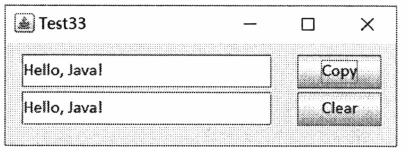

**注:要求你编写代码，实现单击两个按钮要完成的事件处理程序。**

```java
import java.awt.*; import java.awt.event.*; import javax.swing.*;
public class Test33 extends WindowAdapter implements ActionListener{
  JFrame f; JButton bClear, bCopy;JTextField tfs, tft;
  public static void main(String[] args){
    Test33 t = new Test33(); t.go();
  }
  public void go() {
    f = new JFrame("Test33");
    f.setLayout(null);
    f.setSize(490,180);
    tfs = new JTextField(15); tft = new JTextField(15);
    bCopy = new JButton("Copy"); bClear = new JButton("Clear");
    tfs.setBounds(20,15,300,40); tft.setBounds(20,60,300,40);
    bCopy.setBounds(350,15,100,40);
    bClear.setBounds(350,60,100,40);
    f.add(tfs); f.add(tft); f.add(bCopy); f.add(bClear);
    bClear.addActionListener(this);
    bCopy.addActionListener(this);
    f.setVisible(true);
  }
  public void actionPerformed(ActionEvent e){
    // 请在答题纸上填写此处应编写的代码
    if(e.getSource() == bCopy) (2分)
      tft.setText(tfs.getText());(2分)
    else {(1分)
      tfs.setText("");(1分)
      tft.setText("");(1分)
    }
  }
}
```

### 2019年10月

32\.

```java
int[][]arr2 =new int[arr[0].length][arr.length];(2分)
for (int i= 0; i<arr[0].length; i++){ (2分)
   for (int j= 0; j< arr.length, j++){ (2分)
      arr2[i][j]=arr[j][i];(1分)
   }
}
```

33\.

```java
BarMain = new JMenuBar();(1分)
frame.setJMenuBar(barMain);(1分)
menuFile = new JMenu( "File" );（1分)
barMain.add(menuFile);(1分)
itemOpen= new JMenultem( "Open..." );(1分)
itemExit= new JMenultem( "Exit",KeyEvent.VK_X ); (1分)
menuFile.add(itemOpen);
menuFile.add(itemExit);(1分)
```

### 2020年4月

**请编写方法 int lessKeyCount(int\[]a, int min, int max)，该方法的功能是返回已知整数数组a内所有大于min并且小于max的元素的个数num。**

```java
int lessKeyCount(int[] a, int min, int max){
  // 请在答题卡(纸)上填写此处应编写的代码
  int num=0;(1分)
  for(int i=0; i<a.length; i++)(2分)
    if(a[i]>min && a[i]<max)(2分)
      num++;(1分)
  return num;(1分)
}
```

**类MyWin构造了3个文本域及1个“连接”按钮，该按钮的功能是连接前2个文本域中的字符串，并将结果放在最右边的文本域中，如题33图所示。若结果为空串，则最右边的文本域中显示NULL。注:要求你编写代码，实现单击“连接”按钮所完成的事件处理程序。**

```java
import java.awt.*; import java.awt.event.*; import javax.swing.*;
class MyWin extends JFrame implements ActionListener {
  JButton butt = new JButton("连接");
  JTextField textl= new JTextField(10);
  JTextField text2 = new JTextField(10);
  JTextField text3 = new JTextField(20);
  MyWin(){
    super("Test33");
    Container con = getContentPane();
    con.setLayout(new GridLayout(1,3));
    con.setPreferredSize(new Dimension(600,50));
    con.add(text1);con.add(text2);con.add(butt);con.add(text3);
    butt.addActionListener(this);
    pack(); setVisible(true);
  }
  public void actionPerformed(ActionEvent e)
    String a,b,c;
    // 请在答题卡（纸）上填写此处应编写的代码
    a=textl.getText();(1分)
    b=text2.getText();(1分)
    c=a+b;//(或ca.concat(b);)(1分)
    if(c.length()!=0)(1分)
      text3.setText(c);(2分)
    else
      text3.setText("NULL");(1分)
  }
}
public class Test33{
  public static void main(String[] args) {
    MyWin w = new MyWin();
    w.setDefaultCloseOperation(JFrame.EXIT_ON_CLOSE);
  }
}

```

### 2020年10月

**没有大于2的偶整数n。编写方法void printArray(int\[]\[] arr)，该方法的功能是实现n行n列数组arr从外至内的顺时针螺旋输出。例如，对于如下的数组a,**

```java
int a[][] = {
  {1,2,3,4}, 
  {12,13,14,5},
  {11,16,15,6},
  {10,9,8,73}
}

```

**printArray(a)将得到从1到16的升序序列。**

```java
void printArray(int[][]arr){
  int i,j;
  // 在答题卡(纸)上填写此处应编写的代码
  for (i = 0; i < arr.length / 2; i++) {
    for (j = i; j < arr.length-i; j++){
      System.out.println(arr[i][j] + "\t");
    }
    for(j=i+1;j<arr.length-i;j++){
      System.out.println(arr[j][arr.length-i-1]+"\t");
    }
    for(j =arr.length-i-2;j>=i;j--){
      System.out.println(arr[arr.length-i-1][j]+"\t");
    }
    for (j= arr.length-i-2;j>i;j--){
      System.out.println(arr[j][i]+"\t");
    }
  } 
}
```

**类Test33显示一个窗口，其中画有一个红色的平行四边形(上面的)、一个蓝色的平行四边形(下面的）及一条蓝色的直线，如题33图所示。其中，红色平行四边形的顶点坐标值保存在数组xpointsl\[和 ypoints10中，蓝色的平行四边形相对于红色的平等四边形分别向右平移60像素且向下平移80像素。
要求:编写代码，使用画多边形的方法画出两个平行四边形，并且画出直线。**

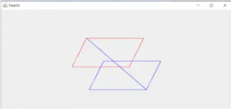

```java
import java.awt.*; import java.awt.event.*; import javax.swing.*;
public class Test333{
  public static void main(String args[]){
    DrawingExample de = new DrawingExample();
    de.go();
  }
}
class DrawingExample {
  JFrame frame;
  MyPanel panel;
  public void go() {
    frame = new JFrame("Test33");
    panel = new MyPanel();panel.repaint();
    frame.getContentPane().add(panel, "Center");
    frame.setDefaultCloseOperation(JFrame.EXIT_ON_CLOSE);
    frame.setSize(360,300);frame.setVisible(true);
  }
  class MyPanel extends JPanel {
    int xpoints1[]= {300,500,450,250,300};
    int ypoints1[]= {100,100,200,200,100};
    int xpoints2[]=new int[5],ypoints2[]=new int[5];
    protected void paintComponent(Graphics g){
      // 在答题卡(纸)上填写此处应编写的代码
      for (int i = 0; i < 5; i++) {
        xpoints2[i] = xpoints1[i] + 60;
        ypoints2[i] = ypoints1[i] + 80;
      }
      g.setColor(Color.RED);
      g.drawPolygon(xpoints1, ypoints1, 5);
      g.setColor(Color.BLUE);
      g.drawPolygon(xpoints2, ypoints2, 5);
      g.drawLine(xpoints1[0], ypoints1[0], xpoints2[2], ypoints2[2]);
    }
  }
}

```

### 2021年4月

**编写方法double sumS(int n)，计算以下公式的值s，并返回。**

$$
s=\begin{cases}-1 \space n \leq 0  
\\ 1 + \frac{1}{3} + \frac{1}{6} + \cdots + \frac{1}{3+n} \space n > 0
\end{cases}
$$

```java
double sumS(int n){
  double s=1;
  // 请在答题卡（纸）上填写此处应编写的代码
  if (n<=0) return -1;(2分)
  else {
    for (int i=1; i<=n; i++)(2分)
      s+=1.0/(3*i);(2分)
    return s;(1分)
  }
  // 注:若考生使用其他的循环语句，结果正确同样给分。
}
```

**类Test33显示一个窗口，响应鼠标事件。当鼠标进入到窗口中时，在窗口最下面一行，显示鼠标的当前坐标，如题33图所示。要求:编写代码,实现鼠标事件处理程序。**

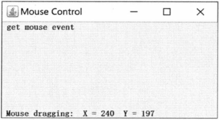

```java
import java.awt.*;
import java.awt.event.*;
import javax.swing.*;
public class Test33 implementsMouseMotionListener{
  private JFrame frame;
  private JLabel tf;
  public static void main(String[] args)
  {
    Test33 two = new Test33();
    two.go();
  }

  public void go(
  {
    frame = new JFrame("Mouse Control ");
    Container contentPane = frame.getContentPane();
    contentPane.add(new JLabel("get mouse event"), BorderLayout.NORTH);
    tf = new JLabel();
    contentPane.add(tf, BorderLayout.SOUTH);
    frame.addMouseMotionListener(this);
    frame.setSize(300,300);
    frame.setVisible(true);
  }
  
  // 请在答题卡（纸）上填写此处应编写的代码
  public void mouseDragged (MouseEvent e){ //(1分)
    String s = "Mouse dragging: X="+e.getX()+" Y="+e.getY(); //(2分)
    tf.setText(s); //(1分)
  }
  public void mouseMoved (MouseEvent e) {
    String s = "Mouse dragging: X="+e.getX()+" Y="+e.getY(); //(2分)
    tf.setText(s);
  }
}
```

### 2021年10月

**编写方法void myPrint(int n)，打印三角形图案。如当n=5时，将打印如下的图案。**

```java
*****
 ****
  ***
   **
    *
    
void myPrint(int n){
  // 请在答题卡（纸）上填写此处应编写的代码
  for(int i=0; i<n; i++){(2分)
    for(int j=0; j<i; j++)(1分)
      System.out.print(" ");（1分)
    for(int k=0; k<n-i; k++)(1分)
      System.out.print("*");(1分)
    System.out.println();(1分)
  }
}
```

**类Test33显示一个窗口,其中含有两个标签、两个文本框及三个按钮。如题33图所示。单击 Clear按钮时清空两个文本框的内容;单击Copy按钮时将上面文本框的内容复制到下面的文本框中;单击Close 按钮则结束程序的运行。要求:编写代码,实现单击三个按钮所完成的事件处理程序。**

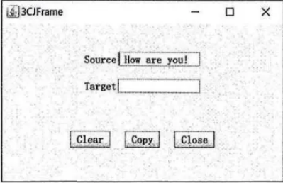

```java
import java.awt.*:
import java.awt.event.*:
import javax.swing.*;
public class Test33 extends WindowAdapter implements ActionListener{
  JFrame f;
  JButton bClear, bCopy, bClose;
  JLabel ISource, ITarget, ISpace1, ISpace2;
  JTextField tfs, tft; String ad = "How are you!";
  public static void main(String args []){
    Test33 be = new Test33(); be.go();
  }
  public void go(){
    f =new JFrame("3CJFrame");
    f.setLayout(new GridLayout(6,1,10,10));
    f.setSize(350,250);
    ISource = new JLabel("Source"); ITarget = new JLabel("Target");
    ISpace1 = new JLabel(); ISpace2 = new JLabel();
    tfs = new JTextField(ad, 15); tft=new JTextField(15);
    JPanel pan1 = new JPanel(); JPanel pan2 = new JPanel();
    JPanel pan3 = new JPanel();
    pan3.setLayout(new FlowLayout(FlowLayout.CENTER,40,0));
    pan1.add(ISource); pan1.add(tfs);
    pan2.add(ITarget); pan2.add(tft);
    bClear = new JButton("Clear"); bCopy = new JButton("Copy");
    bClose = new JButton("Close");
    bClear.addActionListener(this); bCopy.addActionListener(this);
    bClose.addActionListener(this);
    pan3.add(bClear); pan3.add(bCopy); pan3.add(bClose);
    f.add(ISpace1); f.add(pan1); f.add(pan2);
    f.add(ISpace2); f.add(pan3);
    f.addWindowListener(this);
    f.setVisible(true);
  }
  public void actionPerformed(ActionEvent e){
    // 请在答题卡（纸）上填写此处应编写的代码
    if(e.getSource() == bClear){ (1分)
      tfs.setText(""); (1分)
      tft.setText(""); (1分)
    }
    if (e.getSource() == bCopy){ (1分)
      tft.setText(tfs.getText()); (1分)
    }
    if (e.getSource() == bClose){ (1分)
      System.exit(0); (1分)
    }
  }
  public void windowClosing(WindowEvent e){
    System.exit(0);
  }
}
```

### 2022年4月

**设有大于3的奇整数n。请编写方法 void printArray(int\[]\[] arr)，该方法的功能是在屏幕上输出n行n列数组 arr中特殊位置的数据。以7行7列的方阵为例,标注"×"的即是这些特殊位置。输出的元素次序任意，但不允许有重复。**

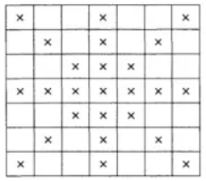

```java
void printArray(int[][]arr){
  //请在答题卡（纸）上填写此处应编写的代码
  int i,k = arr.length;
  for(i=0; i<k; i++) System.out.print(arr[k/2][i]+"t"); //(1分)
  for(i=0; i<k; i++) if (i!=k/2) System.out.print(arr[i][k/2]+"Yt"); //(2分)
  for(i=0; i<k; i++) if (i!=k/2) System.out.print(arr[i][i]+"Yt"); //(2分)
  for(i=0; i<k; i++) if (i!=k/2) System.out.print(arr[i][k-i-1]+"it"); //(2分)
}

```

**类Statement 显示一个窗口，其中含有一个标签、一个文本域和一个按钮。初始时，文本域中显示“This is a JFrame!”，如题33图所示。注:要求你将方法go()中的代码补充完整，不需要实现事件处理。**

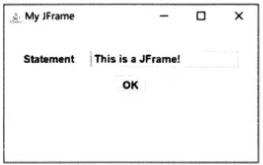

```java
import java.awt.*;
import java.awt.event.*;
import javax.swing.*;
public class Test33{
  public static void main(String args []){
    Statement be = new Statement();
    be.go();
  }
}
class Statement extends WindowAdapter implements ActionListener{
  JFrame f; JButton myButton; JLabel myLabel;JTextField tfs;
  String ad= "This is a JFrame!";
  public void go(){
    f =new JFrame("My JFrame"");
    f.setLayout(new GridLayout(6,1,10,10));
    f.setSize(650,400);
    myLabel = new JLabel("Statement"");
    JPanel pan1 = new JPanel();
    JPanel pan2 = new JPanel();
    pan1.setLayout(new FlowLayout(FlowLayout.CENTER,40,0));
    // 请在答题卡(纸)上填写此处应编写的代码
    tfs = new JTextField(ad,15); //(1分)
    pan1.add(myLabel); //(1分)
    pan1.add(tfs); //(1分)
    myButton = new JButton("OK"); //(1分)
    pan2.add(myButton); //(1分)
    f.add(new JLabel()); //(1分)
    f.add(pan1); f.add(pan2); //(1分)


    f.addWindowListener(this);
    f.setVisible(true);
  }
  public void windowClosing(WindowEvent e){
    System.exit(0);
  }
}


```

### 2022年10月

**编写方法int sDiagonal(int\[]\[]arr)，该方法的功能是计算n行n列数组 arr的两条对角线之和并返回。**

```java
int sDiagonal(int[][]arr){
  // 请在答题卡(纸)上填写此处应编写的代码
  
  
}
```

**类Test33显示一个窗口，其中含有1个文本区、2个单选按钮及1个按钮，如右图所示。如选中“大写”或“小写”单选按钮，则单击“转换”按钮后，文本区中的所有字母转换为大写或小写显示。要求:编写代码，实现单击“转换”按钮所完成的事件处理程序。**

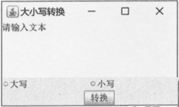

```java
import java.awt.*; import java.awt.event.*; import javax.swing.*;
public class Test33 extends WindowAdapter implements ActionListener{
  JFrame jf;JPanel jp;JTextArea taText;
  JRadioButton rbUppercase, rbLowercase;
  JButton bCvt;Font f;
  public static void main(String[] args){
    Test33 w = new Test33();
    w.go();
  }
  public void go() {
    jf = new JFrame("大小写转换"); jf.setSize(500,300);
    Container c = jf.getContentPane();
    c.setLayout(new BoxLayout(c, BoxLayout.Y_AXIS));
    taText = new JTextArea("请输入文本",5,10);
    jp = new JPanel(); jp.setLayout(new GridLayout(1,2));
    rbUppercase =new JRadioButton("大写");
    rbLowercase =new JRadioButton("小写");
    ButtonGroup bg = new ButtonGroup();
    bg.add(rbUppercase); bg.add(rbLowercase);
    jp.add(rbUppercase); jp.add(rbLowercase);
    bCvt = new JButton("转换"); bCvt.addActionListener(this);
    jf.add(taText); jf.add(jp); jf.add(bCvt);
    jf.addWindowListener(this);
    jf.setVisible(true);
  }
  public void actionPerformed(ActionEvent e) {
    // 请在答题卡（纸）上填写此处应编写的代码
    
  }
}

```
