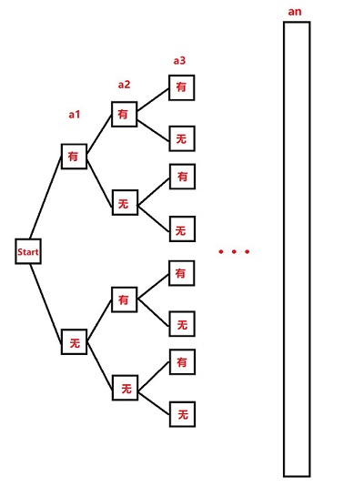

# 陈纪修第三版习题

-   [1.1 集合](#1.1-集合)
-   [1.2 映射与函数](#1.2-映射与函数)
-   [2.1 实数连续性](#2.1-实数连续性)
-   [2.2 数列极限](#2.2-数列极限)
-   [2.3 无穷大量](#2.3-无穷大量)
-   [2.4 收敛准则](#2.4-收敛准则)
-   [3.1 函数极限](#3.1-函数极限)

## $1.1$ 集合

**1.1.1** 证明由n个元素组成集合T={$a_1$, $a_2$, $a_3$ $\cdots$  $a_n$}有$2^n$个子集.

证(一):  假设集合S是某个子集,那么第一个元素对于该集合S有两种可能,即该元素在集合S内或者不在集合S内.

则n元素有$2^n$个子集.

证(二): 假设$S_i$是由i个元素组成的集合,那么$S_i$的所有可能的组合就是子集的个数( $0\le i \le n$).

则 $\sum\limits_{i=0}^n{S_i}$ = $C_n^0$ + $C_n^1$ + $C_n^2$ + $C_n^3$ + $\cdots$ + $C_n^n$.

根据二项式定理: $(x+y)^n$ =  $C_n^0 x^0 y^n$ + $C_n^1 x^1 y^{n-1}$ + $C_n^2 x^2 y^{n-2}$ + $C_n^3 x^3 y^{n-3}$ + $\cdots$ + $C_n^n x^n y^0$.

当x=y=1时, $2^n$=  $C_n^0$ + $C_n^1$ + $C_n^2$ + $C_n^3$ + $\cdots$ + $C_n^n$.

所以$\sum\limits_{i=0}^n{S_i}$ = $2^n$

**1.1.2** 证明:

(1)任意无限集必包含一个可列子集.

(2)设A与B都是可例集, 证明A$\cup$B也是可列集.

**1.1.3** 指出下列表述中错误:

(1) {0} = $\empty$;

(2) a $\sub$ {a, b, c};

(3) {a, b} $\in$ {a, b, c};

(4) {a, b, {a, b}} = {a, b};

**1.1.4** 用集合符号表示下列数集:

(1) 满足$\frac{x-3}{x+3} \le 0$全体实数;

(2) 平面上第一象限点的全体;

(3)大于0并且小于1的有理数全体;

(4) 方程$sinx$  $cotx$ = 0的实数解全体;

**1.1.5** 证明下列集合不等式:

(1) A $\cap$ (B $\cup$ D)  = (A $\cap$ B) $\cup$ (A$\cap$D);

(2)  $(A \cup B)^C$ = $A^C$ $\cap$ $B^C$;

**1.1.6** 举例说明集合运算不满足消去律:

(1) A $\cup$ B = A $\cup$ C    $\nRightarrow$ B=C;

(2) A $\cap$ B = A $\cap$ C    $\nRightarrow$ B=C;

**1.1.7** 下述命题是否正确?不正确的话.请改正.

(1)x $\notin$ A $\cap$ B  $\Longleftrightarrow$  x $\notin$ A 并且 x $\notin$ B;

(2)x $\notin$ A $\cup$ B $\Longleftrightarrow$ x $\notin$ A 或者 x $\notin$ B;

## $1.2$ 映射与函数

## $2.1$ 实数连续性

## $2.2$ 数列极限

## $2.3$ 无穷大量

## $2.4$ 收敛准则

## $3.1$ 函数极限

