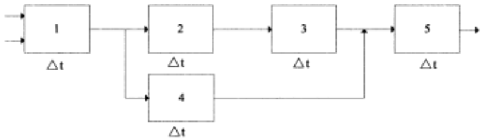
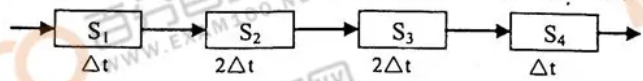

# 计算机系统结构自考真题

## 目录

-   [选择题](#选择题)
    -   [2019年4月](#2019年4月)
    -   [2019年10月](#2019年10月)
    -   [2020年4月](#2020年4月)
    -   [2020年10月](#2020年10月)
    -   [2021年4月](#2021年4月)
    -   [2021年10月](#2021年10月)
    -   [2022年4月](#2022年4月)
    -   [2022年10月](#2022年10月)
-   [填空题](#填空题)
    -   [2019年4月](#2019年4月)
    -   [2019年10月](#2019年10月)
    -   [2020年4月](#2020年4月)
    -   [2020年10月](#2020年10月)
    -   [2021年4月](#2021年4月)
    -   [2021年10月](#2021年10月)
    -   [2022年4月](#2022年4月)
    -   [2022年10月](#2022年10月)
-   [简答题](#简答题)
    -   [2019年4月](#2019年4月)
    -   [2019年10月](#2019年10月)
    -   [2020年4月](#2020年4月)
    -   [2020年10月](#2020年10月)
    -   [2021年4月](#2021年4月)
    -   [2021年10月](#2021年10月)
    -   [2022年4月](#2022年4月)
    -   [2022年10月](#2022年10月)
-   [简单应用题](#简单应用题)
    -   [2019年4月](#2019年4月)
    -   [2019年10月](#2019年10月)
    -   [2020年4月](#2020年4月)
    -   [2020年10月](#2020年10月)
    -   [2021年4月](#2021年4月)
    -   [2021年10月](#2021年10月)
    -   [2022年4月](#2022年4月)
    -   [2022年10月](#2022年10月)
-   [综合应用题](#综合应用题)
    -   [2019年4月](#2019年4月)
    -   [2019年10月](#2019年10月)
    -   [2020年4月](#2020年4月)
    -   [2020年10月](#2020年10月)
    -   [2021年4月](#2021年4月)
    -   [2021年10月](#2021年10月)
    -   [2022年4月](#2022年4月)
    -   [2022年10月](#2022年10月)

# 选择题

### 2019年4月

1.  用微程序直接解释另一种机器指令系统的方法称为 **B**
    1.  A. 编译
    2.  B.仿真
    3.  C.翻译
    4.  D.模拟
2.  从计算机信息加工的各个步骤和阶段的角度来看,并行性等级最低的是 **B**
    1.  A.处理器操作步骤并行
    2.  B.存储器操作并行
    3.  C.处理器操作并行
    4.  D.指令、任务、作业并行
3.  下列选项中属于高级数据表示的是 **A**
    1.  A.向量
    2.  B.定点数
    3.  C.逻辑数
    4.  D.字符串
4.  浮点数表示中,当阶值位数一定时,不会受到尾数进制影响的是 **B**
    1.  A.精度
    2.  B.数符
    3.  C.范围
    4.  D.离散程度
5.  下列属于总线标准的是 **D**
    1.  A.吞吐率
    2.  B.速率
    3.  C.流量
    4.  D.电气
6.  浮点数系统使用的阶基$r_p$= 2 ,阶值位数p =2,尾数位数m=4,尾数基值$r_m$=2时,在非负阶正尾数、规格化的情况下可表示的最小尾数是 **A**
    1.  A. 1/2
    2.  B. 1/4
    3.  C. 1/8
    4.  D.1/16
7.  总线按在系统中的位置分的级别数为 **A**
    1.  A.3级
    2.  B.4级
    3.  C. 5级
    4.  D.6级
8.  Cache存储器是为了解决主存满足不了要求的性能指标是 **D**
    1.  B.价格
    2.  C.字长
    3.  D.速度
    4.  A.容量
9.  编号为0,1 ,…,15的16个处理器,当互连网络函数为Cube,时,13号处理器连接到的处理器的号数是 **C**
    1.  A.3
    2.  B.4
    3.  C.5
    4.  D.6
10. 通过通道互连实现通信,或通过消息传送系统交换信息的计算机系统是 **C**
    1.  A.向量处理机
    2.  B.紧耦合多处理机
    3.  C.松耦合多处理机
    4.  D.标量处理机

### 2019年10月

1.  计算机系统结构的研究内容不包括 **A**
    1.  A.主存速度
    2.  B.数据表示
    3.  C.中断分类
    4.  D.信息保护方式
2.  自定义数据表示包括标志符数据表示和 **B**
    1.  A.标题数据表示
    2.  B.数据描述符
    3.  C.向量数据表示
    4.  D.堆栈数据表示
3.  关于指令执行的"一次重叠",下列说法正确的是 **B**
    1.  A."一次重叠"是同时解释很多条指令
    2.  B."一次重叠"是同时解释相邻两条指令
    3.  C."一次重叠"是同时解释一条指令
    4.  D."一次重叠"是只解释两条指令
4.  计算机外部中断不包括 **A**
    1.  A.机器校验中断&#x20;
    2.  B.定时器中断
    3.  C.外部信号中断
    4.  D.中断键中断
5.  虚拟存储器地址变换是指 **C**
    1.  A.将实地址变换成虚地址
    2.  B.静态再定位时将程序的逻辑地址变换成主存的实地址
    3.  C.程序执行时将虚地址变换成对应的实地址
    4.  D.将指令的符号地址变换成二进制地址
6.  流水线分为部件级、处理机级和系统级的划分依据是 **D**
    1.  A.流水的状态
    2.  B.硬件的功能
    3.  C.流水的功能
    4.  D处理的级别
7.  不属于堆栈型替换算法的是 **C**
    1.  A
    2.  B
    3.  C
    4.  D
8.  分布式存储器阵列处理机属于 **A**
    1.  A.SIMD 系统
    2.  B.SISD 系统
    3.  C.MISD 系统
    4.  D.MIMD 系统
9.  紧耦合多处理机系统的机间通信是通过 **D**
    1.  A.共享总线实现
    2.  B.共享Cache实现
    3.  C.共享虚拟存储器实现
    4.  D.共享主存实现
10. 下列关于数据流计算机的描述,不正确的是 **B**
    1.  A.数据流计算机的主要目的是为了提高对操作级并行的开发水平
    2.  B.数据流计算机对具有很强数据相关,且并行性不高的题目会大大提高解题效率
    3.  C.数据流计算机需要花费较多的辅助开销和存储空间为数据建立、识别和处理标记
    4.  D.数据流计算机对标量运算非常有利,而对数组、递归操作及其他高级操作较难管理

### 2020年4月

1.  从计算机系统结构上讲,机器语言程序员能看到的机器属性是 **C**
    1.  A.计算机硬件的全部组成
    2.  B.计算机各部件的硬件实现
    3.  C.编程要用到的硬件组织
    4.  D.计算机软件所要完成的功能
2.  多处理机操作系统的类型不包括 **D**
    1.  A.主从型
    2.  B.各自独立型
    3.  C.浮动型
    4.  D.固定型
3.  由于掉电引起的中断是 **B**
    1.  A.程序性中断
    2.  B.机器校验中断
    3.  C.外中断
    4.  D.访管中断
4.  为了提高等效访问速度,在采用组相联映像的Cache存储器应 **C**
    1.  A.减小组的大小而块的大小不变
    2.  B.减小块的大小而组的大小不变
    3.  C.增加Cache块数而块的大小不变
    4.  D.增大主存容量而Cache容量不变
5.  计算机机器指令间的"一次重叠"是指 **B**
    1.  A."执行k"与"取指k+1"重叠
    2.  B."分析k+1"与"执行k"重叠
    3.  C."取指k”与"分析k+1"重叠
    4.  D."分析k"与"执行k+1"重叠
6.  不属于集中式总线仲裁方式的是 **D**
    1.  A.串行链接
    2.  B.定时查询
    3.  C.独立请求
    4.  D.同步查询
7.  ILLIAC Ⅳ是一种 **A**
    1.  A.阵列处理机
    2.  B.超标量处理机
    3.  C.流水线处理机
    4.  D.多处理机
8.  多处理机是属于 **D**
    1.  A.SIMD系统
    2.  B. SISD 系统
    3.  C. MISD系统
    4.  D. MIMD 系统
9.  下列关于归约机的描述,正确的是 **C**
    1.  A.归约机是属于Von Neumann型计算机
    2.  B.归约机不是以函数式语言为机器语言的计算机
    3.  C.归约机采用需求驱动,执行的操作序列取决于对数据的需求
    4.  D.归约机采用数据驱动,执行的操作序列取决于输入数据的可用性
10. 传统的Von Neumann型计算机使用的工作方式是 **A**
    1.  A.控制流方式
    2.  B.数据流方式
    3.  C.智能推理方式
    4.  D.需求驱动方式

### 2020年10月

1.  在多用户机器中,应用程序员不能使用的指令是
    1.  A."访管"指令
    2.  B."访存"指令
    3.  C."启动I/O"指令
    4.  D."算术运算"指令
2.  浮点数机器字长和尾数位数一定时,如果尾数基值$r_m$增大,则运算中的精度损失和表示的精度分别会
    1.  A.减少和降低
    2.  B.增大和提高
    3.  C.增大和降低
    4.  D.减少和提高
3.  机器指令执行结果出现异常引起的中断是
    1.  A.机器校验中断
    2.  B. I/O中断
    3.  C程序性中断
    4.  D.外中断
4.  与虚拟存储器的等效访问速度无关的是
    1.  A.主存的容量
    2.  B.页面地址流
    3.  C:页面调度策略
    4.  D.辅存的容址
5.  "一次重叠"中消除"指令相关",下列方法中最佳的是
    1.  A.不准在程序执行过程中修改指令
    2.  B.增设相关专用通路
    3.  C推后下一条指令的执行
    4.  D.推后下一条指令的分析
6.  程序在主存中的定位技术不包括
    1.  A.静态再定位
    2.  B.动态再定位
    3.  C.虚实地址映像表
    4.  D.自动再定位
7.  现有0\~15编号的16个处理器采用$PM2_{+3}$,单级网络互连,则与13号处理器相连的处理器编号是
    1.  A.1
    2.  B.5
    3.  C.7
    4.  D.14
8.  下列关于多处理机系统的任务粒度描述,不正确的是
    1.  A.任务粒度的大小,会显著影响多处理机的性能和效率
    2.  B.任务粒度过小,系统的并行度会提高,则性能会提高
    3.  C.任务粒度过小,系统的辅助开销增大,则性能会下降
    4.  D.任务粒度过大,系统的并行度会降低,则性能会下降
9.  下列关于数据流计算机的描述,不正确的是
    1.  A.数据流计算机的主要目的是为了提高对操作级并行的开发水平
    2.  B.数据流计算机擅长处理具有很强数据相关且并行性不高的任务
    3.  C.数据流计算机需要花费较多的辅助开销和存储空间用于数据建立、识别和处理标记
    4.  D.数据流计算机对标量运算非常有利,而对数组、递归及其他高级操作较难管理
10. 能够被硬件识别并执行的程序是
    1.  A.微指令程序
    2.  B.高级语言程序
    3.  C.汇编语言程序
    4.  D.人工智能语言程序

### 2021年4月

1.  在主存设计上,属于计算机系统结构应考虑的内容是 **C**
    1.  A.频宽的确定
    2.  B.采用多体交叉还是单体交叉存储器
    3.  C.容量和编址方式
    4.  D.采用 MOS还是TTL
2.  堆栈型计算机比通用型计算机更具有的优越性之一是**C**
    1.  A.能提高存储器空间的利用率
    2.  B.支持先进先出类解题算法的求解
    3.  C.支持子程序的嵌套和递归调用
    4.  D.支持向量的运算
3.  中断响应由高到低的优先级排列次序是 **B**
    1.  A.访管$\rightarrow$程序性$\rightarrow$机器故障
    2.  B.访管$\rightarrow$程序性$\rightarrow$重新启动
    3.  C.程序性$\rightarrow$ I/O $\rightarrow$ 访管
    4.  D.外部 $\rightarrow$ 访管 $\rightarrow$ 程序性
4.  下列不会对主存命中率产生影响的是 **D**
    1.  A.程序地址流
    2.  B.替换算法
    3.  C.分配给程序的实页数
    4.  D.主存总线结构
5.  各个功能段在同一时间内可按不同的运算或功能进行连接的多功能流水线是 **B**
    1.  A.系统流水线
    2.  B.部件流水线
    3.  C.静态流水线&#x20;
    4.  D.动态流水线
6.  采用分布式结构的多处理机机间互连形式为 **A**
    1.  A.开关枢纽结构
    2.  B.环形互连
    3.  C交叉开关
    4.  D.多端口存储器
7.  ILLIAC IV处理机属于 **A**
    1.  A.SIMD系统
    2.  B. SISD系统
    3.  C.MISD系统
    4.  D. MIMD 系统
8.  在多处理机环境中,两个程序段之间如果存在"先读后写"的数据反相关时，下列说法正确的是 **B**
    1.  A.无论如何不能并行
    2.  B.不可以交换串行
    3.  C.即使同步控制也不能并行
    4.  D.若指令满足交换律,可以交换串行
9.  数据流计算机中的数据驱动的策略是 **D**
    1.  A.请求式求值
    2.  B.滞后求值
    3.  C.边求值边计算
    4.  D.提前求值
10. 下列关于归约机的描述,不正确的是 **C**
    1.  A.归约机是面向函数式语言或以函数式语言为机器语言的非Neumaa型机器
    2.  B.归约机采用适合于函数式程序运行的多处理器(机)互连的结构
    3.  C.归约机具有大容量物理存储器的同时,还需要少量的虚拟存储器
    4.  D.归约机的处理部件应当是一种有多个处理器或多个处理机并行的结构形式

### 2021年10月

1.  汇编语言源程序变换成机器语言自标程序是经**A**
    1.  A.汇编程序翻译
    2.  B,编译程序翻译
    3.  C.汇编程序解释
    4.  D.编译程序解释
2.  在计算机系统设计中,设计方法最好的是 **D**
    1.  A由上主往下设计
    2.  B.由下往上设计
    3.  C.从两边向中间设计
    4.  D.从中间开始向两边设计
3.  浮点数尾数基值$r_m=8$,尾数数值部分长6位,可表示的规格化最小正数尾数为 **B**
    1.  A.0.015625
    2.  B.0.125
    3.  C.0.25
    4.  D.0.5
4.  总线控制采用集中式定时查询需另外增加控制线根数为 **C**
    1.  A.3
    2.  B. N+2
    3.  C.2+$log_2^N$
    4.  D.2N+1
5.  不属于堆栈型替换算法的是 **A**
    1.  A.先进先出法
    2.  B.近期最少使用法
    3.  C.近期最久未用法
    4.  D.页面失效频率法
6.  流水机器IBM 360/91对指令中断的处理方法是 **C**
    1.  A.指令复执达
    2.  B.猜测法
    3.  C.不精确断点法
    4.  D.对流水线重调度法
7.  标量处理机的重叠方式中二次相关是 **B**
    1.  A.指令k与指令k+1存在先读后写相关
    2.  B.指令k与指令k+2存在先写后读相关
    3.  C.指令k 与指令k+1存在先写后读相关
    4.  D.指令k+1与指令k+2存在写写相关
8.  ILLIAC Ⅳ阵列处理机中,PE之间所用的互连函数是 **D**
    1.  A.$Cube_0$和 $Cube_1$
    2.  B.$PM2_{\pm 2}$
    3.  C. Shuffle
    4.  D.$   PM2_{\pm0} $和$PM2_{\pm 3}$
9.  混洗交换单级网络,最远的两个单元建立连接需要 **B**
    1.  A.n-1次混洗和n-1次交换
    2.  B.n-1次混洗和n次交换
    3.  C.n次混洗和n-1次交换
    4.  D.n次混洗和n次交换
10. 有关多处理机任务粒度说法正确的是 **A**
    1.  A.任务粒度小,辅助开销大
    2.  B.任务粒度大,并行度高
    3.  C.任务粒度小,并行度低
    4.  D.任务粒度小,效率高

### 2022年4月

1.  关于软硬件取舍的基本原则中,叙述不正确的是 **A**
    1.  A.硬件的设计费用比软件的设计费用低
    2.  B.硬件的生产费用比软件的生产费用低
    3.  C.软件设计费用比软件重复生产费用高
    4.  D.硬件功能只需实现一次,而软件功能可能要多次重复实现
2.  不同系列的机器之间,实现软件移植的途径不包括 **C**
    1.  A.模拟
    2.  B.仿真
    3.  C.统一的汇编语言
    4.  D.统一的高级语言
3.  在相同的阶码位数和尾数位数的前提下,浮点数尾数基值取小,可使浮点数 **C**
    1.  A.可表示数的个数增多
    2.  B.可表示数的范围增大
    3.  C.数在数轴上的分布变密
    4.  D.运算中数的精度损失降低
4.  根据通道数据传送中信息传送方式的不同,不属于其分类的是 **B**
    1.  A.选择
    2.  B.位多路
    3.  C.数组多路
    4.  D.字节多路
5.  与虚拟存储器的等效访问速度无关的是 **D**
    1.  A.页地址流
    2.  B.主存容量
    3.  C.替换算法
    4.  D.辅存容量
6.  主存空间数相关的最佳处理方式是 **A**
    1.  A.推后"分析k+1"
    2.  B.采用相关专用通路
    3.  C.采用"执行"指令处理
    4.  D.采用延迟转移技术
7.  有关超长指令字处理机叙述正确的是 **D**
    1.  A.配套多套功能部件
    2.  B.适合求解稀疏矩阵类标量计算
    3.  C.着重开发时间并行性
    4.  D.将水平微型码和超标量处理相结合
8.  多级互连网络中的omega 网络是 **C**
    1.  A.多级PM2I网络
    2.  B.多级立方体网络
    3.  C.多级混洗交换网络
    4.  D.全排列网络
9.  有关松耦合多处理机叙述正确的是 **B**
    1.  A.共享主存
    2.  B.通过消息传送系统通信
    3.  C.不共享外设
    4.  D.处理机之间通过PMIN互连
10. 关于数据流机叙述正确的是 **D**
    1.  A.采用控制驱动方式
    2.  B.采用需求驱动方式
    3.  C.不利于计算并行性开发
    4.  D.数据以令牌方式在指令间传递

### 2022年10月

1.  "从中间开始"设计的"中间"一般是指百
    1.  A.微程序机器级与汇编语言机器级之间
    2.  B.操作系统机器级与汇编程序机器级之间
    3.  C.传统机器语言机器级与微程序机器级之间
    4.  D.传统机器语言机器级与操作系统机器级之间
2.  计算机系统结构的属性不包括
    1.  A.中断机构
    2.  B.指令系统
    3.  C.主存速度
    4.  D.数据表示
3.  尾数下溢处理方法中,平均误差最大的是
    1.  A.舍入法
    2.  B.截断法
    3.  C.恒置"1"法
    4.  D.查表舍入法
4.  通道程序执行结束后引起的中断是
    1.  A.外中断
    2.  B.I/O中断
    3.  C.程序性中断
    4.  D.机器校验中断
5.  在Cache地址映像方式中,块冲突概率最高的是
    1.  A.直接
    2.  B.组相联
    3.  C.段相联
    4.  D.全相联
6.  在流水处理机中,与流水线最大吞吐率高低有关的是
    1.  A.各子过程的时间
    2.  B.最快子过程的时间
    3.  C.最慢子过程的时间
    4.  D.最后子过程的时间
7.  在计算机组成上实现指令的重复解释需要解决的不包括
    1.  A.访主存冲突
    2.  B.指令间各种相关的处理
    3.  C."分析"与"执行"操作的串行
    4.  D."分析"与"执行"操作控制上的同步
8.  在16个处理器中,用单级立方体互连函数Cube, ,可与7号处理器相连的处理器号是
    1.  A.0
    2.  B.10
    3.  C.12
    4.  D.15
9.  在多处理机中,程序段之间不能并行的原因是
    1.  A.数据相关
    2.  B.数据反相关
    3.  C.数据输出相关
    4.  D.以交换数据为目的时
10. 针对非Von Neumann计算机叙述正确的是
    1.  A.归约机采用需求驱动方式
    2.  B.归约机采用控制驱动方式
    3.  C.数据流机采用需求驱动方式
    4.  D.数据流机采用控制驱动方式

# 填空题

### 2019年4月

1.  计算机系统结构是对计算机系统中(**各级界面**)的定义及其上下的(**功能**)分配 *。*
2.  计算机组成着眼于机器内部各事件的(**排序方式**)与(**控制机构**)、各部件的功能及各部件之间的联系。
3.  数据表示表现在它有对计算机硬件识别和引用类型的数据进行操作的(**指令**)和(**运算部件**)。
4.  可表示的浮点数规格化数的总个数应当是可表示(**阶**)的个数.与可表示(**尾数**)的个数的乘积。
5.  指令系统的设计包括指令(**功能**)和指令(**格式**)的设计。
6.  指令系统的改进是以(**不删改**)原有指令系统为前提的,通过增加少量(**强功能**)新指令代替常用指令串。
7.  能并行读出多个CPU字的单体多字、(**多体单字**)和(**多体多字**)的交叉访问主存系统被称为并行主存系统 *。*
8.  信息在总线上的传送方法基本上可分为(**同步**)和 **(异步**)两种。
9.  按运算基本对象,并行算法可分为(**数值**)型和(**非数值**)型两类。
10. 数据驱动的数据流方式中,数据令牌是一种表示某一(**操作数**)或(**参数**)已准备就绪的标志。

### 2019年10月

1.  计算机组成是计算机系统结构的(**逻辑**)实现,计算机实现是计算机组成的(**物理**)实现。
2.  浮点数尾数下溢处理方法包括截断法、舍入法、(**恒置1法**)和(**查表舍人法**)。
3.  流水线单位时间能流出的任务数或结果数称为(**吞吐率**),流水线中设备的实际使用时间占整个运行时间的比值称为(**效率**)。
4.  页式虚拟存储器中的CPU要用到的指令或数据不在(**主存**)时会发生(**页面失效**)。
5.  集中式总线仲裁方式分为(**串行链接**)、(**定时查询**)和独立请求等三种。
6.  按多功能流水线的各功能段能否允许同时用于多个不同功能连接,可将流水线分为(**静态**)流水线和(**动态**)流水线。
7.  流水处理机"先写后读"相关的解决方法包括推后(**后续指令对相关单元**)的读和设置(**相关直接通路**)。
8.  与阵列处理机相比,流水线处理机利用的是(**时间重叠**)方式而不是(**资源重复**)方式的并行技术。
9.  从指令的格式来看,指令由(**操作码**)和(**地址码**)两部分组成。
10. 计算机仿真是用(**微程序**)解释,其解释程序存储于(**控制寄存器**)中。

### 2020年4月

1.  弗林提出的对计算机系统进行分类的依据,是按照(**指令流**)和(**数据流**)的多倍性对计算机系统进行分类的。
2.  Cache 的地址映像方式包括(**全相联映像**)、(**直接映像**)和组相联映像。
3.  选择通道适合连接多台高优先级的(**高速设备**),此时的通道"数据宽度"为(**可变长块**)。
4.  根据信息传送方式的不同,通道可分为字节多路通道、(**数组多路通道**)和(**选择通道**)。
5.  构成计算机系统的多个处理机之间的流水称为(**系统级**)流水,处理机的各部件之间的流水则称为(**处理机级**)流水。
6.  CRAY-1向量处理机有一个显著特点是只要不出现(**功能部件**)冲突和(**源寄存器**)冲突,均可使有数据相关的向量指令能在大部分时间并行执行。
7.  依据结构和应用目的不同,多处理机可分为(**同构型**)多处理机、(**异构型**)多处理机和分布型多处理机。
8.  松耦合多处理机的每台处理机都有一个容量较大的(**局部存储器**),用于存储经常用的指令和数据,以减少紧耦合系统中存在的(**访主存**)冲突。
9.  任务粒度的大小会影响多处理机的性能,对于处理机之间通信较少的应用程序宜用(**细粒度**)处理,而要求冗长的计算宜用(**粗粒度**)处理。(注:填"粗粒度"或"细粒度")
10. 根据机器内部对函数表达式所用不同的存储方式划分,归约机的归约方式可以分为(**串归约**)和(**图归约**)两类。

### 2020年10月

1.  计算机系统设计的主要任务包括系统结构、()和()的设计。
2.  从多级层次结构出发,计算机系统设计的方法包括"()"设计、"()"设计和"从中间开始向两边"设计
3.  根据信息传送方式的不同,通道可分为()通道、()通道和选择通道。
4.  当Cache块失效,将主存块装入Cache又出现Cache块冲突时, Cache存储器采用的替换算法有()算法或()算法。
5.  部件内部的各个处理子部件之间的流水称为(),而处理机的各部件之间的流水则称为()。
6.  中断响应次序是用()硬件实现,中断处理次序可以通过设置的()寄存器的值加以改变。
7.  交换开关的连接方式包括()、()上播和下播。
8.  标量流水线处理机解决全局相关问题的方法包括()、加快和提前形成条件码、()和加快短循环程序的处理。
9.  对称多处理机的各个处理器的地位是均等的,可以同等地访问()、()和运行操作系统。
10. 超标量处理机是利用(),设置多个执行部件寄存器堆端口,而超流水线处理机则是侧重开发(),在公共的硬件上采用较短的时钟周期来提高速度。

### 2021年4月

1.  从计算机原理上看,软件的功能可以用硬件或(**固件**)完成,硬件的功能也可以用(**软件**)模拟完成 *。*
2.  软件移植的模拟方法是用(**机器语言**)程序解释,其解释程序存储于(**主存**)中。
3.  在高性能多用户计算机系统中,用户程序输入/输出应由用户向系统发出(**I/O**)请求,经(**操作系统**)来调度分配设备,并进行具体的输入输出处理。
4.  计算机总线按信息传送的方向而言,可分为(**单向**)传输和(**双向**)传输。
5.  多级立方体网络交换开关的控制方式主要有(**分布式**)控制、(**集中共享式**)控制和部分级控制。
6.  CRAY-1向量处理机的一个显著特点是只要不出现(**功能部件**)使用冲突和(**源向量寄存器**)使用冲突,通过链接机构可使有数据相关的向量指令能在大部分时间内并行执行。
7.  阵列处理机的构形主要有采用(**分布式**)存储器阵列构形和采用(**集中式共享**)存储器阵列构形 *。*
8.  组相联映像指的是各组之间是(**直接**)映像,而组内各块之间是(**全相联**)映像。
9.  Cache的写策略主要包括(**写回法**)和(**写直达**)两种。
10. 根据对数据令牌处理的方式不同,数据流计算机可以划分为(**静态**)和(**动态**)两种类型。

### 2021年10月

1.  计算机系统结构研究的是(**软硬件**)之间的功能分配以及对传统(**机器级**)界面的确定。
2.  程序访回的局部性包括(**时间**)上和(**空间**)上的两个局部性。
3.  在机器指令系统的设计、发展和改进上有两种不同的途径和方向,分别是(**CISC**)和(**RISC**)。
4.  并行主存系统是指能并行读出多个CPU字的单体多字和(**多体单字**)、(**多体多字**)的交叉访问主存系统。
5.  虚拟存储器的存储管理方式按存储映像算法不同,有段式、(**页**)式和(**段页**)式等。
6.  从流水线中各个功能段之间是否有反馈回路的角度,可以把流水线分为(**线性流水线**)流水线和(**非线性流水线**)流水线 *。*
7.  超标量超流水线处理机是(**超标量流水线**)与(**超流水线**)处理机的结合。
8.  在SIMD 系统的互连网络的设计目标中,为了降低成本,要求(**结构**)不要过分复杂;为满足算法和应用的需要,要求(**互连**)要灵活。
9.  多处理机操作系统有3种类型,它们是主从型、(**各自独立型**)和(**浮动型**)。
10. 传统的Von Neuman型计算机采用(**控制**)驱动方式;而非Von Neuman型的归约机则基于(**需求**
    )驱动方式。

### 2022年4月

1.  计算机组成指的是计算机系统结构的逻辑实现,包括机器级内部的(**数据流**)和(**控制流**)的组成以及逻辑设计等。
2.  从计算机执行程序的并行性看,由低到高的并行性等级可分为(**指令内部**)、(**指令之间**)、任务或进程之间和作业或程序之间四级。
3.  自定义数据表示包括(**标志符**)数据表示和(**数据描述符**)两类。
4.  数组多路通道适用于连接多台磁盘等(**高**)速设备,通道"数据宽度"为(**定长块**)。
5.  页式虚拟存储器把(**主存**)空间和(**程序**)空间都机械地等分成固定大小的页面,按页顺序编号。
6.  在重叠方式的相关处理中,转移指令的处理一般采用(**延迟转移**)技术;指令相关的处理一般设置一条"(**执行**)"指令来解决。
7.  提高流水线的吞吐率,主要是消除瓶颈子过程,其主要的方法是将瓶颈子过程(**再细分**)或可以通过设置多套瓶颈段(**并联**)。
8.  向量的流水处理方式有向量(**纵向**)处理和(**分组纵横**)处理。
9.  多处理机是指两台以上的处理机,共享I/0子系统,机间通过(**共享主存**)或(**高速通信网络**)进行通信。
10. 以硬件为基础实现多 Cache 一致性的最普遍采用的办法叫作(**监视 Cache协议**)法,即各处理机中的Cache控制器随时都在(**监视**)其他Cache的行动。

### 2022年10月

1.  实现软件移植的主要方法有统—高级语言、设计系列机、()与()等 *。*
2.  计算机系统结构中的并行性包含()和()二重含义。
3.  按复杂指令系统计算机(CISC)方向发展和改进指令系统可以分别从面向目标程序、面向()和面向()等三个方面来优化实现。
4.  在满足通道设计流量不低于设备工作时的最大流量时,为使微观上不丢失设备信息,可以加设一定容量的()或动态提高低速设备的响应()来弥补。
5.  为了提高访问Cache的命中率,Cache的取算法有()预取和()预取两种不同的预取方法。
6.  为同时解释相邻两条或多条指令,常用的控制方式是()和()。
7.  在流水处理机中,若指令的执行采用异步流动方式,指令之间不仅会产生"先写后读"的相关,还会产生"()"相关和"()"相关。
8.  在 SIMD计算机的互连网络中,多采用硬连的()交换方法;网络中的开关单元一般采用()控制策略。
9.  多处理机的结构机间互连、并行算法,操作系统等都会直接影响到系统的()和()。
10. 在紧耦合多处理机中,为了减少访问主存冲突,主存一般采用()存取;为了减少访问主存的次数,处理机还可以自带()。

# 简答题

### 2019年4月

21**简述设计RISC的基本原则。**

1.  确定指令系统时,只选择使用频度很高的指令,再增加少量能有效支持操作系统、高级语言实现及其他功能的指令;(1分)
2.  减少指令系统所用寻址方式种类;(1分)
3.  让所有指令都在一个机器周期内完成;(1分)
4.  扩大通用寄存器数,尽量减少访存;(1分)
5.  大多数指令都用硬联控制实现,少数指令用微程序实现;(1分)
6.  通过精简指令和优化设计编译程序,简单、有效地支持高级语言。(1分)

22 **简述数组多路通道的数据传送方式原理。**

1.  数组多路通道活合干连接多台磁盘等高速设备;(2分)
2.  数组多路通道在每洗择好一台设备后,要连续传送完固定K个字节的成组数据后,才释放总线;(1分)
3.  释放总线后通道重去选择下一台设备,再传送该设备K个字节;(1分)
4.  以成组方式轮流交叉地为多台高速设备服务;(1分)
5.  某台设备想要传送n个字节,就需要先后经 n/K次申请总线。(1分)

23 **简述总线控制的集中式独立诸求方式的优点和缺点。**

优点: 总线分配速度快;(1分)所有部件的总线请求同时送到总线控制器,不用查询;(1分)控制器可以使用程序可控的预定方式、自适应方式、循环方式或它们的混合方式灵活确定下个使用总线的部件;(1分)能方便地隔离失效部件的请求。(1分)

缺点: 控制线数量过大,为控制N个设备必须有2N+1根控制线,(1分)且总线控制器要复杂很多。(1分)

24 **简述提高模m值,影响主存实际频宽的因素及结果。**

1.  对模m交叉,若都是顺序取指,效率可提高到m倍;(1分)
2.  一旦出现转移,效率会下降;转移频率越高,并行主存系统效率下降越大;(1分)
3.  数据的顺序性比指令要差,实际的频宽带可能要低一些;(1分)
4.  工程实现上由于模m越大,存储器数据总线越长,总线上并联的负载越重,有时还不得不增加门的级数,会使传输延迟增加;(1分)
5.  因此提高模m值能提高主存系统的最大频宽,(1分)但主存的实际频宽并不随m值增大而线性提高,实际效率并不像所希望的那么高。(1分)

25 **简述归约机结构的特点。**

1.  归约机应当是面向函数式语言,或以函数式语言为机器语言的非 Neumann型机器;(1分)
2.  具有大容量物理存储器并采用大虚存容量的虚拟存储器,具备高效的动态存储分配和管理的软、硬件支持;(1分)
3.  处理部分应当是一种有多个处理器或多个处理机并行的结构形式;(1分)
4.  采用适合于函数式程序运行的多处理器(机)互连的结构,(1分)最好采用树形方式的互连结构或多层次复合的互连结构形式;(1分)
5.  尽量把运行各种的结点机紧靠该进程所需用的数据安排,(1分)并使运行时需相互通信的进程所占用的处理机也靠近,让各处理机的负荷平衡。(1分)

### 2019年10月

**21 简述提高计算机系统并行性技术的三个途径。**

1.  时间重叠是在并行性概念中引人时间因素,(1分)让多个处理过程在时间上相互错开,轮流使用同一套硬件设备的各个部分以加快硬件的周转来赢得速度;(1分)
2.  资源重复是在并行性概念中引人空间因素,(1分)通过重复设置硬件资源来提高可靠性或性能:(1分)
3.  资源共享是用软件的方法,(1分)让多个用户按一定的时间顺序轮流使用同一套资源来提高资源利用率从而提高系统的性能。(1 分)

**22 简述紧耦合多处理机中解决多Cache 一致性的办法。**

1.  解决进程迁移引起的多Cache不致性.可以通过禁止进程迁移的方法予以解决，也可以在进程挂起时，靠硬件方法将Cache 中该进程改写过的信息块强制写回主存相应位置。(2 分)
2.  以硬件为基础实现多Cache的致性，主要有监视Cache协议法，即各个处理机中的Cache 控制器随时都在监视着其他Cache的行动。另种是目录表法,建立一个目录表，记录每一个数据块的使用情况。(2分)
3.  以软件为基础实现多Cache的致性，例如依靠编译程序的分析,不把一些公用的可写数据存人Cache中。(2 分)

**23简述Cache全相联映像的概念及其优缺点。**

概念: Cache全相联映像是主存中任意块 都可映像装人Cache中的任意一块位置的地址映像。(1 分)

优点: 块冲突率最低,(1分)只有当Cache全部装满才可能出现冲突,(1分)Cache的空间利用率最高:(1分)

缺点: 要构成容量为2项的相联存储器的代价太大;(1分)Cahe容量很大时，其查表的速度很难提高。(1 分)

**24 1BM360/91解决流水控制的途径****。** ​

1.  在各个寄存器中设置忙位标志来判断是否相关，当寄存器正在使用时置该寄存器的忙位标志为"1";(1分)当寄存器被释放,其忙位标志清为"0"，访问寄存器时先看忙位标志如果为"1"表示相关。(1 分)
2.  设置多条流水线让它们并行工作,(1分)同时在分布于各流水线的人、出端上分别设置若干保存站来缓冲存放信息，-口相关采用异步方式流动:(1分)
3.  通过分布设置的站号来控制相关专用通路的连接:(1分)
4.  相关专用通路采用总线方式，相关后通过更改站号来实现不同相关专用通路的连接。(1 分)

**25 脉动阵列结构计算机具有以下特点****。** ​

1.  结构简单，规整，模块化强，可扩充性好，非常适合用超大规模集成电路实现。(2 分)
2.  处理单元( PE)间数据通信距离短，规则，数据流和控制流的设计、同步控制等均简单规整。(2 分)
3.  脉动阵列中所有PE能同时运算，具有极高的计算并行性，可通过流水获得很高的运算效率和吞吐率。(1 分)
4.  脉动阵列结构的构形与特定计算任务和算法密切相关，具有某种专用性。(1分)

### 2020年4月

**21 简述实现软件移植的技术途径及其适用环境。**

1.  统一高级语言;(1分)适用于结构完全相同以至完全不同的机器之间的高级语言程序应用软件的移植;(1分)
2.  采用系列机;(1分)适用于结构相同或相近的机器之间的汇编语言应用软件和部分系统软件的移植;(1分)
3.  模拟与仿真;(1分)适用于结构不同的机器之间的机器语言程序的移植。(1分)

**22 简述中断的概念﹑中断的分类依据及分类的目的。**

中断的概念: CPU中止正在执行的程序,转去处理随机提出的请求,待处理完后,再回到原先被打断的程序继续恢复执行的过程称为中断;(2分)

中断的分类依据: 将中断源性质相近、中断处理过程类似的归为一类;

中断的分类的目的: 减少中断处理程序的入口,(1分)每一类给一个中断服务程序总入口,(1分)可以减少中断服务程序入口地址形成的硬件数量。(1分)

**23 简述设计多处理机的目的。**

1.  通过多台处理机对多个作业、任务进行并行执行来提高解题速度,从而提高系统的整体性能;(3分)
2.  使用冗余的多个处理机通过重新组织来提高系统的可靠性、适应性和可用性。(3分)

**24 简述超标量处理机与超流水处理机的区别。**

1.  超标量处理机是利用资源重复,(1分)设置多个执行部件寄存器堆端口;(1分)
2.  超流水处理机是着重开发时间并行,(1分)在公共的硬件上采用较短的时钟周期,(1分)深度流水来提高速度,(1分)需使用高速的时钟机制来实现。(1分)

**25 简述实现全排列网络的两种方法。**

1.  在多级互连网络的输出端设置锁存器,使数据在时间上顺序通行两次;(3分)
2.  将一个多级互连网络和它的逆网络串接起来,合并掉中间完全重复的一级,得到总级数为$2log_2-1$的多级网络。(3分)

### 2020年10月

**21 简述总线控制的三种方式及各需要增加用于总线控制的控制线根数。**

**22 简述提出虚拟存储器的原因并根据存储映像算法的不同写出虚拟存储器主要的三种存储管理方式。**

**23 简述阵列处理机与流水线处理机的区别。**

**24 简述设计RISC计算机的基本技术。**

**25 简述多处理机的概念并根据硬件构形不同写出多处理机的两种类型。**

### 2021年4月

**21 简述设计RISC计算机的基本原则。**

1.  只选择使用频度很高的指令;(1分)
2.  减少指令系统寻址方式的种类:(1分)让所有指令都在一个机器周期内完成;(1分)
3.  扩大通用寄存器的数量;(1分)
4.  多数指令都采用硬联控制实现;(1分)
5.  精简指令和优化设计编译程序,简单有效地支持高级语言的实现。(1分)

**22 简述字节多路通道、数组多路通道、选择通道分别适用连接的设备及各通道的特点。**

1.  字节多路通道适用于连接大量的字符类低速设备.(1分)传送一个字符(字节)的时间很短.但字符(字节)间的等待时间很长;(1分)
2.  数组多路通道适用于连接多台高速设备. ( 1分)设备的传送速率很高,但传送开始前的寻址输助操作时间很长;(1分)
3.  选择通道适用于连接优先级高的高速设备.(1分)在数据传送期内独占通道,只能执行一道通道程序。(1分)

**23 简述页式虚拟存储器页面失效和实页冲突发生的原因及所确定替换算法的依据。**

当处理机要用到的指令或数据不在主存中时,会发生页面失效;(2分)当主存已满且发生页面失效时,会发生实页冲突。(2分)替换算法的确定主要看主存是否有高的命中率,是香便于实现和辅助软硬件成本是否低。(2分)

**24简述流水线机器全局性相关的概念及处理全局性相关的四种方法。**

全局性相关指的是也进入流水线的转移指令和其后续指令之间相关。(2分)处理全局性相关的四种方法有:使用猜测法;(1分)加快和提前形成条件码;(1分)采取延迟转移;(1分)加快短循环程序的处理。(1分)

**25 简述多处理机与阵列处理机在指令流和并行等级的区别。**

1.  指令流的区别。阵列处理机是单指令流;(1分)多处理机是多指令流。(1分)
2.  并行等级区别。阵列处理机主要针对向量,数组处理,实现向量指令操作级的并行,是开发并行性的同时性;(2分)多处理机实现的则是更高一级的作业或任务间的并行.是开发并行性的并发性。(2分)

### 2021年10月

**21 简述模拟和仿真的概念及两者的主要区别。**

模拟是用机器语言程序解释实现软件移植的方法;(2分)仿真是用微程序直接解释另一种指令系统的方法。(2分)模拟与仿真的主要区别在于解释用的语言及其存储的位置,模拟是用机器语言程序解释,其解释程序存储于主存中;(1分)仿真是用微程序解释,其解释程序存储于控制存储器中。(1分)

**22 简述数据表示中的标志符和数据描述符的差别。**

标志符和数据描述符的差别在于标志符是和每个数据相连的,合存在一个存储单元中,描述单个数据的类型特征;(3分)数据描述符是与数据分开存放,用于描述所要访问的数据是整块的还是单个的,访问该数据块或数据元素所要的地址以及其他信息。(3 分)

**23 简述中断的概念和中断系统采用软硬件结合的好处。**

中断是指CPU中止正在执行的程序,转去处理随机提出的请求,待处理完后,再回到原先被打断的程序继续恢复执行的过程。(2分)中断采用软硬件结合的好处是中断响应用排队器硬件实现可以加快响应和断点现场的保存;(2分)中断处理采用软件的技术可以提供很大的灵活性。(2分)

**24 简述全局相关处理中,采用猜测法猜错后保证恢复分支点原先现场的方法。**

保证猜测法猜错后恢复分支点原先现场的方法一般有3种办法:方法一,采取对指令只译码和准备操作数,在转移条件码出现之前不进行运算;(2分)方法二,让指令运算完但不送回运算结果,只要猜对分支可送回运算结果;(2分)方法三,采用后援寄存器把可能被破坏的原始状态保存起来,一旦猜错,就取出后援寄存器中的内容来恢复分支点的现场。(2分)

**25 简述多级立方体网络对各个交换开关的控制方式。**

多级立方体网络对各个交换开关的控制方式有3种:(1)级控制,同一级的所有开关只用一个控制信号控制,同时只能处于同—种状态;(2分)(2)单元控制,每一个开关都由自己独立的控制信号控制,可各自处于不同的状态;(2分)(3)部分级控制,第i级的所有开关分别用i+1个信号控制,其中$0≤i≤n-1$,n为级数。(2分)

### 2022年4月

**21 简述计算机系统从"从中间开始"向两边设计的方法及软硬件人员各需设计的内容。**

计算机系统从"从中间开始"向两边设计是选择从层次结构的主要软,硬界面开始设计,即在传统机器语言机器级与操作系统机器级之间进行合理的软、硬件功能分配。(2分)软件人员依次设计操作系统级、汇编语言级,高级语言级和应用语言级;(2分)硬件人员依次设计传统机器语言机器级、微程序机器级和数字逻辑级。(2分)

**22 简述堆栈计算机的特点。**

堆栈计算机的特点:由高速寄存器组成的硬件堆栈,并与主存中的堆栈区在逻辑上构成整体;有丰富的堆栈操作指令且功能强;支持高级语言的编译;支持子程序的嵌套和递归调用。(每点2分,任写3点即可得满分)

**23 简述更新主存内容算法中的写回法和写直达法。**

写回法是在CPU执行写操作时,信息只写人Cache ,仅当需要替换时,才将改写过的Cache块先写回主存,然后再调人新块。(3分)

写值达法是利用Cache存储器在处理机和主存之间的直接通路,每当处理机写入Cache,的同时,也通过此通路直接写入主存。(3分)

**24 简述多功能流水线的概念和静动态流水线分类的依据。**

多功能流水线的概念是指同一流水线的各个功能段之间可以有多种不同的连接方式,以实现多种不同的运算或功能;(3分)静动态流水线分类的依据是按多功能流水线的各段能否允许同时用于多种不同功能连接流水。(3分)

**25 简述CRAY-1向量流水处理机**$v_i$**冲突和功能部件冲突的概念。**

$v_i$冲突是指并行工作的各向量指令的源向量或结果向量使用了相同的$v_i$。(3分)

功能部件冲突是指同一个功能部件被要求并行工作的多条向量指令所使用。(3分)

### 2022年10月

**21 简述计算机程序时间上的局部性和空间上的局部性。**

**22 简述标志符数据表示的概念和标志符数据表示存在的两个问题。**

**23 简述中断系统和作用。**

**24 简述紧耦合多处理机以软件为基础实现多Cache的一致性的优缺点及应用场合。**

**25 简述阻塞式网络产生阻塞的原因及其解决方法。**

# 简单应用题

### 2019年4月

**求向盘**$D=A \times (B+C)$**,各问茧兀系个数为N,参照CRAY-l 万式分解为3条向量指令:**

1.  $V_3$$\longleftarrow$存储器;访存取A送入$V_3$，寄存器
2.  $V_2 \longleftarrow V_0 + V_1$; $B+C \longrightarrow K$
3.  $V_4 \longleftarrow V_2 \times V_3$; $K \times A \longrightarrow D$

当采用下列3种工作方式时,各需多少拍才能得到全部结果?

1.  (2)和(3)串行执行;
2.  (1)和(2)并行执行后,再执行(3);
3.  采用链接技术。

**考虑一个1000个字的程序,其访问虚存的地址流为16、219、136、156、332、480、503、868、916、999。若页面大小为200字,主存容量为400字,采用FIFO替换算法,请按访存的各个时刻,写出其虚页地址流,计算主存命中率。**

### 2019年10月

**在并行存储器中,为了对**$4 \times 4$**的二维数组A的各元素**$a_j(i=0 \sim 3,j=0 \sim 3)$**在行、列、主对角线、次对角线上均能实现无冲突访问,则**

1.  存储器的分体数m 至少应该为多少?
2.  画出数组各元素在该存储器各分体中的分布情况(假设分体号从0开始、体内地址从i+0开始,且$  a_{00} $已存放在分体号为2,体内地址为i+0的位置)。

**有10台外设,各设备要求传送信息的工作速率如题27表所示。**

| 设备                   | A    | B    | C    | D   | E   | F   | G   | H  | I  | J  |
| -------------------- | ---- | ---- | ---- | --- | --- | --- | --- | -- | -- | -- |
| 工作速率/$KB \cdot s^-1$ | 2500 | 2000 | 1500 | 800 | 400 | 160 | 100 | 80 | 40 | 18 |

现设计的通道在数据传送期,每选择一次设备需$2 \mu s$,每传送一个字节数据需要$0.5\mu s$。若用作字节多路通道,则:

1.  通道工作时的最高流量是多少?
2.  如果希望同时不少于5台设备挂在此通道上,最好多挂一些,且高速设备尽量多挂一些,请问应选哪些设备挂在此通道上?为什么?
3.  如果定长块大小为512B,求通道工作时的最高流量。
4.  请问应选哪些设备挂在此通道上?为什么?

### 2020年4月

**设某计算机阶值4位、尾数15位,阶符和数符不在其内,当尾数以8为基时,在非负阶、正尾数、规格化情况下,试计算:**

1.  最小阶值;
2.  最大阶值;
3.  阶的个数;
4.  最小尾数值;
5.  最大尾数值;
6.  可表示的最小值;
7.  可表示的最大值;
8.  可表示数的个数

**处理器具有一个静态双功能流水线,其中**$1 \rightarrow 2 \rightarrow 3 \rightarrow 5$**为乘法流水线,**$1 \rightarrow 4 \rightarrow 5$**为加法流水线,每段经过时间均为**$\Delta t$**。处理器中每个部件的输出均可直接送到任何部件的输入或存人缓冲器中,其间的传送延时以及功能切换的时间忽略不计。现有长度为4的向量A和B,在此处理器上计算向量点积**$A \cdot B= \sum^{4}_{i=4}{a_i \times b_i}$**。**

1.  设计合理的算法,使得完成计算的时间最少。
2.  画出流水线完成该计算的时空图,并求出计算时间。

### 2020年10月

**有一个由Cache和主存组成的两级存储系统:主存的容量为100MB,访问时间为200ns,主存每MB的价格为1元;Cache的容量为4MB,访问时间为10ns , Cache每MB 的价格为50元。该系统运行某程序,在一段时间内,访问 Cache的次数为1980次,访问主存的次数为20次。要求:**

1.  计算该存储系济每MB的平均价格。
2.  计算系统运行该程序时 Cache的命中率。
3.  计算该存储系统的平均访问时间。
4.  计算该存储系统的访问效率。

**实现8个处理单元互连的 PM2I单级网络要求。**

1.  写出所有单级 PM2I互连函数的一般式。
2.  5号处理单元用PM2I单级网络可将数据直接传送到哪些处理单元上?
3.  该PM2I单级网络中两个处理单元的最大距离是多少?

### 2021年4月

**有一条4段(S1\~S4)组成的数据处理流水线如题26图所示。其中,S1与S4的执行时间均为**$\Delta t$**,S2 与S3的执行时间均为2 **$\Delta t$**。该流水线连续处理5个数据,要求:**

1.  画出处理过程的时空图。
2.  求出该流水线的实际吞吐率和效率。

**阵列处理机有0\~7共8个处理单元互连.要求按照(0,3)、(1,2)、(4,7)、(5,6)配对通信。**

1.  写出实现此功能的互连函数的一般式。
2.  画出用三级立方体网络实现该互连函数的拓扑结构图,并标出各级控制开关的状态。

### 2021年10月

**26 Cache-主存存储层次中,主存有0\~7共8块,Cache为4块,采用组相联映像,分2组。假设Cache已先后访问并预取进了主存的第4、1、3、6块,现访存块地址流又为1、2、4、1、3、7、0、2、5、6时,请完成:**

1.  画出用LRU替换算法, Cache内各块的实际替换过程图,并标出命中时刻。
2.  求出在此期间的Cache命中率。

**27 设某流水线有4个功能段S1、S2、S3、S4,每个功能段所需的执行时间分别为**$1\Delta t$\*\* **$2\Delta t$**、**$3\Delta t$**、**$1\Delta t$**。\*\*

1.  画出流入4个任务时空图
2.  计算流入50个任务的实际吞吐率和效率。
3.  假设流水线的功能段可以通过细分进行改进,功能段S2可细分为S21和S22,功能段可细分为S31,532 和 S33,细分后每个功能段所需的执行时间都为$1\Delta t$;计算改进后流入50个任务的实际吞吐率。

### 2022年4月

**26 经统计,某计算机的9条指令的使用频度分别为:0.01、0. 06、0.24、0.03、0.02、0.07、0.25、0.28、0.04。分别求出用等长码、哈夫曼码、只有两种码长的扩展操作码3种编码方式的操作码平均码长。**

**27 画出8个处理单元的间接二进制n方体网络(属于多级立方体网络),现要求1**$\rightarrow$**6、3**$\rightarrow$**1、4**$\rightarrow7$**、5**$\rightarrow$**2、7**$\rightarrow$**4同时进行传送,请用虚线标出各开关的控制状态。如果是STARAN网络,上述的5对单元是否可以同时进行传送?为什么?**

### 2022年10月

**26 设某虚拟存储器上运行的程序含5个虚页,其页地址流依次为4,5,3,2,5,1,3,2,5,1,3。用LRU替换。**

1.  用堆栈对该页地址流模拟一次,画出此模拟过程,并标出实页数为3,4,5时的命中情况。
2.  为获得最高的命中率,至少应分配给该程序几个实页?其可能的最高命中率是多少?

**27 在CRAY-1向量流水处理机中,如果向量长度为64,各功能部件执行时间分别为:浮加为6拍,浮乘为7拍,存储器读数为6拍,送入寄存器及启动功能部件各1拍。**

1.  如题27图向量指令之间哪些可以并行?哪些可以链接执行?
2.  计算向量指令执行完所需最少拍数。

$V_0 \leftarrow 存储器$

$V_2 \leftarrow V_0XV_1$

$V_3 \leftarrow V_0+V_2$

$V_4 \leftarrow V_5XV_6$

# 综合应用题

### 2019年4月

**现设流水线由5段组成,段号k分别为1\~5,任务经讨流水线总共需要9拍,其预约表如表所示。**

| 拍号n\段号k | 1 | 2 | 3 | 4 | 5 | 6 | 7 | 8 | 9 |
| ------- | - | - | - | - | - | - | - | - | - |
| 1       | ✓ |   |   |   |   |   |   |   | ✓ |
| 2       |   | ✓ | ✓ |   |   |   | ✓ |   |   |
| 3       |   |   |   | ✓ |   |   |   |   |   |
| 4       |   |   |   |   | ✓ | ✓ |   |   |   |
| 5       |   |   |   |   |   |   | ✓ | ✓ |   |

1.  写出延迟禁止表F、冲突向量C;
2.  画出流水线状态转移图;
3.  求出最佳调度方案、最小平均延迟及流水线的最大吞吐率。

**由霍纳法则给定的表达式为E=(a +h)+b((c + g)+ def),利用减少树高的办法来加速运算,要求:**

1.  画出树形流程图;
2.  确定$T_P$、$P$、$S_P$、$E_P$的值。

### 2019年10月

**在一个采用组相联映象的Cache系统中,主存由0\~15共16块组成, Cache分为2组,每组2块,每块大小为16个存储字。在某个程序执行时,访存的主存块地址流为:6、2、4、1、 4、6、3、0、4、5、7、3。**

1.  写出主存块地址和 Cache块地址的格式,并指出各字段的长度。
2.  采用LRU 替换算法时,画出 Cache内各块实际替换过程图,并计算Cache命中率。

**由霍纳法则给定的表达式如下:**$x=a+b(c+( d+e))+f(g(i+j))$**利用减少树高来尽可能加快运算速度,要求:**

1.  画出在3台处理机上并行运算的树形流程图。
2.  当P=3时,求运算级数$T_p$。加速比$S_p$和效率$E_p$的值。

### 2020年4月

**若计算机有4级中断,中断响应的优先次序为**$1 \rightarrow 2 \rightarrow 3 \rightarrow 4$**。设中断级屏蔽位"1"对应于开放,"0"对应于屏蔽,各级中断处理程序的中断级屏蔽位设置。**

| 中断处理程序级别 | 中断级屏蔽位 |   |   |   |
| -------- | ------ | - | - | - |
|          | 1      | 2 | 3 | 4 |
| 1        | 0      | 0 | 0 | 0 |
| 2        | 1      | 0 | 0 | 0 |
| 3        | 1      | 1 | 0 | 1 |
| 4        | 1      | 1 | 0 | 0 |

1.  求中断处理次序。
2.  如果所有的中断处理各需3个单位时间,中断响应和中断返回时间相对于中断处理时间少得多。当计算机正在运行用户程序时,同时发生第3、4级中断请求,过两个单位时间后,又发生第2级中断请求,再过两个单位时间后,发生第1级中断请求。画出程序运行过程示意图。

**若有下述程序:**

C=A \* B

D=A + B

G=E \* C

H=F + D

l=G + H

1.  利用FORK、JOIN语句将其改写成可在多处理机上并行执行的程序。
2.  假设乘法运算时间比加法运算时间长,画出该程序在有两台处理机的系统上运行的时间关系图。

### 2020年10月

**设有如下**$K_1,K_2 \cdots K_6$**。的累加和程序段:**

$K_1=K_1+K_2$

$K_3=K_3+K_4$

$K_5= K_5 + K_6$

$K_1=K_1+K_3$

$K_1=K_1+K_5$

1.  试用FORK、JOIN语句将其改写成可在多处理机上并行执行的程序。
2.  画出该程序在2台处理机的系统上运行的时间关系示意图。

**有一个5段的单功能非线性流水线,各段执行时间均为**$\Delta t$**,需经**$7\Delta t$**才能完成一个任务,其预约表如题29表所示:**

1.  分别写出延迟禁止表F、初始冲突向量C。
2.  画出流水线状态转移图。
3.  求出最小平均延迟及其调度时的最佳方案。

| 时间\功能段 | 1 | 2 | 3 | 4 | 5 | 6 | 7 |
| ------ | - | - | - | - | - | - | - |
| S1     | ✓ |   |   |   |   |   | ✓ |
| S2     |   | ✓ |   |   | ✓ |   |   |
| S3     |   |   | ✓ | ✓ |   |   |   |
| S4     |   |   |   | ✓ |   |   | ✓ |
| S5     |   |   |   |   | ✓ | ✓ |   |

### 2021年4月

**假设某机器共有8条指令(**$I_1$**\~**$I_8$**),使用频度如题28表所示,要求:**

| 指令    | 使用频度$P_i$ |
| ----- | --------- |
| $I_1$ | 0.20      |
| $I_2$ | 0.30      |
| $I_3$ | 0.05      |
| $I_4$ | 0.12      |
| $I_5$ | 0.15      |
| $I_6$ | 0.08      |
| $I_7$ | 0.04      |
| $I_8$ | 0.06      |

1.  构造哈夫曼树,计算采用哈夫曼编码时操作码的平均码长。
2.  如果采用只有两种码长的扩展操作码进行编码,给出一种最优编码方案,使得操作码的平均码长最短,并求出平均码长。

**若计算机有4级中断,中断响应的优先次序为1**$\rightarrow$\*\* 2 **$\rightarrow$** 3 **$\rightarrow$** 4,要求中断处理次序为1 **$\rightarrow$** 4 **$\rightarrow$** 2 **$\rightarrow$** 3。\*\*

设计各级中断处理程序的中断级屏蔽位(中断级屏蔽位"1"对应于开放,"0"对应于屏蔽)。

如果所有的中断处理各需3个单位时间,中断响应和中断返回时间相对于中断处理时间少得多。当计算机正在运行用户程序时,发生第2级中断请求,过两个单位时间后,同时发生第3、4级中断请求,再过两个单位时间后,又发生第1级中断请求。画出程序运行过程示意图。

### 2021年10月

**有8台外设,各设备要求传送信息的工作速率分别如题28表所示。**

| 设备标识       | A   | B   | C   | D  | E  | F  | G  | H |
| ---------- | --- | --- | --- | -- | -- | -- | -- | - |
| 工作速率(KB/s) | 360 | 180 | 100 | 60 | 50 | 20 | 10 | 9 |

现设计的通道在数据传送期,每选择一次设备需$2\mu s$,每传送一个字节数据需要$3\mu s$。

1.  若用字节多路通道,通道工作的最高流量是多少?
2.  作字节多路通道用时,希望同时不少于4台设备挂在此通道上,最好多挂一些,且高速设备尽量多挂一些,请回应选哪些设备挂在此通道上?为什么?
3.  若用作数组通道用时,通道工作的最高流量是多少?设定长块大小取256B。
4.  作数组多路通道用时,应选哪些设备挂在此通道上?为什么?

**设在串行单处理机上有如题9图的程序段,图中右边为相应语句执行所需的时间:**

| S1 | $A1=B/6$        | $6 \Delta$ |
| -- | --------------- | ---------- |
| S2 | $A2=E \times F$ | $5 \Delta$ |
| S3 | $A3=H+I$        | $4 \Delta$ |
| S4 | $C=A2+A3$       | $4 \Delta$ |
| S5 | $B=D \times A1$ | $5 \Delta$ |
| S6 | $Y=B \times C$  | $5 \Delta$ |

1.  分析程序语句并行性,并用FORK、JOIN,GOTO语句改成多处理机上并行执行的程序。
2.  依据相应语句执行所需的时间,画出并行程序在2台处理机上执行的时间资源图。

### 2022年4月

**某机器共有5级中断,其中断响应次序为1**$\rightarrow$**2**$\rightarrow$**3**$\rightarrow$**4**$\rightarrow$**5,现要求其实际的处理中断次序为3**$\rightarrow$**5**$\rightarrow$**2**$\rightarrow$**4**$\rightarrow$**1。**

1.  设计各级中断处理程序的中断级屏蔽位,填入题28表中(令"1"对应屏蔽,"0"对应开放,并将题28表画在答题卡上作答)。
2.  若在运行用户程序时,同时出现4、5级中断请求,而当第5级中断未处理完时,又同时出现1、2、3级中断请求,请画出机器运行程序的全过程示意图。

| 中断处理级别 | 中断处理级别 |    |    |    |    |
| ------ | ------ | -- | -- | -- | -- |
|        | 1级     | 2级 | 3级 | 4级 | 5级 |
| 第1级    |        |    |    |    |    |
| 第2级    |        |    |    |    |    |
| 第3级    |        |    |    |    |    |
| 第4级    |        |    |    |    |    |
| 第5级    |        |    |    |    |    |

**有表达式**$Z=A*(B+C*(D+E*F))+G*H *D$**在多处理机上,要求利用减少树高的方法加速运算。**

1.  画出并行算法的树形流程图,并确定处理机数Р和树高$T_P$。
2.  用FORK、JOIN、GOTO语句写出运算表达式的多处理机并行程序段。

### 2022年10月

**某模型机9条指令使用频度如题28表所示。要求有两种指令码长,都按双操作数指令格式,采用扩展操作码,并限制只能有两种操作码码长。**

| 指令        | 使用频度 | 指令      | 使用频度 | 指令        | 使用频度 |
| --------- | ---- | ------- | ---- | --------- | ---- |
| ADD(加)    | 32%  | SUB(减)  | 22%  | CLA(清加)   | 20%  |
| STD(存)    | 8%   | JMP(转移) | 7%   | JOM(按负转移) | 5%   |
| CLI(循环左移) | 3%   | SHR(右移) | 2%   | STP(停机)   | 1%   |

1.  根据使用频度,设计出全Huffman操作码,并计算其平均码长。
2.  考虑题目的要求,设计优化实用的操作码形式,并计算其操作码的平均码长。

**在一个4段的流水线处理机上需经过6拍才能完成一个任务,其预约表如题29表所示。**

1.  写出延迟禁止表,冲突向量。
2.  画出流水线状态转移图。
3.  求出最小平均间隔拍数及其最佳调度方案。

| 段号\时间 | $t_1$ | $t_2$ | $t_3$ | $t_4$ | $t_5$ | $t_6$ |
| ----- | ----- | ----- | ----- | ----- | ----- | ----- |
| S1    | ✓     |       |       |       |       | ✓     |
| S2    |       | ✓     | ✓     |       |       |       |
| S3    |       |       |       | ✓     |       |       |
| S4    |       |       |       |       | ✓     |       |
