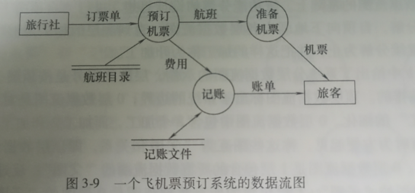
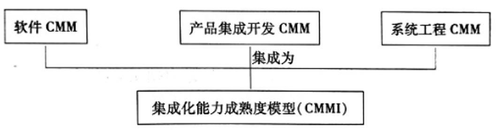
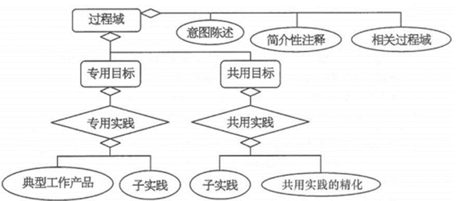
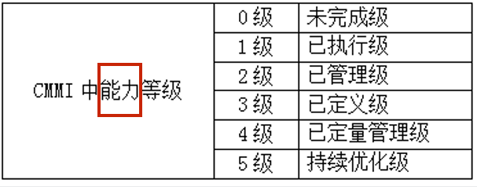
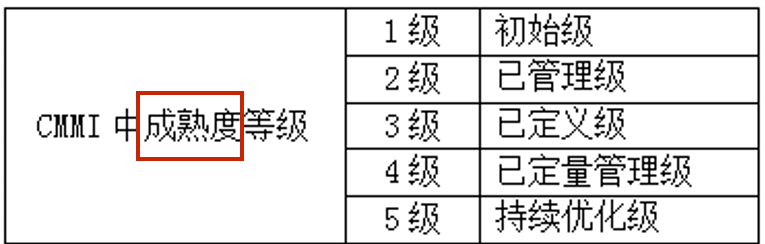

# 软件工程自考笔记

# 第1章:绪论

### 软件工程(software Engineering)概念提出与发展

定义:应用计算机科学理论和技术以及工程管理原则和方法,按预算和进度实现满足用户要求的软件产品的工程,或以此为研究对象的学科

(时间地点)软件工程术语首次出现在1968年NATO会议(北约峰会)上

(起因)软件危机: 随着计算机的广泛应用,软件生产率和质量远远满足不了社会发展需求,成为社会,经济发展的制约因素产生的现象

(目的)概念提出目的: 倡导以工程的原理,原则和方法进行软件开发,期望解决软件危机

(阶段)两个时期

-   1960\~1980
    -   瀑布模型
    -   开发支持,调试,测试工具
    -   过程式语言(c, Ada)
-   1980\~至今
    -   <<软件生存周期过程>> 软件工程标准
    -   计算机辅助软件工程(CASE)
    -   面向对象语言(c++)

### 软件开发本质

定义: 不同抽象层术语之间的"映射",以及不同抽象层处理逻辑之间的"映射"。映射两个方面问题: 如何实现、如何管理。

(组成)软件的组成:程序+文档。程序是计算机任务的处理对象和对处理规则描述。文档是理解程序所需的阐述性资料

(目标)软件开发的目标: 将问题域中概念映射为运行平台层面上的概念。将问题域中处理逻辑映射为运行平台层面上的处理逻辑。"弥补"问题域与运行平台之间的"距离"

(途径)基本途径: 系统建模

模型(待建系统的抽象): 分为概念模型和软件模型(设计模型+实现模型+部署模型),而分层的基本动机是为了控制开发的复杂性

(技术)涉及两大类技术: 求解软件的开发逻辑和求解软件的开发手段

# 第2章:软件需求与软件需求规约

### 需求

定义: 描述了待开发产品/系统(或项)功能上的能力、性能参数或其它性质

性质

-   必要的(Necessary): 该需求是用户所要求的
-   无歧义的(Unambiguous): 该需求只能用一种方式解释
-   可测的(Testable): 该需求是可进行测试的
-   可跟踪的(Traceable): 该需求可从一个开发阶段跟踪到另一个阶段
-   可测量的(Measurable): 该需求是可测量的

分类

-   功能需求: 规约了系统或系统构件必须执行的功能
-   非功能需求
    -   性能需求: 规约了一个系统或系统构件在性能方面必须具有的一些特性
    -   外部接口需求: 规约了系统或系统构件必须与之交互的用户、硬件、软件或数据库元素,其中也可能规约交互格式、时间或其它因素
    -   设计约束: 设计约束是一种需求,它限制了系统或系统构件的设计方案的范围
    -   质量属性: :规约了软件产品所具有的一个性质必须达到其质量方面所期望的水平

发现技术

-   自悟(Introspection): 需求人员把自己作为系统最终用户,审视系统并提出问题
-   交谈(Individual Interview): 需求人员通过提出问题/用户回答的方式,直接询问用户需要什么样的系统
-   观察(Observation): 通过观察用户执行现行的任务和过程,或通过观察他们如何操作与所期望的新系统相关的现有系统,了解系统运行环境,新系统和现存系统的过程以及工作方法之间必须进行的交互
-   小组会(Group Session): 举行客户和开发人员的联席会议,与客户组织的一些代表共同开发需求
-   提炼(Extraction): 复审技术文档,并提取相关信息

### 需求规约&#x20;

定义: 一个软件项/产品/系统所有需求陈述的正式文档,它表达了一个软件产品/系统的概念模型

性质

-   重要性和稳定性程度(Ranked for Importance and Stability): 按需求重要性和稳定性对需求进行分级
-   可修改的(Modifiable): 在不过多影响其他需求的前提下,可以容易的修改一个单一需求
-   完整的(Complete): 没有被遗漏的需求
-   一致性(Consistent): 不存在互斥的需求

内容格式: 由IEEE 830-1998 所给出的格式, 内容由引言，总体描述，特定需求组成

表达风格

-   非形式化的需求规约: 以一种自然语言来表达需求规约,如同用一种自然语言写一篇文章
-   半形式化的需求规约: 以半形式化符号体系来表达需求规约
-   形式化的需求规约: 以一种基于良构数学概念符号体系来编制需求规约

作用

-   是软件开发组与用户之间的一份技术合同书,是产品功能及其环境的体现;
-   对于项目的其余大多数工作,需求规约是一个管理控制点
-   对于产品/系统的设计,需求规约是一个正式的、受控的起始点
-   是创建产品验收测试计划和用户指南的基础,即基于需求规约一般还会产生另外两个文档-初始测试计划和用户系统操作描述

需求规约和项目需求不同

-   需求规约是软件开发组织与用户的一份技术合同书，即关注产品需求
-   项目需求是用户与开发者之间有关技术合同书-产品/系统需求的理解，即关注项目工作与管理

# 第3章:结构化方法

### 需求分析(产出DFD)

三大挑战:问题空间理解、人与人之间的通信和需求变化性

开发方法:结构化方法、面向数据结构的软件开发方法和面向对象方法

基本术语

-   数据流: 数据流是数据的流动。用箭头表示
-   加工: 加工是数据的变换单元,即它接受输入的数据,对其进行处理,并产生输出。用椭圆表示。标识一般采用动宾结构
-   数据存储: 是数据的静态结构。用双横线表示
-   数据源和数据潭: 数据源是数据流的起点,数据潭是数据流的归宿地。是系统之外的实体,可以是人,物或其他软件系统。用矩形表示

首要任务: 建立系统功能模型

-   工具: 数据流图(DFD)图是一种描述数据变换的图形化工具,包含元素可以是数据流,数据存储,加工,数据源和数据潭

建模过程

-   建立系统环境图,确定系统语境
-   自顶向下,逐步求精,建立系统的层次数据流程图
-   定义数据字典
-   描述加工
    -   结构化自然语言: 逻辑关系比较简单
    -   判定表: 逻辑关系比较复杂
    -   判定树: 逻辑关系比较复杂

验证: 需求阶段主要任务是完整地定义问题,确定系统的功能和能力

### 设计

主要任务: 是在需求分析的基础上,确定"怎么做"的问题

**总体设计**

目的: 是建立系统的模块结构,每一模块均是一个"黑盒子",其细节描述是详细设计的任务

基本任务: 把系统的功能需求分配到一个特定的软件体系结构中

基本术语: 模块:指软件中具有特定标识的独立成分。模块调用:即指模块之间的一种使用关系

工具

-   模块结构图: 由yourdon提出的一种描述软件"宏观"结构的图形化工具.处于高层次的是控制模块,处于较低层次的是从属模块,它们功能相对简单且具体
-   层次图: 描绘软件的层次结构
-   HIPO图(层次图+输入/处理/输出的英文缩写): 由美国IBM公司提出

步骤: 将系统的DFD图首先转化为初始的模块结构图,再基于"高内聚低耦合"这一软件设计原则,通过模块化将初始的模块结构图转化为最终的,可供详细设计使用的模块结构图(MSD)

-   变换型数据流图:具有较明显的输入部分和变换部分之间的界面、变换部分和输出部分之间界面的数据流图
-   处理输入数据
-   数据变换部分
-   处理输出数据
-   事务型数据流图: 在其后的若干动作序列中选出一个来执行,这类数据流图称为事务型数据流图
    -   接收输入数据
    -   分析并确定对应的事务
    -   选取与该事务对应的一条活动路径

结论: 实践中,一个大型的软件系统一般是变换型数据流图和事务型数据流图的混合结构,通常以变换设计为主,事务设计为辅进行结构设计

阶段

1.  初始设计
    -   设计准备-复审精化系统模型
    -   变换设计:确定输入、变换、输出这三部分之间的边界 事务设计:确定事务处理中心
    -   第一级分解-系统模块结构图顶层和第一层设计
    -   第二级分解-自顶向下,逐步求精
2.  精化设计
3.  复审阶段

"高内聚,低耦合"启发式规则

作用: 提高模块的独立性

耦合:耦合是指不同模块之间相互依赖程度的度量

-   内容耦合:一个模块直接修改或操作另一个模块的数据,或一个模块不通过正常人口而转入到另一个模块时
-   公共耦合:两个或两个以上的模块共同引用一个全局数据项
-   控制耦合:一个模块通过接口向另一个模块传递一个控制信号,接收信号的模块根据信号值进行适当的动作
-   标记耦合:若一个模块A通过接口向两个模块B和C传递一个公共参数,那么称模块B和C之间存在一个标记耦合
-   数据耦合:模块之间通过参数来传递数据,则称为数据耦合

内聚:内聚是指一个模块内部各成分之间相互关联程度的度量

-   偶然内聚: 一个模块的各成分之间基本不存在任何关系
-   逻辑内聚: 几个逻辑上相关功能被放在同一模块中
-   时间内聚:一个模块完成的功能必须在同一时间内执行,但这些功能只是因为时间因素关联在一起
-   过程内聚:一个模块内部的处理成分是相关的,而且这些处理必须以特定的次序执行
-   通信内聚: 一个模块的所有成分都操作或生成同一数据集
-   顺序内聚: 一个模块的各个成分和同一个功能密切相关,而且一个成分的输出作为另一个成分的输入
-   功能内聚: 模块的所有成分对于完成单一的功能都是基本的

术语

-   深度表示其控制的层数
-   宽度是指同一个层次上模块总数的最大值
-   扇出是指一个模块直接控制的下级模块数目
-   扇入表明有多少个上级模块直接调用它
-   模块的控制域是指这个模块本身以及所有直接或间接从属于它的模块的集合
-   模块的作用域是指受该模块内一个判定所影响的所有模块的集合

规则

-   1.改进软件结构,提高模块独立性
-   2.力求模块规模适中
-   3.力求深度、宽度、扇出和扇入适中
-   尽力使模块的作用域在其控制域之内
-   尽力降低模块接口的复杂度
-   力求模块功能可以预测

结论: 好的软件结构设计，通常顶层模块扇出比较大，中间层模块扇出小，底层扇入较大，即系统的模块结构呈现"葫芦"形状

**详细设计**

方式: 结构化程序设计就一种基于结构的编程方法,即采用顺序结构、选择结构以及重复结构进行编程(理论上最基本的控制结构只有两种顺序和循环),其中每一结构只允许一个入口和一个出口

工具

-   程序流程图(程序框图):不是一种逐步求精的工具。所表达的控制流,往往不受任何约束可随意转移,从而会影响甚至破坏好的系统结构设计。不易表示数据结构
-   盒图(N-S图)
-   PAD(Problem Analysis Diagram)缩写
-   类程序设计语言(伪码)

# 第4章:面向对象方法UML

全称: 统一建模语言(Unified Modeling Language)

意义:  UML是面向对象技术发展的重要里程碑

定义: UML把客观世界的一切事务(包括客体和可标识的行为单元)分为8大范畴，为了规约这8大范畴的事物,UML引入8个术语

### 基本术语

表达客观事物的术语

-   类与对象: 类是一组具有相同属性、操作、关系和语义的对象的描述，而对象是类的一个实例
    类的属性(Attribute): 表达属性的默认语法为\[可见性]属性名\[':'类型]\['\[多重性]']\['='初始值]\[{','性质串}]
    详情见书78页
-   接口(Interface): 一个操作的集合,其中每个操作描述了一个类、构件或子系统的服务
-   协作(Collaboration): 一个交互、涉及交互的三要素:交互各方、交互方式以及交互内容
-   用况(Use Case): 对一组动作序列的描述
-   主动类(Active Class): 至少具有一个进程或线程的类
-   构件(Component): 系统设计中的一种模块化部件,通过外部接口隐藏了它的内部实现
-   制品(Artifact): 系统中包含物理信息(比特)的、可替代的物理部件
-   节点(Node): 是在运行时存在的物理元素、通常表示一种具记忆能力和处理能力的计算机资源

表达关系的术语

-   关联(Association)关联是类目之间的一种结构关系,是对一组具有相同结构、相同链(links)的描述
    -   关联名(Name):关联可以有一个名字,用于描述该关联的一定"内涵"
    -   导航: 对于一个给定类目,可以找到与之关联的另一个类目
    -   角色(Role):是关联一端类目对另一端类目的呈现
    -   可见性:通过导航可以找到另一类目的实例
    -   多重性(Multiplicity):类中对象参与一个关联的数目
    -   限定符(Qualifier): 是一个关联属性或属性表
    -   聚合(Aggregation):分类是增加客观实际问题语义的一种手段
    -   组合(Composition):组合又是聚合的一种特殊形式
    -   关联类:是一种具有关联和类特性的模型元素
-   泛化(Generalization)是一般类目(称为超类或父类)和它的较为特殊性类目(称为子类)之间的一种关系. is-a-kind-of
    -   完整(Complete): 模型中给出了泛化中所有子类，不允许增加子类
    -   不完整(Incomplete): 模型中没有给出了泛化中所有子类，允许增加子类
    -   互斥(Disjoint): 父类对象最多允许该泛化中一个子类作为它的类型
    -   重叠(Overlapping): 表明父类对象允许该泛化中可能有多个子类作为它的类型
-   细化(Realization)是类目之间的语义关系,其中一个类目规约了另一个类目执行的契约
-   依赖(Dependency)是一种使用关系,用于描述一个类目使用另一个类目的信息和服务
    -   标记: 绑定(Bind)、导出(Derive)、允许(Permit)、实例(InstanceOf)、实例化(Instantiate)、幂类型(Powertype)、精化(Refine)、使用(Use)
    -   客观世界一切事务之间的关系都可用依赖来规约
    -   关联、泛化和细化是一类特定的依赖

<!---->

-   表达组合信息的术语
    -   为了控制信息组织的复杂性,UML提供了组织信息的一种通用机制--包
    -   通过在包的名字前加上一个可见性符号(+,-,#),来指示该包的可见性.
        \+:表示对其它包都可见
        \#:表示对子孙包都可见
        \-:表示对其它包都不可见

### 工具类型

-   结构图: 表达系统或系统成分的静态结构模型和一些说明信息
-   行为图: 表达系统或系统成分的动态结构模型和一些行为信息

### 建模工具

类图: 可视化表达系统静态结构模型的工具,通常包含类,接口,关联,泛化,依赖关系等

-   模型化待建系统中的概念,形成类图中的基本元素
-   模型化待建系统中的各种元素
-   模型化系统中的协作,给出系统的最终类图
-   模型化逻辑数据库模式

用况图: 一种表达系统功能模型的图形化工具

-   功能: 可以为系统建模,描述软件系统行为的功能结构,也可以对业务建模,描述企业或组织业务过程结构.业务模型和系统模型之间具有"整体/部分"关系.
-   六元素: 主题、用况:动作序列、关联、泛化、依赖、参与者

状态图: 显示一个状态机的图,强调了一个状态到另一状态的控制流

-   一个状态机: 是一种行为,规约了一个对象在其生存周期因响应事件并作出响应,而经历的状态
-   一个状态: 是类目的一个实例在其生存期的一种条件或情况,期间该实例满足这一条件,执行某一活动或等待某一消息
-   状态分类: 初态,常态,终态
-   事件: 一个事件是对确定的时空内一个有意义发生的规约。2类事件: 外部事件,内部事件。UML中将信号,调用,时间和变化模型的事件为别称为信号事件,调用事件.

顺序图:是一种交互图,即由一组对象以及按时序组织的对象之间的关系组成,其中还包含这些对象之间所发送的消息

# 第5章:面向对象方法RUP

全称: 统一软件开发过程(Rational Unified Process)

过程: RUP的每次迭代中都要经历一个核心工作流，即需求获取、分析、设计、实现和测试

特点:

-   以用况为驱动: 指在系统的生存周期中，以用况作为基础，驱动系统有关人员对要建立系统的功能需求进行交流，驱动系统分析、设计、实现和测试等活动
-   以体系结构为中心: 指在系统的生存周期中，开发的任何阶段都要给出相关模型视角下有关体系结构的描述，作为构思、构造、管理和改善系统的主要制品
-   迭代,增量式开发: 指通过开发活动的迭代，不断地产生相应的增量,分为初始阶段,细化阶段,构造阶段和移交阶段4个阶段

### 需求获取

目的：使用UML中的用况、参与者及依赖等术语抽象客观实际问题，形成系统的需求获取模型——一种特定的系统/产品模型，并产生该模型视角下的体系结构描述

工具：采用Use Case技术获取需求

步骤

-   1\. 列出候选需求: 先从客户、用户、计划者、开发者的想法和意愿中搜取特征，形成特征表
-   2\. 理解系统语境: 创建领域模型和业务模型
    -   领域模型: 一般用类图表达，用于捕获系统语境中的一些重要领域对象类.
    -   业务模型: 以用况图表达、包括工作人员、工作单元和业务实体
-   3\. 捕获系统功能需求: 创建系统的用况模型(用况模型是系统的一种概念模型，是对系统功能的抽象，包括系统参与者、系统用况以及它们之间的关系)
-   4\. 捕获系统非功能需求: 补充需求/针对一些特定需求的用况

### 需求分析

目的: 在系统用况模型的基础上,创建系统分析模型以及在该分析模型视角下的体系结构的描述

基本术语

-   分析类: 分析类是概念层面上的"大粒度"术语，是类的一种衍型,很少有操作和特征标记,并用责任来定义其行为,并且其属性和关系也是概念性的
-   边界类: 封装了一些重要的通信接口和用户界面机制,可以用边界类来分离不同用户接口或不同通信接口,形成一个或多个边界类
-   实体类: 封装了问题域中一个重要现象
-   控制类: 封装了一些重要定序

分析包: 是一种控制信息组织复杂性的机制,提供了分析制品的一种组织手段,形成一些可管理的部分

用况细化: 是一个协作

主要活动

-   体系结构分析: 建立分析模型体系结构"骨架",标识有关分析包和分析类的特定需求。定义分析包的依赖;标识重要的实体类;标识分析包和重要实体类的公共特定需求
-   用况分析: 标识那些在用况事件执行流中所需要的分析类和对象;将用况的行为，分布到参与交互的各个分析对象;捕获用况细化上的特定需求
-   类的分析: 标识并维护分析类的责任;基于它们在用况细化中的角色,标识并维护分析类的属性和关系;捕获分析类细化中特殊需求
-   包的分析: 确保分析包尽可能与其他包相对独立;确保分析包实现了它的目标,即细化某些领域类或用况;描述依赖,以益于可以估计未来的变化

分析模型: 与用况模型一样,也是一种概念模型,解决系统用况模型中存在二义性和不一致性等问题

表达: 1.分析模型由“分析系统”定义，该分析系统包含一组具有层次结构的包，每个包中可包含一些分析类和用况细化;2.分析类和用况细化可单独出现在分析模型中，以凸显其系统体系结构方面的作用

对以后工作的影响: 设计中子系统、设计类、用况细化

用况模型和分析模型的比较

| 用况模型                       | 分析模型                      |
| -------------------------- | ------------------------- |
| 客户语言                       | 开发者语言                     |
| 给出系统对外视图                   | 给出系统对内视图                  |
| 用用况结构化，给出外部视角下的系统结构        | 用衍型类结构化，给出内部视角下的系统结构      |
| 客户和开发者间关于“系统应做什么、不应做什么”的契约 | 开发者理解系统如何勾画、如何设计、如何实现的基础  |
| 需求间存在冗余、不一致、冲突等            | 需求间不应存在冗余、不一致、冲突等         |
| 捕获系统功能，包括在体系结构方面有意义的功能     | 给出细化的系统功能，包括在体系结构方面有意义的功能 |
| 定义了进一步需在分析模型中予以分析的用况       | 定义了用况模型中每一个用况的细化          |

### 设计

目的：定义满足系统/产品分析模型所规约需求的软件结构

基本术语

设计类: 对系统实现一个类或类似构造的一个无缝抽象

接口: 用于规约由设计类和设计子系统提供的操作；为设计类/设计子系统提供一种分离功能的手段；一个接口的重要关联是细化

用况细化: 设计模型中的一个协作，使用设计类及其对象，描述一个特定用况是如何细化、执行的

设计子系统: 包含设计类、用况细化、接口，及其他子系统， 通过对其操作来显示功能

主要活动

体系结构设计: 创建设计模型和部署模型，及其视角下的体系结构描述

用况的设计: 分析模型的用况细化是该活动的输入，对应输出用况细化

类的设计: 完成用况细化\[设计]中每一类的角色设计，完成有关每一类的非功能需求设计

子系统设计: 确保子系统尽可能独立于其他子系统或其接口;
确保子系统提供正确接口;
确保子系统实现了目标，即给出该子系统提供的接口定义的操作的细化

设计模型及其视角下的体系结构描述

RUP设计主要结果是系统设计模型，它尽量保持该系统具有分析模型结构，并作为系统实现的输入

包括元素:设计子系统和服务子系统，及其依赖、接口和内容;设计类，及其具有的操作、属性、关系、实现需求;用况细化\[设计]，描述了用况的设计;体系结构描述。

部署模型及其模型视角下的体系结构描述

RUP设计主要结果是系统的设计模型，它尽量保持该系统具有分析模型结构，并作为系统实现的输入

包括元素

-   设计模型包括以下元素：设计子系统和服务子系统，以及它们的依赖、接口和内容
-   设计类，以及它们具有的操作、属性、关系及其实现需求
-   用况细化\[设计]
-   体系结构描述

设计模型与分析模型比较

| 设计模型                              | 分析模型                        |
| --------------------------------- | --------------------------- |
| 概念模型，对系统的抽象，无实现细节                 | 软件模型，对系统的抽象，无实现细节           |
| 可用于不同设计                           | 特定于一个实现                     |
| 用3个衍型类：控制类、实体类、边界类                | 用多个衍型类，依赖于实现语言              |
| 几乎非形式化                            | 较形式化                        |
| 开发费用少（相对于设计是1:5) 开发费用高（相对于分析是5:1) | 开发费用高（相对于分析是5:1)            |
| 结构层次少                             | 结构层次多                       |
| 动态的，很少关注定序                        | 动态的，更多关注定序                  |
| 概括地给出了系统设计，包括系统的体系结构              | 表明了系统设计，包括设计视角下的系统体系&#xA;结构 |
| 软件生存周期中不能修改、增加等                   | 软件生存周期中应维护                  |
| 为构建系统包括创建设计模型，定义一个结构，是一个基本输入      | 构建系统时，尽可能保留分析模型所定义结构        |

实现的目标: 基于设计类和子系统生成构件。对构件进行单元测试、集成、连接。把可执行的构件映射到部署模型

实现活动

| 活动名 | 输入                                                  | 活动     | 执行者     | 输出                             |
| --- | --------------------------------------------------- | ------ | ------- | ------------------------------ |
| 活动1 | 设计模型、部署模型、体系结构描述设计模型、部署模型、体系结构描述&#xA;\[设计模型、部署模型角度] | 实现体系结构 | 体系结构设计者 | 构件\[概述]、体系结构、描述 \[实现模型、部署模型角度] |
| 活动2 | 补充需求、用况模型、设计模型、实现模型\[当前建造]                          | 集成系统   | 系统集成者   | 集成建造计划、实现模型\[连续的建造]            |
| 活动3 | 集成建造计划、体系结构描述\[实现模型角度]、设计子系统\[已设计]、接口\[已设计]         | 实现子系统  | 构件工程师   | 实现子系统\[建造完成]，接口\[建造完成]         |
| 活动4 | 设计类\[已设计]、接口\[由设计类提供]                               | 实现类    | 构件工程师   | 构件\[完成]                        |
| 活动5 | 构件\[完成]、接口                                          | 完成单元测试 | 构件工程师   | 构件\[已完成单元测试]                   |

# 第6章 软件测试

### 软件测试目标与测试过程模型

软件测试的概念:  使用人工或自动手段，运行或测定某个系统的过程，目的是检验它是否满足规定的需求，清楚了解预期结果与实际结果的差异

软件测试目标: 首要目标:预防错误(几乎不可实现); 第二目标:发现错误

软件评估: 静态评估(评审、走查和形式化证明); 动态评估(软件测试)

软件测试目的认识阶段

1.  软件测试和软件调试无区别
2.  测试为表明软件能正常工作
3.  测试为表明软件不能正常工作
4.  测试仅为了将已察觉的错误风险减少到可接受的程度
5.  测试不仅是一种行为，而是一种理念，即测试是产生低风险软件的一种训练

好的测试方案：极尽可能去发现迄今为止尚未发现的错误的测试方案

成功的测试：发现了至今为止尚未发现的错误的测试

软件测试与软件调试的区别

| 软件测试                                    | 软件调试                       |
| --------------------------------------- | -------------------------- |
| 从侧面证明程序员的"失败"                           | 为证明程序员的正确                  |
| 从已知条件开始，使用预先定义的程序且有预知结果，不可预见的仅是程序是否通过测试 | 以不可知的内部条件开始，除统计性调试外，结果不可预见 |
| 有计划、要进行测试设计                             | 不受时间约束                     |
| 一个发现错误、改正错误、重新调试的过程                     | 一个推理过程                     |
| 执行有规程                                   | 执行要求程序要进行必要推理              |
| 由独立的组在不了解软件设计条件下完成                      | 必须由了解详细设计的程序员完成            |
| 多数测试的执行和设计可由工具支持                        | 程序员能利用的工具主要是调试器            |

软件测试是一个有程序的过程，包括测试设计、测试执行、测试结果比较等

### 软件测试技术

分类: 白盒测试技术; 黑盒测试技术

路径测试技术要点

用控制流程图表达被测程序模型，揭示程序的控制结构

合理选择一组穿过程序的路径，达到某种测试度量

控制流程图

表示程序控制结构的图形化工具

程序流程图的差异: 过程块的差异，在控制流程图中不显示细节，在程序流程图中着重于过程属性的描述

元素

-   过程块：没被判定和（或）被节点分开的一组程序语句
-   判定：一个程序点，此处控制流出现分叉
-   节点：一个程序点，此处控制流进行汇合
-   链：判定、节点、过程块之间一种具有特定语义的关系
-   路径：一个有程序入口和出口的链的集合(路径命名方式：用相关的链命名)

测试策略: 语句覆盖 ≤ 分支覆盖 ≤ 条件组合覆盖 ≤ 路径覆盖

| 名称     | 概念                     | 特点                |
| ------ | ---------------------- | ----------------- |
| 路径覆盖   | 执行所有可能穿过程序控制流程的路径      | 度量最强，不可实现         |
| 语句覆盖   | 至少执行程序中所有语句一次          | 度量最低              |
| 分支覆盖   | 至少将程序中的每一分支执行一次        | 度量强于语句覆盖；不能查出全部错误 |
| 条件覆盖   | 每个判定中为真的条件取值至少执行一次     |                   |
| 条件组合覆盖 | 每个判定中所有可能的条件取值组合至少执行一次 |                   |

总结: 路径选取是测试用例设计的基础;实际软件测试中好的用例设计是发现程序错误的关键。

### 软件测试步骤

**单元测试**

任务：检验软件设计的最小单元——模块

指导: 该测试以详细设计文档为指导,测试模块内的重要控制路径

技术：单元测试常采用白盒测试技术

考虑的模块特征

-   模块接口
-   局部数据结构
-   重要的执行路径
-   错误的执行路径

测试中，模块不是独立程序，须为每个模块单元测试开发驱动模块和承接模块

-   驱动模块：模拟“主程序”接受测试用例的数据，将这些数据传送给要测试的模块并打印结果
-   承接模块：代替被测模块的下属模块，打印入口检查信息，并将控制返回到它的上级模块

被测模块的设计是内聚程度高/呈功能性，可简化单元测试

**集成测试**

任务: 其目标是发现与接口有关的错误，将经过单元测试的模块构成一个满足设计要求的软件结构。

驱动模块: 设计承接模块替代其直接的下属模块，按选取的测试方式（先深度/先宽度），在组合模块时进行测试

**有效性测试**

技术：常采用黑盒测试技术

验证：软件需求的可追溯性

任务：关注检验是否符合用户的文档

目标：发现软件实现的功能与需求规格说明书不一致的错误

\*\* 系统测试 \*\*

# 第7章 软件生存周期过程与管理

\*\* 引言\*\*&#x20;

-   软件生存周期：软件产品/系统的一系列相关活动的全周期。从形成概念开始，历经开发、交付使用、在使用中不断修订和演化，直到最后被淘汰，让位于新的软件产品。
-   软件工程标准的基础文件：《ISO/IEC软件生存周期过程12207—1995》
-   软件生存周期过程的3个过程：基本过程、支持过程、组织过程

\*\* 过程描述 \*\*

-   供应过程
-   软件实现过程
-   软件需求分析过程
-   软件体系结构设计
-   软件验证过程
    -   定义: 证实产品是否正确反映规约的需求
    -   作用: 证实是否正确的反映了所规约的需求
    -   区别: 与该产品所要求的特征进行比较
-   软件确认过程
    -   定义: 证实使用的软件是否满足需求
    -   作用: 证实所期望使用的软件工作产品是否满足其需求
    -   区别: 反映特定期望使用的特殊需求

**应用说明**

-   执行系统中确定的主要功能
    -   控制功能
    -   耦合功能
    -   软件本身提供的功能
-   《ISO/IEC系统生存周期15288》
-   组织层和项目层
-   过程间的时序关系
-   过程分解
-   生存周期模型和阶段

### 软件生存周期模型

**瀑布模型**

概念：将软件生存周期的各项活动规定为按固定顺序而连接的若干阶段工作，形如瀑布流水，最终得到软件产品

支持结构化软件开发、控制软件开发的复杂性、促进软件开发工程化

需求已被很好的理解，且开发组织非常熟悉为实现这一模型所需要的过程

**增量模型**

概念：指需求可以分组，形成一个个的增量，并可形成一个结构，即该模型有一个前提，需求可结构化，在此条件下，对每一增量实施瀑布式开发

适用：“技术驱动”的软件产品开发，常被工业界所采用

优点: 第一个可交付版本需时间和成本较少;减少用户需求的变更;增量投资

缺点: 初始增量可能会造成后来增量的不稳定;一些增量就可能需要重新开发;增大管理成本

**演化模型**

类型：迭代、增量式开发模型

基础：用户提出待开发系统的核心需求

过程: 根据需求，开发一个核心系统并投入运行，以便用户能够有效提出反馈;软件开发人员根据用户反馈;实施开发的迭代过程

迭代：由需求、设计、编码、测试、集成组成

增量：通过增加或修正，产生软件产品的增量,最终完成软件产品的开发

适用：事先不能完整定义需求的软件

**螺旋模型**

概念: 在瀑布模型和演化模型的基础上，加入两者忽略的风险分析;沿着螺旋线，经历制定计划，风险分析，实施工程，客户评估这4个方面的活动;自内向外每旋转一圈便产生一个更为完善的新版本

适用:项目的开发风险很大或客户不能确定系统需求

**喷泉模型**

特征：迭代、无间隙

意义：说明了软件活动需要多次重复；活动之间没有明显的间隙

适用：面向对象技术的软件开发

**过程规划与管理**

关于过程建立

-   项目管理计划
    -   过程管理(主体)
    -   软件工程管理
    -   软件配置管理
    -   软件质量保证
    -   软件验证和确认
    -   软件度量
-   建立、评估、改进
-   选择软件生存周期模型(SLCM)的步骤
    -   标识开发项目可用的SLCM
    -   标识那些会影响SLCM选择的属性
    -   标识为选择SLCM所需要的任何约束
    -   评估所选择的SLCM
    -   选择最能满足项目属性和约束的 SLCM

关于软件生存周期过程的监控

-   软件生存周期过程——回答软件开发需要做哪些工作
-   软件生存周期模型——回答软件开发活动或任务如何组织
-   软件项目过程管理——回答软件过程如何管理
-   软件生存周期过程是软件生存周期模型和软件项目过程管理的基础
-   软件生存周期模型为软件项目过程管理提供支持

# 第8章 集成化能力成熟度模型

### 背景与原理

CMMI(集成化能力成熟度模型，Capability Maturity Model Integration for Development)

基本思想

-   CMMI模型基于过程途径思想，把软件质量的3个支撑点：受训的人员、规程和方法、工具和设备进行集成，以开发所期望的系统产品
-   CMMI紧紧围绕开发、维护和运行，把经过证明的最佳实践放在一个结构中
-   该结构有助于指导组织确定其过程的改善优先次序；有助于指导这些改善的实施，以提高其过程能力和成熟度，还支持其他领域能力成熟度模型的开发

CMMI的模型部件

CMMI的等级: 为改善其开发过程和维护过程的组织，CMMI提供了2种类型的等级，这2种等级描述了2种过程改善的演化路径

**能力等级**

过程能力：是指遵循一个过程可达到的预期结果的程度

能力等级：一种过程改善路径，该路径可使组织针对单一过程域不断改善该过程域，即指在单一过程域中已达到的过程改善。能力等级是为了管理，对过程改善程度所设定的几个“台阶

CMMI有6个共用目标，用于表征过程制度化的程度，能力等级1\~5分别对应共用目标1\~5的过程，代表着过程制度化程度的提高。故共用目标编号越小，制度化程度越低

**组织成熟度等级**

成熟度等级：一种过程改善路径，该路径可使组织通过关注一组过程域不断改善一组相关过程域；意在改进组织的整体性能

成熟度等级的组成：由预先定义的一组过程域集及其相关的一些专用实践和共用实践

能力等级和成熟度等级可用于评定活动、估算，作为过程评估的结果

**过程域举例**

项目规划过程域: 建立并维护项目活动计划的定义

需求开发过程域: 生成并分析客户、产品和产品部件需求
