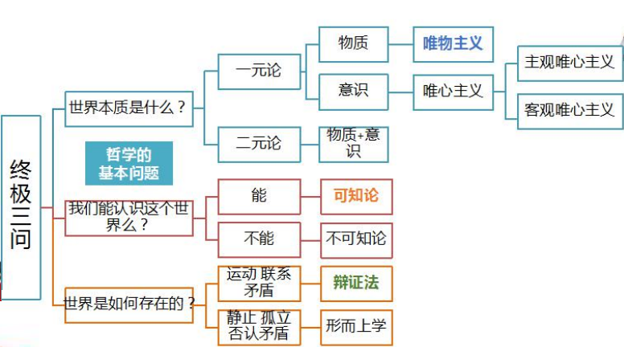

# 马原自考笔记

# 第一章:绪论

### 第一节: 产生与发展

马克思主义是时代的产物，是在 19 世纪 40 年代

马克思主义理论体系分为三个部分: 马克思主义哲学,马克思主义政治经济学,科学社会主义

直接理论来源:

1.  德国古典哲学:其代表人物有**黑格尔**(辩证法)和**费尔巴哈**(唯物论)
2.  英国古典政治经济学:代表人物**亚当•斯密**和**大卫•李嘉图**
3.  英法两国空想社会主义:代表人物是**圣西门**、**傅立叶**和**欧文**

为马克思主义的产生提供了坚实的自然科学基础的有:细胞学说、生物进化论和能量守恒与转化定律

马克思主义在实践中不断发展:

1.  公开问世:《哲学的贫困》和《共产党宣言》是马克思主义公开问世的标志
2.  列宁主义: 社会主义革命有可能在一国或几国首先取得胜利
3.  中国化: 马克思主义中国化得两大理论成果是毛泽东思想和中国特色社会主义理论体系

### 第二节: 科学性和革命性的统一

马克思主义的科学内涵(定义):

1.  马克思主义是马克思、恩格斯共同创立的。为他们的后继者所发展的，以反对资本主义、建设社会主义和共产主义为目标的科学理论体系。简单说是关于工人阶级和人类解放的科学
2.  具体说明:
    1.  马克思、恩格斯共同创立的
    2.  列宁、毛泽东、邓小平等人对马克思主义的继承和发展
    3.  马克思理论前后相继、一脉相承、在本质上是一致的
    4.  马克思主义的各个组成部分、不是彼此孤立、互不相联系的、而是组成一个具有内在逻辑联系的科学体系、其中马克思主义哲学是科学的世界观和方法论、政治经济学揭示了资本主义的发展规律、处于核心地位的则是科学社会主义理论

马克思主义的理论特征(特点)

1.  马克思主义的根本理论特征: 是以实践为基础的科学性和革命性的统一
2.  马克思主义的革命性：表现为具有彻底的批判精神和鲜明的政治立场
3.  马克思主义的科学性：是指它既是建立在科学基础之上的，又是关于自然、社会和思维发展普遍规律的科学
    1.  它不带任何偏见，清除一切狭隘性和片面性的弊端，力求按照世界的本来面目去如实地认识世界，揭示自然界和人类社会发展的客观规律，并根据对客观规律的认识去能动地改造世界
    2.  马克思主义的科学性还在于它的深刻性
    3.  马克思主义之所以具有科学性,不仅仅在于它揭示了自然界和人类社会发展的客观规律,而且还在于它经受了实践的检验并随着实践的发展而不断发展

马克思主义理论品质(优点):**与时俱进**

马克思主义的社会理想(目标)

1.  马克思主义的社会理想是**推翻资本主义、实现社会主义和共产主义**
2.  共同理想是实现最高理想的必经阶段和必要基础
3.  实现共同理想，必须坚持以**最高理想为根本方向**

### 第三节: 学习马克思主义

学习马克思主义的根本方法: **理论联系实际**,我们学习马克思主义的目的全在于运用。所谓理论联系实际,就是把马克思主义的基本原理作为指导,去观察和分析社会实际、工作实际和思想实际。在实际工作中反对经验主义和教条主义两种倾向

世界本质是什么?

1.  一元论: 物质(唯物主义)或意识(唯心主义)。 唯心主义又有主观唯心和客观唯心
2.  二元论: 物质和意识

我们能认识这个世界么?

1.  可知论: 能
2.  不可知论: 不能

世界是如何存在的?

1.  **辩证法**: 运动联系矛盾
2.  形而上学: 静止孤立否认矛盾

物质世界的客观存在

1.  (哲学的基本问题一)物质和意识哪个是世界的本原，即第一性问题。分为**唯物主义**和**唯心主义**
    1.  唯物主义:古代朴素唯物主义、近代形而上学唯物主义、辩证唯物主义和历史唯物主义
    2.  唯心主义: 主观唯心主义,客观唯心主义
2.  世界本原是统一还是分裂,分为**一元论**和**二元论**
    1.  一元论: 认为世界的本原是意识或者物质,是统一的
    2.  二元论: 认为世界的本原是意识和物质,是分裂的

# 第二章: 马克思哲学

### 第一节: 物质世界及其发展规律

### 第二节: 认识本质及其规律

### 第三节: 人类社会及其发展规律

# 第三章: 马克思政治经济学

### 第一节: 资本主义制度的形成及其本质

### 第二节: 资本主义的发展及其规律

# 第四章: 科学社会主义

### 第一节: 社会主义的发展及其规律

### 第二节: 共产主义社会是人类最崇高的社会理想
