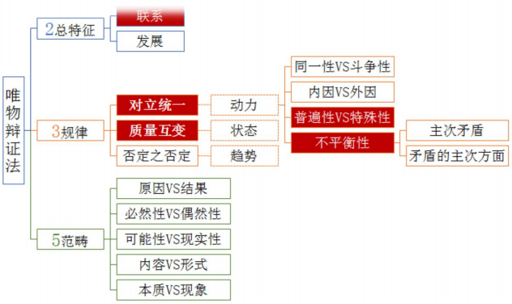

# 马原自考笔记

# 第零章: 绪论

### 第一节: 马克思主义的产生和发展

马克思主义是时代的产物，是在 19 世纪 40 年代

马克思主义理论体系分为三个部分: 马克思主义哲学,马克思主义政治经济学,科学社会主义

**直接理论来源:**

1.  德国古典哲学:其代表人物有**黑格尔**(辩证法)和**费尔巴哈**(唯物论)
2.  英国古典政治经济学:代表人物**亚当•斯密**和**大卫•李嘉图**
3.  英法两国空想社会主义:代表人物是**圣西门**、**傅立叶**和**欧文**

为马克思主义的产生提供了坚实的自然科学基础的有:细胞学说、生物进化论和能量守恒与转化定律

**马克思主义在实践中不断发展:**

1.  公开问世:《哲学的贫困》和《共产党宣言》是马克思主义公开问世的标志
2.  列宁主义: 社会主义革命有可能在一国或几国首先取得胜利
3.  中国化: 马克思主义中国化得两大理论成果是毛泽东思想和中国特色社会主义理论体系

### 第二节: 马克思主义科学性和革命性的统一

**马克思主义的科学内涵(定义):**

1.  马克思主义是马克思、恩格斯共同创立的。为他们的后继者所发展的，以反对资本主义、建设社会主义和共产主义为目标的科学理论体系。简单说是关于工人阶级和人类解放的科学
2.  具体说明:
    1.  马克思、恩格斯共同创立的
    2.  列宁、毛泽东、邓小平等人对马克思主义的继承和发展
    3.  马克思理论前后相继、一脉相承、在本质上是一致的
    4.  马克思主义的各个组成部分、不是彼此孤立、互不相联系的、而是组成一个具有内在逻辑联系的科学体系、其中马克思主义哲学是科学的世界观和方法论、政治经济学揭示了资本主义的发展规律、处于核心地位的则是科学社会主义理论

**马克思主义的理论特征(特点):**

1.  马克思主义的根本理论特征: 是以实践为基础的科学性和革命性的统一
2.  马克思主义的革命性：表现为具有彻底的批判精神和鲜明的政治立场
3.  马克思主义的科学性：是指它既是建立在科学基础之上的，又是关于自然、社会和思维发展普遍规律的科学
    1.  它不带任何偏见，清除一切狭隘性和片面性的弊端，力求按照世界的本来面目去如实地认识世界，揭示自然界和人类社会发展的客观规律，并根据对客观规律的认识去能动地改造世界
    2.  马克思主义的科学性还在于它的深刻性
    3.  马克思主义之所以具有科学性,不仅仅在于它揭示了自然界和人类社会发展的客观规律,而且还在于它经受了实践的检验并随着实践的发展而不断发展

马克思主义理论品质(优点):**与时俱进**

**马克思主义的社会理想(目标)**

1.  马克思主义的社会理想是**推翻资本主义、实现社会主义和共产主义**
2.  共同理想是实现最高理想的必经阶段和必要基础
3.  实现共同理想，必须坚持以**最高理想为根本方向**

### 第三节: 学习、运用和发展马克思主义

学习马克思主义的根本方法: **理论联系实际**,我们学习马克思主义的目的全在于运用。所谓理论联系实际,就是把马克思主义的基本原理作为指导,去观察和分析社会实际、工作实际和思想实际。在实际工作中反对经验主义和教条主义两种倾向

# 第一章: 物质世界及其发展规律

### 第一节: 物质世界和实践

物质和意识哪个是世界的本原，即第一性问题。分为**唯物主义**和**唯心主义**

唯物主义:古代朴素唯物主义、近代形而上学唯物主义、辩证唯物主义和历史唯物主义

唯心主义: 主观唯心主义,客观唯心主义

世界本原是统一还是分裂,分为**一元论**和**二元论**。一元论: 认为世界的本原是意识或者物质,是统一的;二元论: 认为世界的本原是意识和物质,是分裂的

意识能否认识物质,即同一性问题。分为可知论和不可知论。

世界是如何存在的?分为辩证法和形而上学。运动联系矛盾为辩证法；静止孤立否认矛盾为形而上学。

马克思选择唯物主义和辩证法

物质观: 物质是不依赖于意识又能为意识所反映的客观实在。列宁对物质的定义:物质是标志客观实在的哲学范畴,这种客观实在是人通过感觉感知的,它不依赖于我们的感觉而存在(物质先于意识,同唯心主义划清了界限),为我们的感觉所复写,摄影,反映(物质可被认识,同不可知论划清了界限)。物质的唯一特性是客观实在性(客观实在性是一切物质的共性)

运动观

1.  运动是物质的根本属性和存在方式。否认运动,导致形而上学。否认物质,导致唯心主义
2.  运动与静止的关系：物质是绝对运动和相对静止的统一

时空观: 时间和空间是物质运动的存在方式。

1.  时间是物质运动的持续性、顺序性。(一维性:不可逆)
2.  空间是物质运动的广延性和伸张性。(三维性：长宽高)

实践观: 实践的本质、特点、形式和作用。

1.  实践的本质: 实践是主体能动地改造和探索客体的客观物质活动。主体:具有实践能力的人。个人主体,集团(群体)主体,类主体;客体:主体实践活动所指向的对象。自然客体、社会客体、精神客体。
2.  实践的特点: 客观性,自觉能动性,社会历史性
3.  实践的基本形式: 物质生产实践(最基本的实践形式),处理社会关系的实践,科学实验。
4.  社会生活在本质上是实践的。马克思主义认为: 实践是人类社会产生、存在和发展的基础, 所以实践就是社会生活的本质。
    1.  劳动实践是人类社会产生的决定环节(人的发展)
    2.  物质生产实践是人类社会得以存在的基础(衣食住行)
    3.  实践活动是推动社会发展的动力(社会的进步)

### 第二节: 物质世界的普遍联系和永恒发展

**联系的观点和发展的观点是唯物辩证法的总特征**

1.  联系:事物之间以及事物内部诸要素之间的相互影响、相互作用和相互制约。联系的特点:客观性,普遍性,多样性。
2.  发展:新事物代替旧事物的过程。(新事物的产生和旧事物的灭亡)区分新旧事物根本标志:是否符合事物发展的必然趋势;是否具有强大的生命力;是否有远大的发展前途。新事物必然战胜旧事物，是由新旧事物的本质特点和事物发展的辩证本性决定的
    1.  新事物符合事物发展的必然趋势,具有强大的生命力和远大的发展前途
    2.  新事物优越于旧事物
    3.  新事物从根本上符合广大人民群众的利益和要求，能得到广大人民群众的拥护和支持

**唯物辩证法三大规律**

1.  对立统一规律揭示了事物发展的动力和源泉。(内部矛盾)
2.  质量互变规律揭示了事物发展的状态和形式。
3.  否定之否定规律揭示了事物发展的趋势和道路。

**对立统一规律**

1.  对立统一规律是唯物辩证法的实质与核心。这是因为:
    1.  对立统一规律揭示了事物普遍联系的根本内容和发展变化的内在动力
    2.  对立统一规律是贯穿于唯物辩证法其他规律和范畴的中心线索，是理解它们的钥匙
    3.  矛盾分析法是最根本的认识方法
    4.  承认不承认对立统一规律以及矛盾是事物发展的动力，是唯物辩证法与形而上学的斗争焦点和根本分歧
2.  矛盾的基本属性:同一性和斗争性
    1.  同一性(相对的):一、矛盾双方相互依存 二、矛盾双方相互贯通,相互渗透或者包含,一定条件下相互转化
    2.  斗争性(绝对的):矛盾双方相互排斥、相互对立的性质事物发展的内因和外因:内因是事物发展变化的根据，外因是事物发展变化的条件。外因通过内因而起作用。
3.  矛盾的普遍性和特殊性(共性和个性,一般和个别):分析矛盾的特殊性就是坚持具体问题具体分析
4.  矛盾发展的不平衡性
    1.  不同矛盾:分为主要矛盾和次要矛盾。主要矛盾指在事物的发展中处于支配地位,起决定作用的矛盾;次要矛盾指在事物的发展中处于服从地位的矛盾
    2.  同一矛盾:分为主要方面和次要方面。主要方面指矛盾双方中居于支配地位,起着主导作用的方面(主流);次要方面指在矛盾双方中处于被支配地位的方面(支流)
5.  对立统一规律的方法论：两点论和重点论统一
    1.  两点论: 既要研究主要矛盾,又要研究次要矛盾,既要研究矛盾的主要方面,又要研究矛盾的次要方面,二者不可偏颇
    2.  重点论: 在研究复杂事物时,要着重地把握它的主要矛盾。在研究任何一种具体的矛盾时,要着重把握它的主要方面

**质量互变规律**

1.  量变和质变的含义
    1.  量变: 事物数量的增减和场所的变更,事物构成成分在空间上排列组合的变化
    2.  质变: 事物根本性质的变化,是事物由一种质态向另一种质态的的飞跃。质变表现为根本性的、显著的变化，是对原有度的突破,是事物渐进过程的中断
    3.  度: 界限
2.  量变和质变的辩证关系
    1.  量变是质变的必要准备,质变以量变为前提和基础
    2.  质变是量变的必然结果
    3.  量变和质变相互渗透

**否定之否定规律**

1.  唯物辩证法的否定观主要内容是
    1.  辩证的否定是事物的自我否定，即通过事物内部矛盾而进行的对自身的否定
    2.  辩证的否定是联系和发展的环节
    3.  辩证的否定是扬弃,既克服又保留
2.  事物的发展是前进性与曲折性的统一
3.  否定之否定规律: 事物的发展表现为螺旋式上升和波浪式前进的过程。否定之否定规律揭示了事物发展是前进性和曲折性的统一

五对范畴:每对范畴都是对立统一,相互作用的关系

|   | 5对范畴 | 定义                      | 解释    |
| - | ---- | ----------------------- | ----- |
| 1 | 原因   | 引起某种现象的现象               | 因果关系  |
|   | 结果   | 被某种现象所引起的现象             |       |
| 2 | 必然性  | 事物联系和发展过程中确定不移的、不可避免的趋势 | 概率大小  |
|   | 偶然性  | 事物联系和发展过程中不确定的趋势        |       |
| 3 | 现实性  | 客观事物和现象的种种联系            | 是否发生过 |
|   | 可能性  | 包含在现实事物中的、预示事物发展前途的种种趋势 |       |
| 4 | 内容   | 构成事物一切要素的总和             | 规律和表现 |
|   | 形式   | 把内容各要素统一起来的结构或表现形式      |       |
| 5 | 本质   | 事物的根本性质以及组成事物基本要素的内在联系  | 内在和外在 |
|   | 现象   | 事物的表面特征以及这些特征的外部联系      |       |

### 第三节: 客观规律性与主观能动性

**规律: 物质运动发展过程中本质的、必然的、稳定的联系**

1.  特性: 客观性,普遍性
2.  分类: 自然规律,社会规律

**意识**

起源: 自然界长期发展的产物;社会性劳动的产物(决定性作用)

本质:&#x20;

1.  人脑的机能(物质器官)
2.  客观世界的主观映像
3.  社会的产物

意识的能动作用

1.  意识具有主动性、创造性
2.  意识具有目的性和计划性
3.  意识对于人的生理活动有影响作用
4.  意识能通过指导实践改造客观物质世界(最突出的表现)

尊重客观规律是正确发挥主观能动性的前提。认识和利用客观规律又必须充分发挥人的主观能动性

### 第四节: 解放思想,实事求是

解放思想: 就是要从那种落后的传统观念和僵化的教条的束缚中解放出来

**实事求是: 是马克思主义哲学的精髓**

1.  实事求是是马克思主义的灵魂
2.  实事求是是党的思想路线的核心
3.  实事求是是带领人民推动中国革命、建设和改革事业不断取得胜利的重要法宝

# 第二章: 认识的本质及其规律

### 第一节: 认识的本质

**实践是认识的基础**

1.  辩证唯物主义认识论首要的观点是实践的观点。
2.  实践对认识的决定作用表现在
    1.  实践是认识的来源
    2.  实践是认识发展的动力
    3.  实践是检验真理性的唯一标准
    4.  实践是认识的目的

**认识是主体对客体的能动的反映**

1.  含义:是指认识和实践活动的承担者,是处于一定社会关系中从事实践活动和认识活动的现实的、具体的人
2.  认识主体的性质和特点:
    1.  人作为认识主体具有自然的物质基础
    2.  认识主体不仅具有自然的物质基础，而且具有社会性
    3.  认识主体具有历史性，认识主体的社会性和历史性是分不开的
    4.  认识主体具有能动性，这是认识主体的突出特点

**认识的本质是主体对客体的能动反映**

1.  可知论和不可知论
2.  唯物主义认识论和唯心主义认识论
3.  辩证唯物论的能动的反映论和旧唯物论的机械的反映论

### 第二节: 认识的辩证运动

**感性认识**

含义: 认识的初级阶段,它是对事物的各个片面、现象和外部联系的反映,是具体的、丰富的、生动的;然而,它是表面的、个别的、不深刻的

三种形式: 感觉、知觉和表象

**理性认识**

含义: 理性认识是认识的高级阶段,它是对事物的全体、本质和内部联系的反映,是抽象的、间接的、相对稳定的;理性认识是深刻的,它反映的是事物的全体和本质

三种形式: 概念、判断和推理

**感性认识与理性认识的区别**

1.  感性认识是对事物表面的、直接的、具体的、个别特性的反映,因而是不深刻的、片面的认识
2.  理性认识是对事物本质的、全体的、间接 、概括的反映,因而是深刻、全面的、相对稳定的认识

**感性认识与理性认识的联系**

1.  理性认识依赖于感性认识
2.  感性认识有待于发展到理性认识
3.  感性认识和理性认识相互渗透

**感性认识向理性认识的飞跃需要具备两个条件**

1.  感性材料必须十分丰富,必须合于实际而不是错觉,人们是无法根据零碎不全与不符合实际的感性材料造出正确的概念和理论来的
2.  必须有正确的思维方法: 去粗取精、去伪存真、由此及彼、由表及里

**从理性认识到实践(第二次飞跃)**

认识过程的第二次飞跃的重大意义;马克思指出:"哲学家们只是用不同的方式解释世界,问题在于改变世界。"

**认识过程的多次反复和有限与无限的辩证统一**

1.  认识具有反复性
2.  认识是有限性和无限性的辩证统一。(每个时代的人每一次的具体认识有限,整个全人类的认识无限)
3.  主观和客观、认识和实践的具体的历史的统一
    1.  主观和客观、认识和实践的统一是具体的
    2.  主观和客观、认识和实践的统一是历史的
    3.  实践-认识-实践的循环往复体现了认识和实践的统一是具体的、历史的

### 第三节: 真理与价值

**真理和谬误及其关系**

1.  真理: 正确地反映客体的认识
2.  谬误: 歪曲地反映客体的认识
3.  二者是对立统一关系
    1.  对立表现为: 相互排斥、相互否定
    2.  统一表现为: 相互依存、在一定条件下可相互转化

**真理的属性: 客观性、绝对性和相对性**

真理的客观性的含义:

1.  真理的客观性就是指真理的内容是客观的
2.  真理的客观性还在于检验真理的标准是客观的

真理的绝对性(绝对真理)的含义:

1.  真理是对客观事物及其规律的正确反映, 是与客观世界相符合、相一致的认识
2.  无限发展着的物质世界的存在是绝对的,而人的每一个真理性认识,都是向着这个无限发展着的物质世界的接近,这也是无条件的、绝对的

真理的相对性(相对真理)的含义:

1.  从广度上看,任何真理只是对客观世界的某一部分的某些方面的正确认识,这种认识有待于扩展
2.  从深度上,任何真理都只是对客观世界某一部分一定程度、一定层次近似正确的反映,认识有待于深化

**真理标准问题上的两种错误观点**

1.  用伟人、圣人之言作为衡量真理的标准(唯心主义哲学)
2.  "有用即真理"(实用主义哲学)

**实践是检验真理的唯一标准**

1.  实践标准的唯一性
    1.  是不是真理就是要判明认识与认识对象是否相一致、相符合
    2.  实践具有直接现实性的品格
2.  实践标准的确定性和不确定性
    1.  实践的绝对性、确定性是指: 认识是否是真理,只有通过实践来检验;实践能够对人类的一切认识作出检验,今天的时间未能证实或驳倒的认识,最终会被以后的实践所证实或驳倒
    2.  实践的相对性、不确定性是指:任何实践总是一定历史条件下的具体的实践,都是有局限性的;实践对真理的检验具有反复性

**真理与价值的辩证统一**

真理与价值的对立和统一

1.  真理与价值的对立是指真理和价值的不同。价值是指外物对人需要的满足,表示某物具有对人有用或使人愉快的属性
2.  真理与价值既是不可分的,又有统一的一面。表现在: 真理能够指导社会实践,人们通过在真理指导下的实践,成功地改造世界;真理与正确的价值观一致,正确的价值观是在真理指导下形成的

真理的价值表现在真理的功能上

1.  真理具有指导实践的功能
2.  真理具有再认识的功能
3.  真理具有教育和激励的功能

### 第四节: 认识世界与改造世界的统一

**认识的目的全在于运用。而运用的含义就是把客观世界规律的认识再回到改造世界的实践中去**

**一切从实际出发、实事求是**

1.  一切从实际出发是马克思主义哲学的根本要求
2.  马克思主义哲学认识论与党的思想路线
3.  党的思想路线与马克思主义哲学认识论是统一的,具体如下
    1.  党的思想路线坚持了一切从实际出发的原则
    2.  党的思想路线坚持了理论联系实际的原则
    3.  "实事求是"这四个大字是党的思想路线的核心,也是马克思主义哲学的精髓,它充分地体现了马克思主义认识论的根本原则
    4.  党的思想路线坚持了实践是检验真理的唯一标准

# 第三章: 人类社会及其发展规律

### 第一节: 社会基本矛盾及其运动规律

**世界联系与发展的基本环节**

五对范畴:每对范畴都是对立统一,相互作用的关系

**社会存在: 指社会物质生活条件的总和**

1.  地理环境:&#x20;
    1.  含义: 人类生存和发展所依赖的自然条件的总和
    2.  作用: 加速或者延缓社会的发展
2.  人口因素:&#x20;
    1.  含义: 包括人口数量、质量、密度、构成、人口的发展、人口分布和迁移,人口的自然变动和社会变动等各种因素的总和
    2.  作用:制约和影响社会发展
3.  物质生活资料生产方式:&#x20;
    1.  含义: 人类向自然界谋取必需生活资料的方式,包括生产力和生产关系两方面
    2.  作用: 生产方式在社会发展中起决定作用

**社会意识: 社会的精神生活过程**

1.  按照程度的高低可以划分为社会心理和思想体系
2.  按照范围可以划分为意识形态和非意识形态
    1.  意识形态: 思想政治、法律思想、道德宗教、艺术、哲学等。反映特定的经济基础并为之服务,具有一定的阶级性
    2.  非意识形态: 自然科学、数学、物理学、化学、语言学、逻辑学
3.  按照主体可以划分为个体意识和群体意识

**社会存在与社会意识的辩证关系**

1.  社会存在决定社会意识
    1.  社会意识的内容来源于社会存在
    2.  社会意识随着社会存在的发展变化而发展变化
    3.  社会意识受反映者(意识主体)的立场、观点、方法的影响和制约,而反映者的立场、观点、方法,由人们在社会存在中的地位决定
2.  社会意识反作用于社会存在(相对独立性的重要表现)
    1.  先进或正确的社会意识对社会存在的发展起积极的推动作用，促进社会向前发展
    2.  落后或错误的社会意识对社会存在的发展起消极的阻碍作用，延缓社会的发展进程
3.  社会意识具有相对独立性的表现
    1.  社会意识与社会存在变化发展的非完全同步性(非同)
    2.  社会意识与社会经济发展水平具有不平衡性(不平)
    3.  社会意识的发展具有历史继承性(历史)
    4.  社会意识各种形式之间相互作用、相互影响(相互)
    5.  社会意识对社会存在的反作用或称能动性，是社会意识相对独立性的最重要表现

**人类社会运动规律**

生产关系必须适应生产力性质的规律

1.  生产力: 人类获取物质资 料的能力。 生产力发展水平的主要标志是生产工具
2.  生产关系: 物质生产中结成的经济关系

生产资料所有制形式(决定作用)

人们在生产中的地位和作用

产品分配方式

生产力决定生产关系: 性质和改变

生产关系反作用于生产力: 促进或阻碍

**现代生产力系统包括**

分类

1.  实体性因素：包括劳动者、劳动资料和劳动对象。生产工具是生产力发展水平的主要标志
2.  运筹性的综合因素: 包括 分工协作、经济管理、预测决策等
3.  渗透性因素: 主要指自然科学
4.  准备性因素: 主要指教育

科学技术是第一生产力

上层建筑必须适合经济基础发展要求的规律

1.  经济基础: 一个社会中占统 治地位的生产关系各个方面 的总和
2.  上层建筑: 社会的政治、法律、 艺术、道德、宗教、哲学等意 识形态以及与这些意识形态相 适应的政治法律制度和设施的 总和

政治上层建筑(政治法律)。观念上层建筑(社会意识形态)

经济基础决定上层建筑。上层建筑反作用于经济基础

**社会形态的划分与更替**

社会形态的划分: 经济社会形态和技术社会形态。经济社会形态的范围内，又有两种基本的划分方法

1.  按生产关系标准分类,原始社会、奴隶社会、封建社会、资本主义社会、 社会主义社会
2.  按人的发展状况分类,人的依赖性社会、物的依赖性社会、 个人全面发展的社会
3.  技术社会形态分类,渔猎社会、农业社会 工业社会、信息社会

**社会形态的发展是自然历史过程(理解)**

1.  任何人不能自由地选择生产力和生产关系
2.  马克思主义"合力论":社会历史及其发展规律是客观的不以人的意志为转移
3.  历史决定论

**社会历史发展的决定性与选择性(理解)**

含义:历史发展的决定性指的是历史决定论(社会发展有客观规律)

选择性指的是主体选择的作用(可以有很多选择)

**社会形态发展的统一性和多样性(理解)**

社会形态发展的统一性表现在:

1.  社会形态发展的纵向统一性，是指各个国家和氏族的历史，一般都应从低级到高级依次历经原始社会、奴隶社会、封建社会、资本主义 社会、共产主义社会五种社会形态
2.  社会形态发展的横向统一性,是指处于同一社会形态的不同国家和氏族的历史发展具有的共同性、普遍性

社会形态发展的多样性主要表现

1.  处于同一社会形态的不同国家和氏族的历史具有各自的特点
2.  各国在不同的社会形态中所具有的典型意义不同。人类社会在由较低的社会形态向较高的社会形态转变时，不同国家和民族所采取的过度形式各有特点
3.  有些国家和民族，由于特殊的历史条件，在由一个社会形态向另一个社会形态转变的过程中，可能超越某一个或某个社会形态不同

### 第二节: 社会历史发展的动力

**社会历史发展的动力**

基本动力: 社会基本矛盾,生产力和生产关系,经济基础和上层建筑的矛盾

直接动力: 阶级斗争(根源:物质利益对立)

**社会基本矛盾在社会发展中的作用**

社会的基本矛盾指生产力和生产关系，经济基础和上层建筑的矛盾

两对社会基本矛盾之间的关系: 相互制约、有主次之分

社会的基本矛盾是社会发展的基本动力

**阶级的实质**

阶级首先是一个经济范畴,是一些经济集团,划分阶级的唯一标准是经济标准

阶级不仅仅是一个经济集团，而且是一个社会集团和社会组织

**革命和改革**

社会革命和社会改革是社会运动的基本方式

1.  社会革命: 社会制度根本变革,由下到上,政权转移
2.  社会革命: 社会制度根本变革,由下到上,政权转移

**社会革命和社会改革在社会发展中的作用**

社会革命在社会发展中的作用(理解)

1.  社会革命是阶级社会由低级向高级发展的决定性手段
2.  人民群众在革命时期能发挥出创造历史的巨大的主动性和积极性
3.  革命阶级在革命斗争中受到锻炼和改造，成为建设新社会的基础。补充考点

革命的首要的基本的标志是国家政权从反动阶级手里转移到革命的进步的阶级手

革命的根本问题是国家政权问题

暴力革命是社会革命的基本形式

**社会改革推动社会发展的作用(理解**)

1.  巩固新生的社会制度或使原有的社会制度持续存在并获得一定程度的发展
2.  社会改革为新社会制度的诞生作量变和部分质变的准备
3.  必然伴随着人们思想观念和价值取向的变更

### 第三节: 人民群众在历史发展中的作用

**马克思从三个方面对人的本质作了界定:**

1.  劳动是人的本质(区别与动物)
2.  人的本质是一切社会关系的总和
3.  人的需要即人的本质

**人与社会的关系: 人与社会是具体的、历史的统一**

**历史观上两种根本对立的观点: 广大人民群众还是个别英雄人物是历史的创造者,即推动历史发展的决定力量,历史唯物主义和历史唯心主义在对这个问题的看法上，存在着根本分歧**

**人民群众在历史上的作用:**

1.  人民群众是物质财富的创造者
2.  人民群众是精神财富的创造者
3.  人民群众是实现社会变革的决定力量

# 第四章: 资本主义制度的形成及其本质

### 第一节: 资本主义制度的形成

**商品经济及其产生**

商品是为市场交换而生产的有用产品。商品经济是以商品生产和商品交换为内容,直接以交换为目的而进行生产的经济形式

**商品经济产生和存在的条件:**

1.  社会分工的产生和存在
2.  生产资料和劳动产品属于不同的所有者

**商品的二因素: 使用价值和价值**

使用价值是商品的自然属性,价值是商品的社会属性

**生产商品的劳动的二重性: 具体劳动和抽象劳动**

商品是通过人的劳动生产出来的,因而商品的二因素是由生产商品的劳动二重性所决定的

具体劳动创造商品的使用价值,是生产商品劳动的自然属性;抽象劳动创造商品的价值,是生产商品劳动的社会属性

**商品的价值量:生产商品的社会必要劳动时间决定商品的价值量**

**货币的本质和职能**

货币的本质: 固定充当一般等价物的商品

货币的职能:货币的五种职能是价值尺度、流通手段、贮藏手段、支付手段和世界货币。价值尺度和流通手段是货币最基本的职能

1.  价值尺度: 货币是衡量和计算一切商品价值量大小的社会尺度
2.  流通手段: 指货币起着商品交换媒介的作用
3.  贮藏手段: 指货币退出流通领域,作为社会财富的一般代表而被保存起来
4.  支付手段: 指在商品赊购赊销过程中,当到期偿还货款时货币所执行的还款职能,以及用于清偿债务,支付赋税、租金、工资等所执行的职能
5.  世界货币: 指货币越出一国的范围,在世界市场上发挥一般等价物的作用

**价值规律的内容**

价值规律的内容和要求是: 商品的价值是由生产商品的社会必要劳动时间决定;商品交换以价值为基础,实行等价交换

价值规律作用的表现形式:价值制约着价格,价格以价值为基础;价格围绕价值上下波动

**资本主义制度的确立**

资产阶级革命的胜利初步确立了资本主义制度

产业革命(工业革命)使资本主义制度完全确立

### 第二节: 资本主义经济制度的本质特征

**货币转化为资本和劳动力成为商品**

货币转化为资本的前提是劳动力成为商品

劳动力成为商品的基本条件: 一是劳动者有人身自由。二是劳动者丧失了一切生产资料和其他生活资料,除了自己的劳动以外一无所有,必须靠出卖劳动力为生

**资本主义生产过程是劳动过程和价值增殖过程的统一**

劳动过程是人们通过生产劳动创造出具体特定使用价值的产品的过程,它为一切社会所共有

资本家会迫使工人的劳动时间超过创造其自身价值所需要的时间,从而为其创造出剩余价值,资本主义生产过程也因此转化为价值增殖过程

**资本的本质及不变资本和可变资本**

资本的本质: 在资本主义制度下,资本的本质是体现在物上的资本主义生产关系,即被物的外壳所掩盖的资产阶级和无产阶级之间剥削和被剥削的生产关系

以生产资料形式存在的资本,在生产过程中不发生价值量的变化,所以叫做不变资本

以劳动力形式存在的资本的价值,在生产过程中发生了量的变化,实现了价值增殖,所以叫做可变资本

\*\*剩余价值率是剩余价值和可变资本的比率: \*\*$m'= \frac{m}{v}$

剩余价值率因而可以用另一种形式表示: $m'$=剩余劳动时间/必要劳动时间

资本家要获得更多的剩余价值,要么提高剩余价值率,增加对工人的剥削程度;要么增加可变资本总量,以雇佣更多的工人,扩大剥削范围

**资本家生产剩余价值的两种基本方法**

1.  绝对剩余价值的生产。在雇佣工人的必要劳动时间不变的条件下,由于工作日的绝对延长而生产的剩余价值,叫做绝对剩余价值。资本家除了用延长工作日的方法以外,还用提高劳动强度的方法加强对工人的剥削
2.  相对剩余价值的生产。在工作日长度不变的条件下,由于缩短必要劳动时间相应延长剩余劳动时间而生产的剩余价值,叫相对剩余价值

剩余价值规律是资本主义的基本经济规律

资本积累的实质: 资本家用无偿占有工人创造的剩余价值,进行资本积累来增大资本的规模,以便继续占有更多的剩余价值,从而占有不断增大的资本来扩大对工人的剥削和统治

### 第三节: 资本的流通过程和剩余价值的分配

**单个资本的循环**

1.  产业资本的循环包括购买阶段、生产阶段和销售阶段。与这三个阶段相适应,产业资本依次采取货币资本、生产资本、商品资本三种职能形式
2.  产业资本循环中为生产剩余价值准备条件的阶段是购买阶段;资本循环中实现价值增殖的阶段是销售阶段
3.  资本循环: 产业资本依次经过三个阶段,采取三种职能形式,实现价值增殖,最后又回到原来出发点的全部运动过程,就是资本的循环

社会资本的再生(扩大再生产)

**资本主义经济危机的实质和根源**

1.  实质: 生产相对过剩的危机
2.  产生的根源: 在于资本主义生产方式的基本矛盾,即生产的社会化与生产资料私人资本占有形式之间的矛盾
3.  最根本的现象和典型特征是商品生产过剩
4.  经济危机的周期性爆发原因: 在于资本主义基本矛盾运动的阶段性
5.  资本主义再生产周期的阶段: 一般来说包括危机、萧条、复苏、高涨四个阶段

**剩余价值的分配**

1.  资本的具体形式: 产业资本、商业资本、借贷资本(其中包括银行资本)等
2.  借贷资本的本质是为了取得利息而暂时贷给职能资本家使用的货币资本
3.  利息就是职能资本家使用借贷资本而让给借贷资本家的一部分剩余价值,它是剩余价值的特殊转化方式

剩余价值的具体形式: 产业利润、商业利润、借贷利息、银行利润、农业地租等形式

### 第四节: 资本主义的政治制度和意识形态

**资本主义的政治制度及其本质**

资本主义的国家制度(资本主义政治制度的核心)

资本主义的民主制度:&#x20;

1.  时间: 是在 17 和 18 世纪资产阶级取得政权后逐步建立的
2.  核心和主要标志: 议会制

**资本主义意识形态的核心及其主要特征**

利己主义是资本主义意识形态的核心。

利己主义是生产资料私有制的必然产物，是一切以私有制为基础的剥削阶级所共有的观念。

# 第五章资本主义的发展及其趋势

### 第一节垄断资本主义的形成与发展

资本主义从自由竞争到垄断(19世纪末20世纪初)

**金融资本和金融寡头的形成及其统治**

1.  金融资本: 是由垄断的工业资本和银行资本
2.  金融寡头: 掌握了金融资本,操纵国民经济命脉,并在实际上控制国家政权的少数垄断资本家或垄断资本家集团

**垄断利润及其来源**

垄断利润的来源

1.  来自对本国无产阶级和其他劳动人民的剥削
2.  由于垄断资本可以通过垄断高价和垄断低价来控制市场,使得它能获得一些其他企业,特别是非垄断企业的利润
3.  通过加强对其他国家劳动人民的剥削和掠夺,获取的海外利润
4.  通过资本主义国家政权进行有利于垄断资本的再分配,从而将劳动人民创造的国民收入的一部分变成垄断资本的收入

垄断利润的实现: 主要是通过垄断组织制定的垄断价格

**战后国家垄断资本主义大发展的原因**

1.  仅靠私人垄断资本的力量,无法满足大规模经济建设所需要的巨额资金
2.  在一些大规模公共设施的建设上,私人垄断资本无能为力或不愿进行投资建设
3.  大型、基础性、前导性的科学研究项目,也是私人垄断资本不愿涉足的领域
4.  日益严重的生产过剩问题仅靠私人垄断资本难以解决
5.  社会化大生产的发展要求国家出面进行某些宏观经济调控
6.  在经济利益关系的调整方面,国家的再分配功能也越来越重要

**资本主义国家宏观经济管理与调节的任务与目标**

资本主义宏观经济管理与调节的总任务,是促进市场总供给和总需求的平衡

**资本主义国家对经济的调控方式与手段**

资本主义国家对经济的调控方式: 一个是国家对国民经济的直接调节、控制和介入;另一个是国家对国民经济的间接调节与控制,主要是运用经济手段。资本主义国家对经济的调控手段,主要是经济手段和法律手段。

国家垄断资本主义宏观经济调控的主要政策。政策包括: 财政政策、货币政策以及在一定程度上实行国民经济计划

资本输出,从资本形态上来看有两种基本形式: 借贷资本输出和生产资本输出

### 第二节经济全球化与当代资本主义的新变化

**经济全球化**

经济全球化的本质: 资源配置的国际化

经济全球化的内容包括: 生产全球化、贸易全球化、资本全球化

**当代资本主义新变化的实质**

1.  当代资本主义发生了许多新变化，它的经济基础仍然是资本主义的私人占有制
2.  资本主义生产社会化与生产资料私人占有的基本矛盾依然存在,导致经济危机的根源依然存在
3.  当代资本主义借鉴社会主义所进行的某些社会改良,虽然没有改变资本主义生产关系的根本性质。目前西方发达资本主义国家的新变化,说明它在总的量变过程中已经发生了某些阶段性的部分质变

**经济全球化的后果(理解)**

积极影响: 引进国外的先进技术、资金和管理经验,调整与优化国民经济结构,增强自身的经济实力,缩短与发达国家的差距,增加国内的就业,促进国内的消费,加强同世界各国的联系与交流

消极影响:

1.  发达国家与发展中国家的差距在扩大
2.  环境恶化与经济全球化有可能同时发生
3.  国家内部和国际社会都出现不同程度的治理危机
4.  经济全球化使各国之间的经济联系越来越紧密,爆发全球性经济危机的风险不断增大

**当代资本主义新变化的表现(选择题、论述题)**

生产力方面: 生产力发展,生产率提高;经济保持了较长时期的相对稳定发展;第三产业和脑力劳动者比例攀升。

生产关系方面: 所有制关系、劳资关系和分配关系三方面都做了一系列调整

上层建筑方面: 当代资本主义发展到国家垄断资本主义阶段,已经建立起比较成熟的政治制度和法制制度。管理经济和社会的职能增强,民主形式扩大

**变化的实质**: 资本主义经济危机的根源依然存在,只是发生了阶段性的质变(总的量变过程中的部分质变)

### 第三节资本主义的历史地位和发展趋势

\*\*资本主义重要历地位: \*\*为一个更高级的生产形式创造物质条件。

**资本主义为社会主义代替的历史必然性和长期性**

1.  社会主义必然会取代资本主义
2.  过渡的过程是复杂的、曲折的和长期的历史过程

# 第六章社会主义的发展及其规律

### 第一节社会主义五百年的历史进程

**社会主义从空想到科学**

早期空想社会主义代表作莫尔《乌托邦》和康帕内拉《太阳城》

三大空想社会主义者: 法国的圣西门、傅立叶和英国的欧文

《共产党宣言》是社会主义思想史上第一个纲领性文件, 标志科学社会主义理论公开面世

社会主义从理论到实践的发展,是无产阶级革命实现的无产阶级革命是迄今人类历史上最广泛、最彻底、最深刻的革命,是不同于以往一切革命的最新类型的革命

1.  无产阶级革命是要消灭私有制、建立公有制的社会革命
2.  无产阶级革命是最终要彻底消灭一切阶级剥削和阶级统治的革命
3.  无产阶级革命是为绝大多数人谋利益的运动
4.  无产阶级革命是不断前进的历史进程

无产阶级革命有两种形式: 暴力革命(主要的基本形式)和非暴力革命

**社会主义从理想道现实**

列宁、斯大林领导下的苏维埃俄国对社会主义的探索

1.  十月革命: 世界上第一个社会主义国家——苏维埃俄国
2.  列宁三个阶段: 巩固政权时期、战时共产主义时期、新经济政策时期
3.  建成了以生产资料公有制为基础的社会主义计划经济体制,被称斯大林为社会主义的苏联模式

**社会主义从一国到多国**

第二次世界大战以后社会主义事业从一国向多国发展壮大

1.  东欧社会主义国家的建立和发展: 第二次世界大战以后,出现了波兰,捷克斯洛伐克,罗马尼亚,保加利亚,匈牙利,民主德国,南斯拉夫和阿尔巴尼亚等一批社会主义国家
2.  中国等亚洲社会主义国家建立和发展中国,朝鲜,越南,老挝和蒙古,古巴建立社会主义制度

社会主义国家从一国到多国发展的历史贡献和经验教训

1.  科学社会主义与各国的时间相结合，探索符合本国国情的社会主义发展道
2.  理论和实践要创新
3.  市场经济体制是迄今为止较为有效的资源配置方式
4.  坚持共产党领导，重视意识形态领域的斗争和思想教育

社会主义在中国焕发出强大的生机活力

1.  1921共产党成立
2.  《论十大关系》《关于正确处理人民内部矛盾的问题》
3.  1978年十一届三中全会"解放思想,实事求是"
4.  1992邓小平南方谈话和党的十四大"社会主义市场经济体制"

**新时代中国特色社会主义**

十八大

1.  五位一体: 经济建设、政治建设、文化建设、社会建设和生态文明建设
2.  四个全面: 全面建成小康社会、全面深化改革、全面依法治国、全面从严治党

十九大: 习近平新时代中国特色社会主义思想写入党章

八个明确

1.  明确坚持和发展中国特色社会主义
2.  明确中国特色社会主义最本质的特征是中国共产党领导
3.  明确新时代我国社会主要矛盾是人民日益增长的美好生活需要和不平衡不充分的发展之间的矛盾
4.  明确中国特色社会主义事业总体布局是"五位一体",战略布局是"四个全面",强调坚定道路自信、理论自信、制度自信、文化自信
5.  明确全面深化改革总目标是完善和发展中国特色社会主义制度、推进国家治理体系和治理能力现代化
6.  明确全面推进依法治国总目标是建设中国特色社会主义法治体系、建设社会主义法治国家
7.  明确党在新时代的强军目标是建设一支听党指挥、能打胜仗、作风优良的人民军队,把人民军队建设成为世界一流军队
8.  明确中国特色大国外交要推动构建新型国际关系,推动构建人类命运共同体

**从党角度出发:**

1.  坚持党对一切工作的领导
2.  坚持党对人民军队的绝对领导
3.  坚持全面从严治党

**从人民角度出发:**

1.  坚持以人民为中心
2.  坚持人民当家作主
3.  坚持在发展中保障和改善民生
4.  坚持人与自然和谐共生
5.  坚持推动构建人类命运共同体

**从国家角度出发:**

1.  坚持全面依法治国
2.  坚持总体国家安全观
3.  坚持"一国两制"和推进祖国统一

**从革新角度出发:**

1.  坚持全面深化改革
2.  坚持新发展理念
3.  坚持社会主义核心价值体系

### 第二节科学社会主义一般原则

**科学社会主义一般原则及主要内容**

1.  资本主义必然灭亡,社会主义必然胜利的根本依据
2.  无产阶级是最先进最革命的阶级
3.  无产阶级革命是无产阶级进行斗争的最高形式
4.  生产资料公有制基础上组织生产
5.  实行按劳分配原则
6.  遵循规律改造、利用自然、人与自然和谐共生
7.  坚持科学的理论指导,大力发展社会主义先进文化
8.  坚持无产阶级政党的领导
9.  大力解放和发展生产力，逐步消灭剥削和消除两极分化，实现共同富裕和社会全面进步，最终向共产主义社会过渡

**正确把握科学社会主义一般原则**

1.  坚持科学社会主义一般原则,不背离原则
2.  把科学社会主义原则与本国实际相结合,创造性回答和解决国家问题
3.  与时俱进,在不断丰富和发展科学社会主义一般原则

### 第三节在实践中探索现实社会主义的发展规律

**经济文化相对落后的国家建设的艰巨性和长期性**

1.  赶上和超过发达国家是长期和艰巨的历史任务
2.  建设社会主义精神文明,发展社会主义民主与完善社会主义法治,是一个长期而艰巨的历史任务
3.  国际环境的严峻挑战

**社会主义发展道路的多样性**

1.  生产力和社会发展阶段不同
2.  历史传统,文化习俗和具体国情不同
3.  时代在前进和实践在发展

**社会主义开拓中前进的客观性**

1.  新生事物,崭新的制度,不会一帆风顺
2.  作为发展中国家的社会主义的基本矛盾,推动了社会主义经济社会发展
3.  世界经济政治形式错综复杂

**社会主义在自我发展和完善中走向辉煌**

1.  要坚持正确的理论指导
2.  要坚持改革的正确方向
3.  因地制宜,循序渐进
4.  处理改革,发展与稳定的关系

### 第四节马克思主义政党在社会主义事业中的地位和作用

**马克思主义政党是新型的革命政党**

1.  科学社会主义与工人运动相结合的产物
2.  工人阶级的先锋队
3.  为实现共产主义而奋斗的党
4.  为人民谋利益的党
5.  民主集中制组织起来的团结统一的党

**马克思主义政党是社会主义建设和改革的领导核心**

思想: 马克思主义是指导思想,要同本国建设的具体实践相结合

政治: 党要起到政治领导核心的作用,保证社会主义建设沿着正确的方向前进

组织: 要在执政党的领导下,有组织、有系统、有管理、有序地进行

# 第七章共产主义社会是人类最崇高的社会理想

### 第一节马克思主义对共产主义社会的展望

**共产主义的特征**

1.  社会生产力高度发展和物质财富极大丰富
2.  实行社会公有制和按需分配的分配原则
3.  经济计划调节管理和商品经济消失
4.  阶级的消灭和国家自行消亡
5.  精神境界极大提高
6.  人的自由而全面发展
7.  全人类的彻底解放

**人的自由而全面发展**

1.  人摆脱了私有制和阶级压迫的束缚
2.  人摆脱了旧式分工
3.  人摆脱了仅仅是谋生手段的劳动束缚
4.  人摆脱了接受教育和训练的限制

### 第二节共产主义是社会历史发展的必然趋势

**共产主义是历史发展规律的必然要求**

一、社会主义和共产主义二者同属于共产主义社会形态,并不是各自独立的两个社会形态。从社会主义社会过渡到共产主义社会,只是从不成熟的共产主义社会发展到成熟的共产主义社会,它表现为同一社会形态内部的过渡和变化

二、广义共产主义:社会主义+共产主义;狭义共产主义:共产主义

三、共产主义和社会主义相同点

1.  都是以公有制作为社会经济制度的基础
2.  生产目的都是满足劳动人民日益增长的物质文化生活需要，实现共同富裕
3.  公有制范围内的产品分配
4.  都要消灭剥削制度
5.  都以马克思主义为指导思想，以集体主义为意识形态的核心

**社会主义社会和共产主义社会的重大差别**

|      | 社会主义社会                          | 共产主义社会                            |
| ---- | ------------------------------- | --------------------------------- |
| 生产力  | 生产力水平仍比较低                       | 生产力极度发达                           |
| 经济制度 | 存在公有制为主体地位条件下的非公有制经济形式          | 单一的社会公有制                          |
| 分配制度 | 还存在按劳分配为主体与按生产要素分配相结合的多种分配方式    | 分配原则是按需分配原则                       |
| 经济体制 | 实行社会主义市场经济体制                    | 商品经济归于消亡,社会经济发展由计划调节              |
| 劳动   | 劳动还仅仅是—种谋生的手段                   | 劳动成为生活的第一需要                       |
| 阶级国家 | 阶级和阶级差别存在;国家仍须存在                | 消灭了一切阶级和阶级差别;国家将自行消亡              |
| 思想   | 仍存在封建主义和资本主义思想影响,小资产阶级习惯势力也长期存在 | 全体社会成员的思想境界和道德品质都将极大提高,建立起高度的精神文明 |

### 第三节在建设中国特色社会主义的进程中为实现共产主义而奋斗

**社会主义是走向共产主义的必由之路**

1.  社会主义社会是走向共产主义社会的必经阶段
2.  为实现共产主义创造条件

**树立共产主义远大理性,积极投身中国特色社会主义事业**

一、社会主义和共产主义:

二者关系: 二者相辅相成、相互促进,有机联系和统一

远大理想是共同理想的奋斗目标

共同理想是远大理想的坚实基础

实现中国特色社会主义的共同理想,是为实现共产主义远大理想而服务
