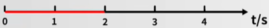
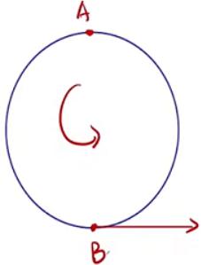
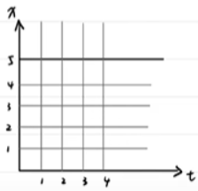

# 高中物理笔记

### 运动学

**质点**

概念: 一个只有质量的点,只有质量没有体积大小的理想模型。

能否将一个物体当成一个点的判断:物体变成质点不影响研究的问题。例: 研究一辆车从吉安到北京的距离，那么这辆车的大小相对于距离就可以忽略不计，可以变成一个质点。

**参考系**

概念: 要描述一个物体的运动,首先要选定某个其他物体做参考,观察物体相对于这个"其他物理"的位置是否随着时间变化,以及怎样变化.这种用来做参考的物体称为参考系。

参照物+坐标系

性质:

1.  任意性: 所有物体都可以用来做参考系
2.  标准性:用来做参考系的物体都是假定不动的
3.  差异性:同一物体选择不同的参考系,观察结果可能不同

结论: 运动是绝对的,静止是相对的

**时间时刻**

时刻(点): 一个瞬间。例: 老八早上6点半起床,七点骑车出门,九点半到公司后立即进厕所,下午四点从厕所出来,四半下回家,六点到家,十点半睡觉,这些都是时刻。

时间(段): 一段时间间隔。例:老八在路上堵了两个半小时后到达公司,开始了一天七个小时的工作,前六个小时上厕所,第七个小时准备下班,回家路上用了一小时,到家后又上了4个小时厕所才安心睡觉,这些都是时间

第几秒(内): 初/末  例:第3秒,表示第二秒末,第三秒初

前n秒  例:前2秒

**位移路程**

路程: 只是运动过程的长度(只有大小,没有方向)

位移: 由初位置指向末位置的有向线段(即有大小又有方向)

位移和路程不能比较,只能是位移的大小与路程相比。当物体做单向直线运动时,位移的大小与路程相等。

**矢量标量**

矢量: 即有大小又有方向的量。例: 浮力。*在直线中用+/-表示方向*

标量: 只有大小没有方向的量。例: 质量、电流

**速度速率**

初中: $速度(v)=路程(s)/时间(t)$

高中: $速率(v)=路程(s)/时间(t)$

高中: $平均速度(v)=位移(x)/时间(t)$

1.  单位: $m/s$
2.  标/矢: $x(矢量)/t(标量)$,所以是矢量
3.  其方向一定与位移相同

**瞬时速度**

概念: 通过某一时刻或某一位置时的速度

符号: $v$,且题目中出现为$v$则默认为瞬时速度

方向: 轨迹的切线方向

**速度变化量**

| 初中  | 高中    |
| --- | ----- |
| 物体  | 质点    |
| 参照物 | 参考系   |
| 时间  | 时间    |
| 路程  | 位移    |
| 速度  | 速度    |
|     | 速度变化量 |

| 时间 | 金额  | 变化          |
| -- | --- | ----------- |
| 1号 | 10块 |             |
| 2号 | 20块 | 变化了**10**块  |
| 3号 | 10块 | 变化了**-10**块 |

变化量: 末状态$\longrightarrow$初状态

单位: $m/s$

标矢: 矢量

方向: 默认初速度方向为正方向

公式: 末速度$\longrightarrow$初速度$\delta v=u_t-u_0$

**加速度**

概念: 描述物体速度变化快慢的物理量

公式: 速度变量化/时间 $ a= \delta v / \delta t  $

单位: $m/s^2$ 读作: 米每二次方秒

标矢: 矢量

方向: 一定与方向一致$\delta v$方向一致

$a$不变: 匀变速运动。加速减速看$a, v$符号,同号加速,异号减速

| $v_0$   | $a$       | $\delta t$ | $v$     | 结果 |
| ------- | --------- | ---------- | ------- | -- |
| $4m/s$  | $2m/s^2$  | $1s$       | $6m/s$  | 加速 |
| $-4m/s$ | $-2m/s^2$ | $1s$       | $-6m/s$ | 加速 |
| $4m/s$  | $-2m/s^2$ | $1s$       | $2m/s$  | 减速 |
| $-4m/s$ | $2m/s^2$  | $1s$       | $-2m/s$ | 减速 |

**x-t图像**

$$
y=kx+b \\
k(斜率)=(y_1-y_2) / (x_1-x_2) \\
大小: 陡平 \\
正负:大小 \\
$$

点的物理意义:

当t=3s时,位置在4m

特殊点的物理意义:

1.  B: 初位置
2.  C: 回到原点的时间

线的物理意义:

平行x轴的直线: 静止不动

斜线: 匀速直线运动

k的物理意义: $k=(y_2-y_1) / (x_2-x_1) = (y_2-y_1) / (t_2-t_1) = v$

物体的快慢: $v$的大小$\longrightarrow$ $k$的大小$\longrightarrow$陡平

斜线的物理意义: $k$不变$\longrightarrow$均速直线运动

$x-t$图象中方向只有两个,所以只能描述直线运动

### 平衡力学

### 牛二力学

### 曲线运动

### 天体运动

