# 高中物理笔记

# 运动学

### **质点**

概念: 一个只有质量的点,只有质量没有体积大小的理想模型。

能否将一个物体当成一个点的判断:物体变成质点不影响研究的问题。例: 研究一辆车从吉安到北京的距离，那么这辆车的大小相对于距离就可以忽略不计，可以变成一个质点。

### **参考系**

概念: 要描述一个物体的运动,首先要选定某个其他物体做参考,观察物体相对于这个"其他物理"的位置是否随着时间变化,以及怎样变化.这种用来做参考的物体称为参考系。

参照物+坐标系

性质:

1.  任意性: 所有物体都可以用来做参考系
2.  标准性:用来做参考系的物体都是假定不动的
3.  差异性:同一物体选择不同的参考系,观察结果可能不同

结论: 运动是绝对的,静止是相对的

### **时间时刻**

时刻(点): 一个瞬间。例: 老八早上6点半起床,七点骑车出门,九点半到公司后立即进厕所,下午四点从厕所出来,四半下回家,六点到家,十点半睡觉,这些都是时刻。

时间(段): 一段时间间隔。例:老八在路上堵了两个半小时后到达公司,开始了一天七个小时的工作,前六个小时上厕所,第七个小时准备下班,回家路上用了一小时,到家后又上了4个小时厕所才安心睡觉,这些都是时间

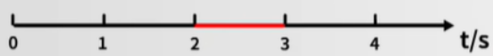

第几秒(内): 初/末  例:第3秒,表示第二秒末,第三秒初

前n秒  例:前2秒

### **位移路程**

路程: 只是运动过程的长度(只有大小,没有方向)

位移: 由初位置指向末位置的有向线段(即有大小又有方向)

位移和路程不能比较,只能是位移的大小与路程相比。当物体做单向直线运动时,位移的大小与路程相等。

### **矢量标量**

矢量: 即有大小又有方向的量。例: 浮力。*在直线中用+/-表示方向*

标量: 只有大小没有方向的量。例: 质量、电流

### **速度速率**

初中: $速度(v)= \frac {路程(s)} {时间(t)}$

高中: $速率(v)= \frac { 路程(s) } { 时间(t) }$

高中: $平均速度(v)= \frac { 位移(x) } { 时间(t) }$

1.  单位: $m/s$
2.  标/矢: $\frac { x(矢量) } { t(标量) }$,所以是矢量
3.  其方向一定与位移相同

### **瞬时速度**

概念: 通过某一时刻或某一位置时的速度

符号: $v$,且题目中出现为$v$则默认为瞬时速度

方向: 轨迹的切线方向

### **速度变化量**

| 初中  | 高中    |
| --- | ----- |
| 物体  | 质点    |
| 参照物 | 参考系   |
| 时间  | 时间    |
| 路程  | 位移    |
| 速度  | 速度    |
|     | 速度变化量 |

| 时间 | 金额  | 变化          |
| -- | --- | ----------- |
| 1号 | 10块 |             |
| 2号 | 20块 | 变化了**10**块  |
| 3号 | 10块 | 变化了**-10**块 |

变化量: 末状态$\longrightarrow$初状态

单位: $m/s$

标矢: 矢量

方向: 默认初速度方向为正方向

公式: 末速度$\longrightarrow$初速度$\delta v=u_t-u_0$

### **加速度**

概念: 描述物体速度变化快慢的物理量

公式: 速度变量化/时间 $ a= \delta v / \delta t  $

单位: $m/s^2$ 读作: 米每二次方秒

标矢: 矢量

方向: 一定与方向一致$\delta v$方向一致

$a$不变: 匀变速运动。加速减速看$a, v$符号,同号加速,异号减速

| $v_0$   | $a$       | $\delta t$ | $v$     | 结果 |
| ------- | --------- | ---------- | ------- | -- |
| $4m/s$  | $2m/s^2$  | $1s$       | $6m/s$  | 加速 |
| $-4m/s$ | $-2m/s^2$ | $1s$       | $-6m/s$ | 加速 |
| $4m/s$  | $-2m/s^2$ | $1s$       | $2m/s$  | 减速 |
| $-4m/s$ | $2m/s^2$  | $1s$       | $-2m/s$ | 减速 |

### **x-t图像**

$$
y=kx+b

$$

-   $k$: 斜率
-   大小: 陡平
-   正负: 大小
-   计算: $k= \frac {y_1-y_2} {x_1-x_2}$

&#x20;

位移时间图像

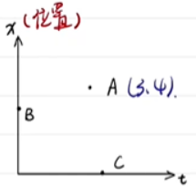

点的物理意义: 当t=3s时,位置在4m

特殊点的物理意义:

-   B: 初位置
-   C: 回到原点的时间

线的物理意义:

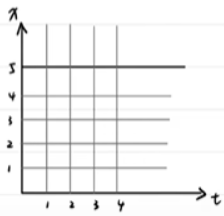

平行x轴的直线: 静止不动

斜线: 匀速直线运动 $m/s$

| $t$ | 1 | 2 | 3 | 4 |
| --- | - | - | - | - |
| $x$ | 1 | 2 | 3 | 4 |

k的物理意义: $k= \frac {y_2-y_1} {x_2-x_1} = \frac {y_2-y_1} {t_2-t_1} = v$

物体的快慢: $v$的大小$\longrightarrow$ k的大小$\longrightarrow$陡平

物体的方向: $v$的正负 $\longrightarrow$k的正负 $\longrightarrow$上下

斜线的物理意义:  k不变$\longrightarrow$均速直线运动

$x-t$图象中方向只有两个,所以只能描述直线运动

位移的计算: 末位置$\longrightarrow$初位置

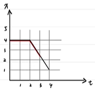

$0 \sim 2$: $0m$

$2 \sim 3$: $-1.5m$

$0 \sim 4$: $-3m$

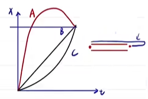

$x: A=B=C$

$s: A>B=C$

速度时间图像

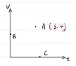

点的物理意义: 当$t=3s$ 时,物体$v=4ms$

特殊点的物理意义:&#x20;

-   B: 初速度
-   C: 速度为0的时间

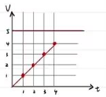

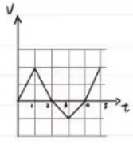

线的物理意义

平行$x$轴的直线: 匀速直线运动

斜线:

| $t$ | 1 | 2 | 3 | 4 |
| --- | - | - | - | - |
| $t$ | 1 | 2 | 3 | 4 |

$a=m/s^2$

$k=1$

$k$的物理意义: $k= \frac {y_2-y_1} {x_2-x_1} = \frac {y_2-y_1} {t_2-t_1} = a$

物体的快慢: $v$的大小 $ \longrightarrow$$ y   $轴大小

物体的方向: $v$的正负 $\longrightarrow$$y$轴的正负

加速减速: 看$ av  $的符号 $ \longrightarrow  $靠近、远离$x$轴

斜线的物理意义: $k$不变 $\longrightarrow$匀变速运动(一根直线)

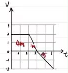

面的物理意义: 面积就是位移

$ 0 \sim 2  $: $4m$

$2 \sim 3$: $1m$

$3 \sim 5$: $-2m$

$ 0 \sim 4  $: $4.5m$

$ 0 \sim 5  $: $3m$

结论: 面积只是正面,位移有正有负

公式: $x = S_上 - S_下$

### **匀变直公式推导**

描述匀速直线运动一共有3个,分别是位移、时间、速度。$x = vt$

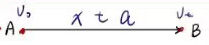

描述匀变速直线运动一共有5个, 分别是: $v_0$$v_t$$a$$t$$x$

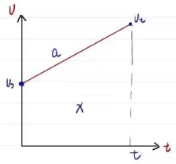

一、根据线的物理含义得: $y=kx+b$

$v_t=v_0+at$(少$x$的公式)

二、根据面积的物理含义得:&#x20;

$x= \frac {(v_0+v_t)t}{2}$(少$a$的公式)

三、$x=v_tt- \frac{1}{2}at^2$(少$v_0$的公式)

四、$x=v_0t+\frac{1}{2}at^2$(少$v_t$的公式)

$t=\frac{v_t-v_0}{a}$

五、$2ax=v_t^2-v_0^2$(少$t$的公式)

### **匀变直自由落体**

"自由落体": $v_0=0$仅受重力 $a=g=9.8m/s$取$10m/s^2$

这类问题必知$v_0$和$a$,还有三个变量$v_t$$t$ $x$

例: 从离地面80 m的空中自由落下一个小球,取$g=10m/s^2$

(1)经过多长时间落到地面;
(2)自开始下落时计时,在第1s内和最后1s内的位移;

(3)下落时间为总时间的一半时的位移。

答:

(1) $x=v_0t+\frac{1}{2}at^2 \Longrightarrow h= \frac{1}{2}gt^2$得 $t=4s$

(2)

$h=\frac{1}{2}gt^2$第1s内得$x_1=5m$

$x_3=v_0t_3+\frac{1}{2}gt_3^2$最后1s内得$x_3=45m$, $x_2=H-x_3=35m$

(3)$20m$

例: 一个物体从某个高度做自由落体运动,它在第1s内的位移恰好等于它最后1s内位移的1/4,取$g=10m/s^2$,求:

(1)第1s内下落的距离;

(2)物体在空中运动的时间;

(3)物体开始下落时离地面的高度。

例:如图所示,悬挂的直杆AB长为a,在BB以下h处有一长为b的无底圆柱筒CD,若将悬线剪断,问:

(1)直杆下端B穿过圆柱筒的时间是多长?

(2)整个直杆AB穿过圆柱筒的时间是多长?

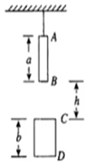

# 平衡力学

### **重力**

公式:$G=mg$

方向: 垂直向下

$g$变化&#x20;

-   高度: 越高g越小&#x20;
-   纬度: 越高g越大

重心测试

-   悬挂法
-   规则.中点

### **弹力**

概念: 产生形变的物体由于想要恢复原来的状态会对所接触的物体产生力的作用

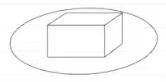

**弹力方向**

接触面类型: 垂直接触面指向受力物体

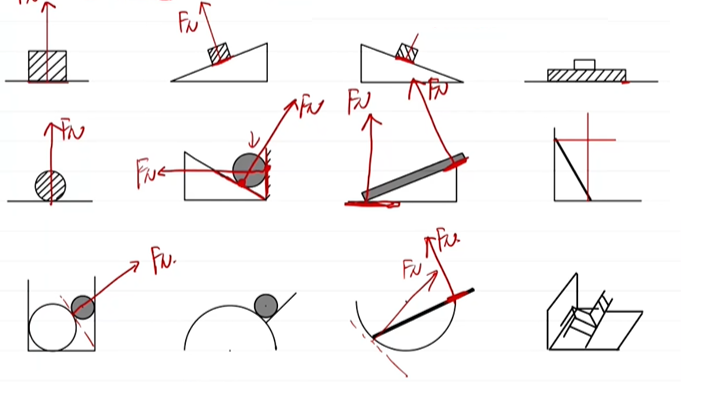

绳子: 沿绳收缩(中心)方向

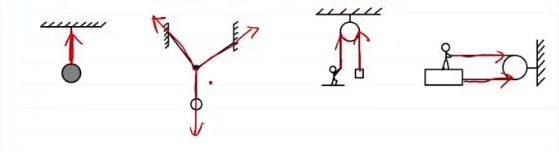

平衡: 有上、有下、有左、有右。静止: 匀速运动

活杆: 沿杆方向

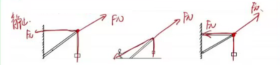

死杆: 受力分析(平力平衡)

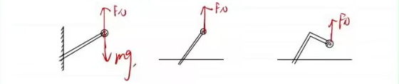

弹簧:&#x20;

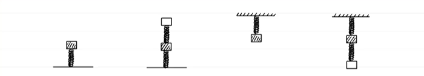

脑子: 平衡

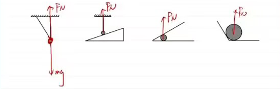

### 摩擦力方向判断

**摩擦力产生的方向**

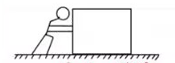

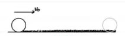

概念: 两个相互接触的物体,当它们发生相对运动或具有相对运动的趋势时。就会产生阻碍相对运对的力。

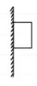

有$f$一定有弹力

条件:

-   接触
-   相对运动(趋势)
-   粗糙
-   挤压(有弹力)

\*\* 摩擦力的类型: \*\*

")

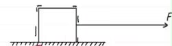

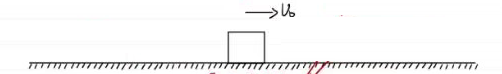

\*\* 摩擦力的大小\*\*​

# 牛二力学

# 曲线运动

# 天体运动
